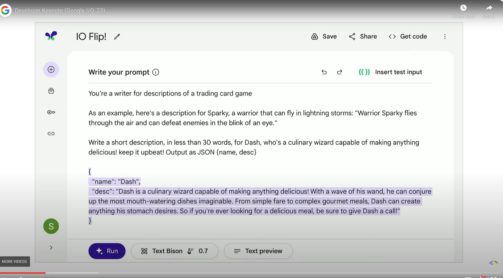
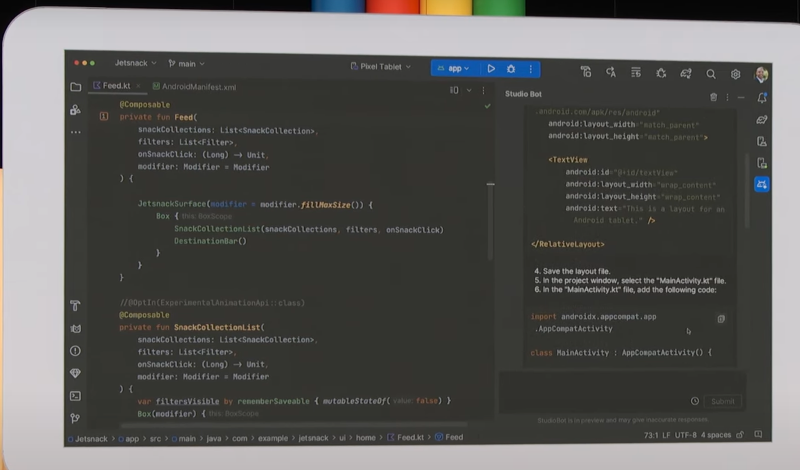
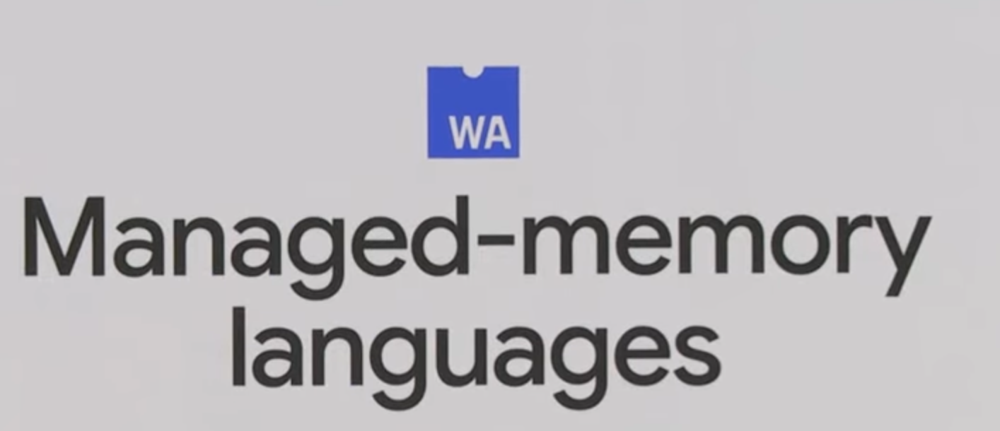

Google I/O 2023 Developer Keynote 相關資訊與討論整理串。 (賣手機跟雲服務的 Google Keynote，有太多新聞可以查，我就不列了 XD) 

## Fip IO

官方運用所有開發工具寫出的卡牌遊戲。 [Google I/O FLIP - A Generative AI Card Game](https://flip.withgoogle.com/)

## [Prompt helper on Bard: (這個名字我是創的) ](https://youtu.be/r8T0SnwHRNI)
你輸入幾個 prompt ，他會幫你把剩下的 prompt 都產生。 比如說你要 JSON ，他會產生預設的格式。 

## Android Studio Bot

目前只有在開發者先行版本 Canary Build 才有，Android Studio Bot: 就類似其他 IDE Bot ，幫你透過自然語音提供建議與程式碼。還有相關文件也給你。 [相關文件跟其他演講](https://android-developers.googleblog.com/2023/05/android-studio-io-23-announcing-studio-bot.html)。

 

## Web Assembly 更新

WebAssembly 是一种新的代码类型，可以在现代 Web 浏览器中运行，并提供性能上的重大提升。它不是主要用于手写，而是旨在成为源语言（如 C、C++、Rust 等）的有效编译目标。这对 Web 平台有巨大的影响，因为它使得许多语言可以直接编译成 WebAssembly 代码并在浏览器中运行。WebAssembly 支持许多语言，包括 C、C++、Rust 等等。²¹

如果您想了解更多关于 WebAssembly 的信息，请访问 Mozilla Developer Network 的 WebAssembly Concepts 页面²。

### 支援 Managed-memory languages

如果 WebAssembly 支援 Managed-memory languages，那麼它將能夠支援更多的語言，例如 C#、Java、Python 等等。Managed-memory languages 是一種具有垃圾回收功能的語言，這意味著它們可以自動管理內存，而不需要手動分配和釋放內存。

