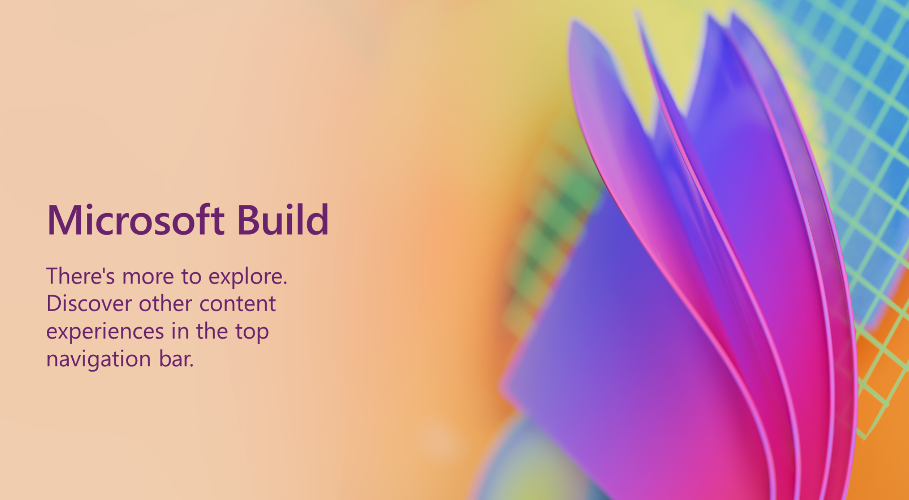

這一屆有很多重要消息：

- [Windows Copilot](https://www.youtube.com/watch?v=FCfwc-NNo30) (Windows 內建 chatgpt)
- ChatGPT with Bing Search (include free tier)
- Azure AI Studio
- [Dev Home](https://www.youtube.com/watch?v=bC-60KNgLuE) : 登入帳號直接連接 github (windows 相關)

- [Microsoft Fabric](https://www.youtube.com/watch?v=X_c7gLfJz_Q&t=77s) : all-in-one BI platform

同步也分享一下，不論是 MSFT CEO 跟 CTO 都有強調關於 **Plugin 生態圈**的重要。以後微軟許多環境，應該都有 GPT 的存在。 但是又開放許多 3rd Party 開發 Plugin 系統。 來客製化自己的搜尋體驗。這就再次呼應到「[生態系競爭策略](https://www.books.com.tw/products/0010923267)」這本書。

