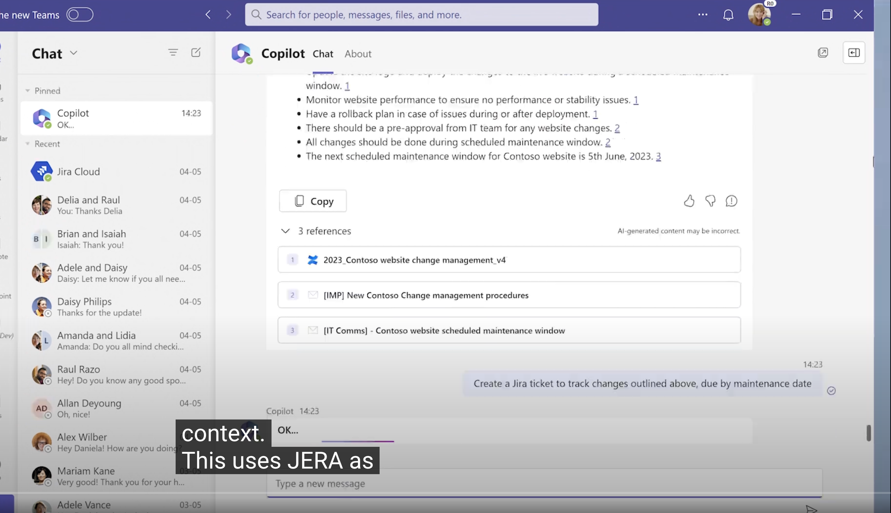

# 影片：

(官方直播，可能會下架）

<iframe width="560" height="315" src="https://www.youtube.com/embed/jeRKfvNylts" title="YouTube video player" frameborder="0" allow="accelerometer; autoplay; clipboard-write; encrypted-media; gyroscope; picture-in-picture; web-share" allowfullscreen></iframe>

# Plugin 會是新世代的 Fontend 

前一天 CTO Kevin Scott 在 "The era of the AI Copilot"

# 關於 IDE 對於 Plugin 開發的支持

- Web IDE 支援很快速建立 Copilot Plugin

## 這裡有個 Jira Copilot Plugin 案例

 

## 商業用語部分 - Syntex  Plugin

- Docu sign flow with Copilot

## Copilot 總結

# 關於 Plugin - Developer Success

- Productivity:

  - 完整的說明，有相關的 "Team Toolkit"
  - 有個人化體驗
  - 可以很方便開發跟 Deploy 

  

# Dev Home: 快速建置開發者的相關環境

- 透過帳號登入
- 相關設置都有
- 今天有 Preview 版本在 Windows Store

## Build and maintain your company Copilot with Azure ML and GPT-4 | BRK211H

<iframe width="560" height="315" src="https://www.youtube.com/embed/Vtf25OPuLgo" title="YouTube video player" frameborder="0" allow="accelerometer; autoplay; clipboard-write; encrypted-media; gyroscope; picture-in-picture; web-share" allowfullscreen></iframe>

整個流程相當清楚，又能完整呈現 Azure Copilot 與 Azure  ML 的強大。

- 先建立一個情境，幫生意擴展找客戶挑選 TA 
- 透過 Copilot 給予相關的信件:
  - 這裡想要給予更多更貼近 TA 的資訊，尋找過去信件與相關資料。

- 
- 
- 

