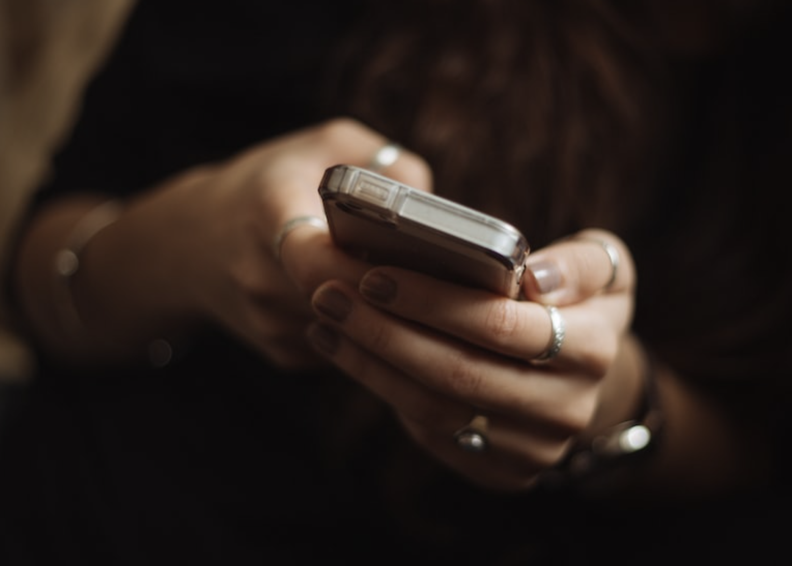

## 為何更換手機

最近因為要出國，因為讓小孩子避免走失。買了 Apple Watch ，卻發現沒有辦法漫遊。只好弄一隻支援 ESIM 卡片的手機給他。 這樣一來，最方便的方式就是把我的手機（iPhone XR) 給他，然後我換一隻最新的 iPhone 14 Pro (明明 15 就快出了)

#### 大部分的軟體使用「iCloud 備份與復原」應該可以搞定。

## iPhone 系統軟體，需要注意的部分

- 舊手機：

  - 記得把 Find My Device 關閉
  - 記得登出 iCloud (先將以下都做完，先將以下都做完，先將以下都做完)

- Apple Watch

  - 需要先解除配對（就算忘記也沒關係，就重新配對洗掉）

- Apple Pay

  - 全部要重新認證（到新手機）

  - Apple Watch 的 Apple Pay 也要重新認證（也是在新手機上操作）

    

# 不要急著洗掉就手機 iCloud 備份與復原後，有一些 App 可能需要他。

大部分的應用程式都可以走 iCloud 復原來安裝（開啟的時候，也通常可以無痛轉移）。但是有一些應用程式需要舊手機轉換。

- **Steam App**
  - 需要舊手機認證，才能轉換。
- **WeChat** 
  - 一樣，需要舊手機掃描 QR-Code
- **VPN 軟體**
  - 每個公司可能不同，有的管制更嚴格。
- LINE 的部分，完整可以參考[【LINE換機官方懶人包】帶您一步一步操作～ iOS與安卓都適用](https://line-tw-official.weblog.to/archives/79051278.html) 
  - 舊手機：
    - 先去備份起來（可以透過 iCloud)
    - 要確保有備份完整，確保有備份完整，確保有備份完整

  - 打開手機裝 LINE
    - 掃描舊手機 QR Code 登入，並且轉換手機。
    - 這時候，選擇從備份恢復。
    - 如果，發現沒有完整恢復回來？（也就是備份有失敗)
      - 想要打開舊手機，會發現已經轉換過來，無法開啟。
      - 刪除舊手機的 LINE ，重新安裝。
      - 重新以上步驟，將新手機帳號轉換回來就手機。
      - 這時候發現對話都回來了，再來重新備份一次。這次要注意有沒有備份完成。
      - 然後重複手續，轉換到新手機。

大概就這樣，本來以為換手機很方便。結果也是卡蠻久，最重要的還是 LINE 卡住（嗚著臉)。

