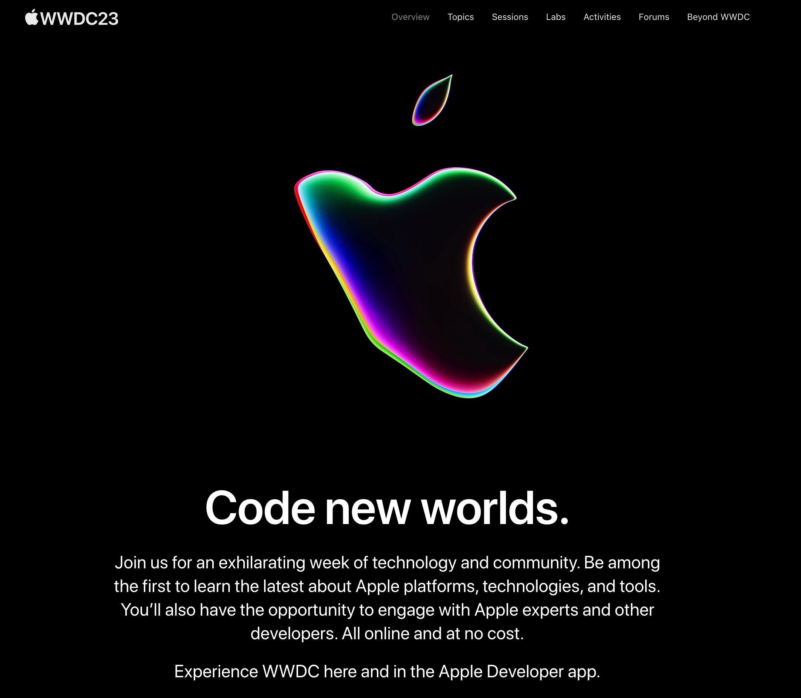

# 我如何看待 WWDC23 ?

身為技術研討會主辦人，我看的是:

-  整體錄影方式與收音技巧
- 每一個講者的職稱(可以看出內部分工與架構)
- 平台想要規劃出的生態圈

## 職稱相關

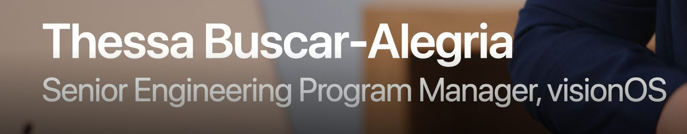

應該跟許多公司一樣:

- Engineering Progam Manager -  技術專案經理
- Engineering Manage - 技術開發的經理

職稱其實也代表部門的多寡，對外部而言很嶄新的 visionOS 部門卻有那麼多清楚分工，而且能演講的人還蠻多的。不愧是 Apple 。

# 硬體相關

- New Mac Studio 可以有六顆螢幕（原來之前的不行啊？！）

# iOS 17 帶來軟體開發新變化

## Name Drop 近場溝通新應用

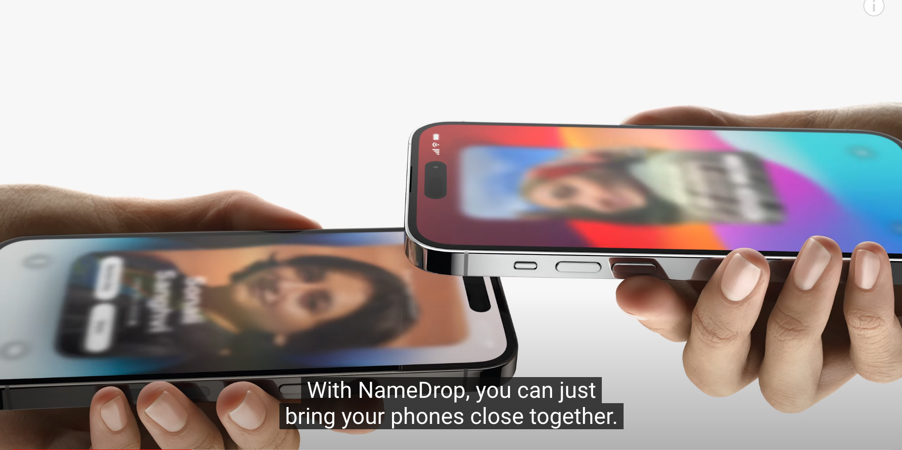

- 取代掉所有名片應用  (LINE OA 其實有類似做法)
- 不知道會用到哪個 SDK ，應該會開放給其他 App 使用。

## 更智能的鍵盤輸入

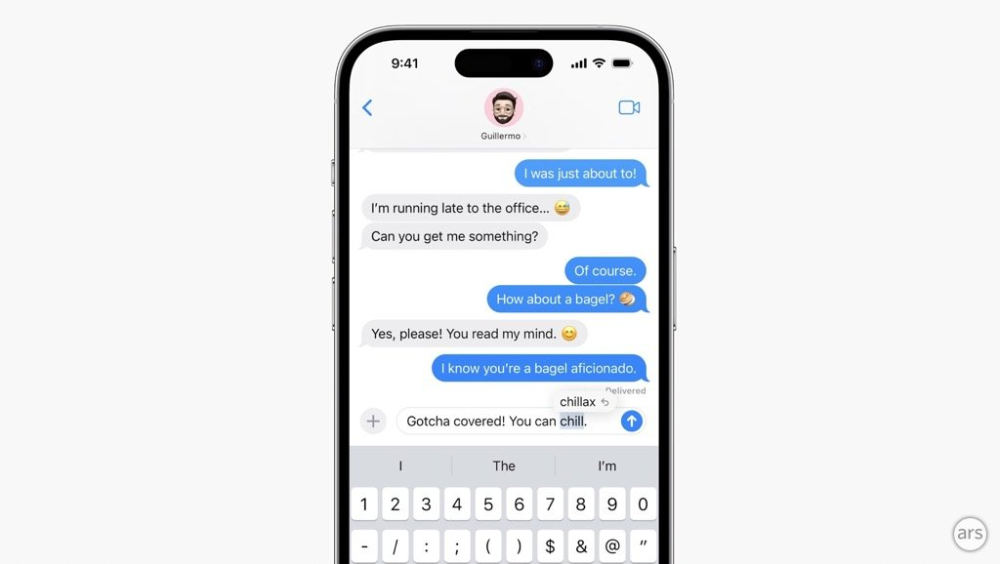

可能是使用 local 「In-line predictive text API」

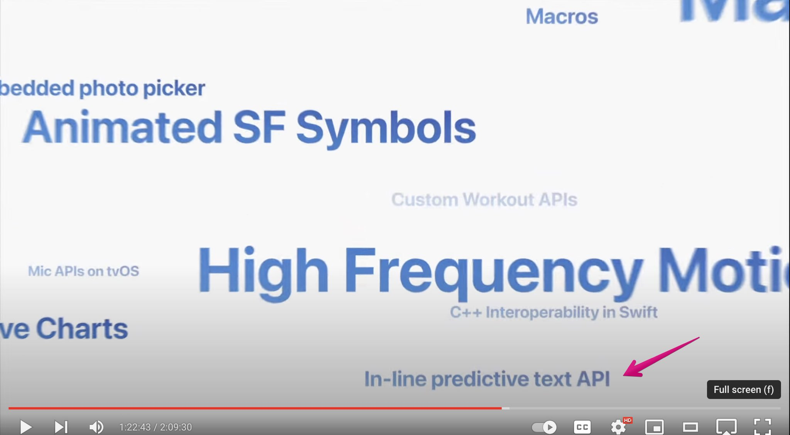

# TV OS 相關變革

## 透過 iPhone 直接在 Apple TV 開會

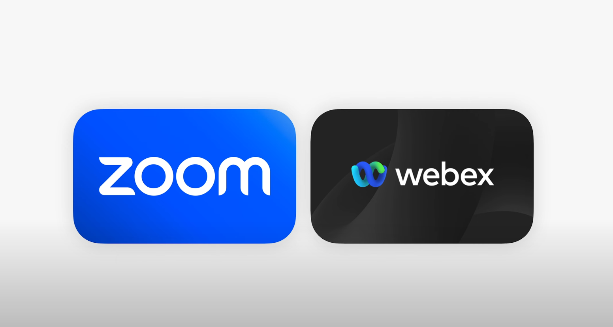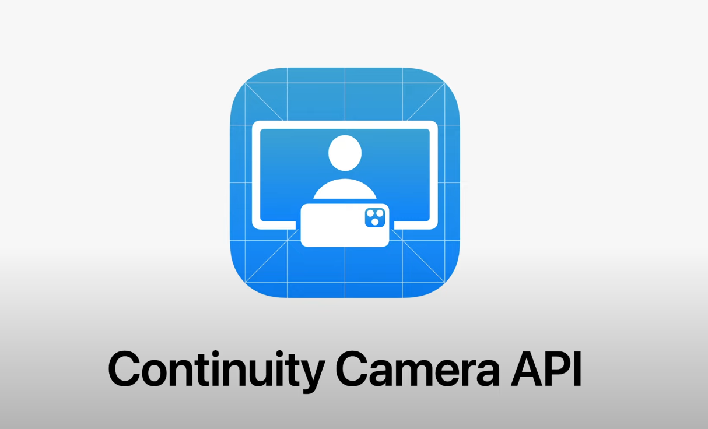

走 Continuity Camera API

# Vision Pro 帶來的軟體開發變化

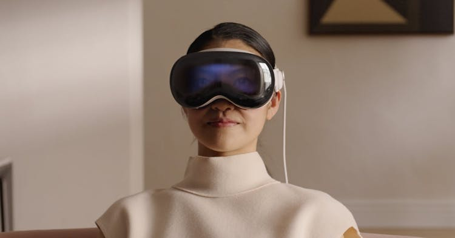

(要接線~~~~~  Orz)

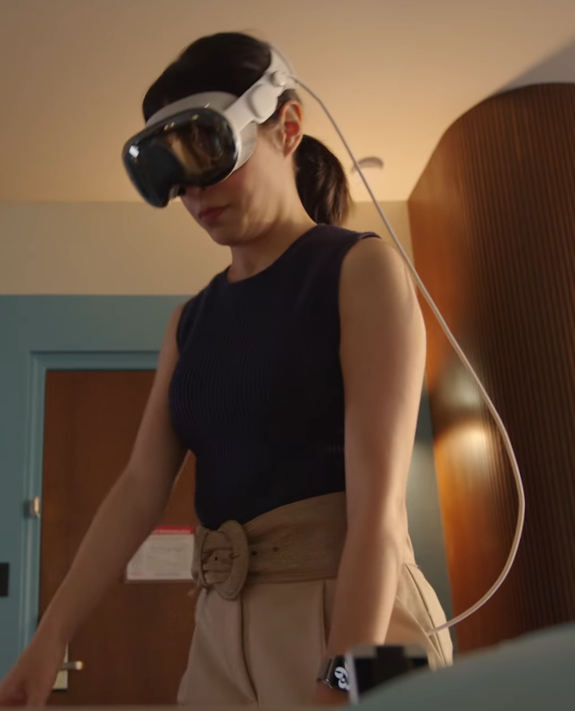

果然要另外接電池

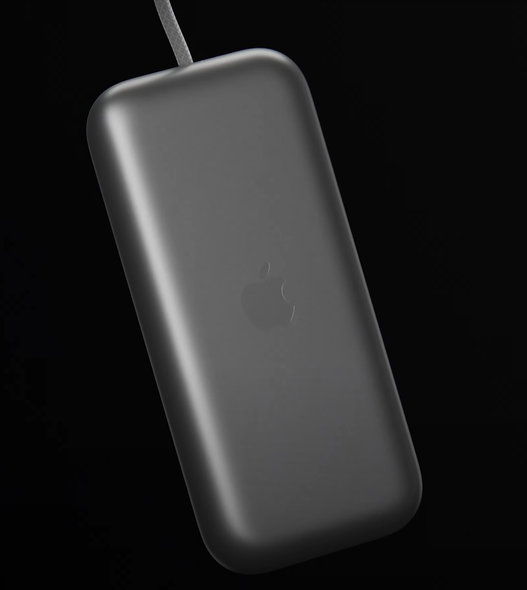

[Apple Vision Pro 帶來新的生物識別系統「Optic ID」](https://chinese.engadget.com/apple-vision-pro-headset-will-use-your-eyes-to-sign-in-with-optic-id-193956176.html)

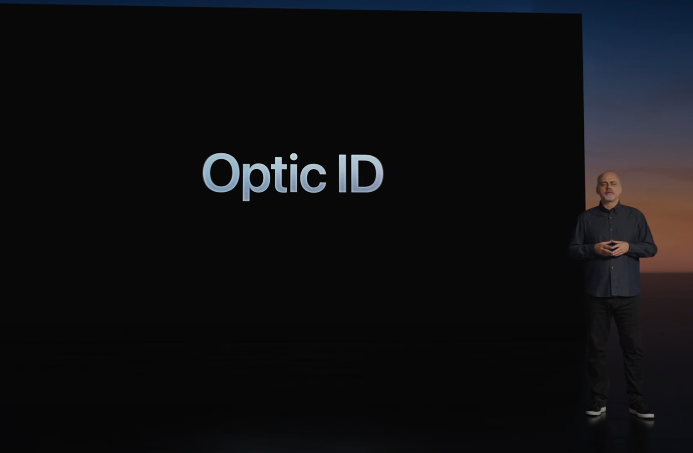

可能帶來影響：

- 虹膜辨識會變成是基本 OAuth 的認證設備（搭配 Passkey (a.k.a. FiDO2)
- 比起 [WorldCoin 可能因為 AirDrop 產生盜用](https://abmedia.io/worldcoin-iris-black-market) ，但是 Vision Pro 更可以取得更多人的虹膜資訊。 
- 雖然依照 Apple 的個性，不可能有任何取得方式。但是代表 Optic ID 可以更加的準確， Passkey 的未來更令人期待。

# iOS SDK

## Accessibility SDK

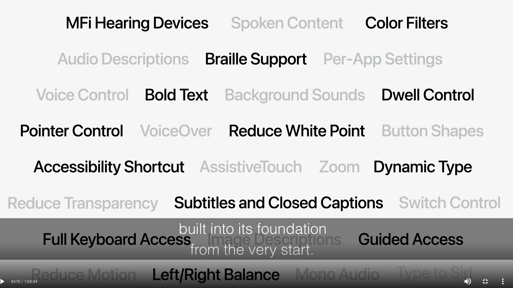 

## Privacy API

