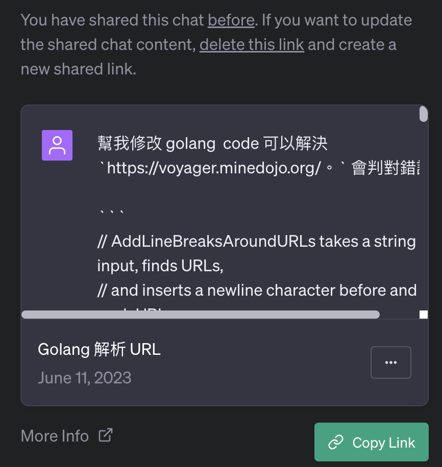

# 前提

大家應該都跟我一樣，經常使用 ChatGPT 來協助一些 coding 上的問題。尤其是對於 Regular Expression 的問題。最近在處理上發現，需要透過「正向表列」，而非跟他講哪些不可以的方向比較容易成功。也應該說， Regular Expression 本來就要透過正向表來才對。


## 原本:


```
// AddLineBreaksAroundURLs takes a string as input, finds URLs,
// and inserts a newline character before and after each URL.
// It returns the modified string.
func AddLineBreaksAroundURLs(input string) string {
	re := regexp.MustCompile(`(https?:\/\/[^\s\p{Han}]+)`)
	return re.ReplaceAllString(input, "\n$1\n")
}
```


### 發現無法處理：


```
 https://voyager.minedojo.org/。
```


當我發現我一直跟 ChatGPT 講要排除 ` https://voyager.minedojo.org/。` 這個案例的時候，往往會一直卡住無法向前。 但是寫多個測試案例倒是真的蠻好的。


### Unit Testing code 

```
func TestAddLineBreaksAroundURLs(t *testing.T) {
	tests := []struct {
		input    string
		expected string
	}{
		{
			input:    "Check out this website https://example.com and this one http://another-example.com",
			expected: "Check out this website \nhttps://example.com\n and this one \nhttp://another-example.com\n",
		},
		{
			input:    "Here is an URL with dot at the end https://voyager.minedojo.org/。",
			expected: "Here is an URL with dot at the end \nhttps://voyager.minedojo.org/\n。",
		},
		{
			input:    "This is another test 可在https://voyager.minedojo.org/上訪問。",
			expected: "This is another test 可在\nhttps://voyager.minedojo.org/\n上訪問。",
		},
		// Add more test cases here as needed
	}

	for _, tt := range tests {
		res := AddLineBreaksAroundURLs(tt.input)
		assert.Equal(t, tt.expected, res, "Should correctly insert line breaks around URLs")
	}
}

```


## 正面表列 

後來決定，透過正面表列來解決這個問題。 

```
// AddLineBreaksAroundURLs takes a string as input, finds URLs,
// and inserts a newline character before and after each URL.
// It returns the modified string.
func AddLineBreaksAroundURLs(input string) string {
    re := regexp.MustCompile(`(https?:\/\/[\w\/\?\&\.\-]+)`)
    matches := re.FindAllString(input, -1)
    for _, match := range matches {
        input = strings.Replace(input, match, "\n" + match + "\n", 1)
    }
    return input
}
```


大家可以透過以下方式[分享 ChatGPT link](https://chat.openai.com/share/68599fd3-2ec7-4e6d-a410-42a1d52b1aac) 




