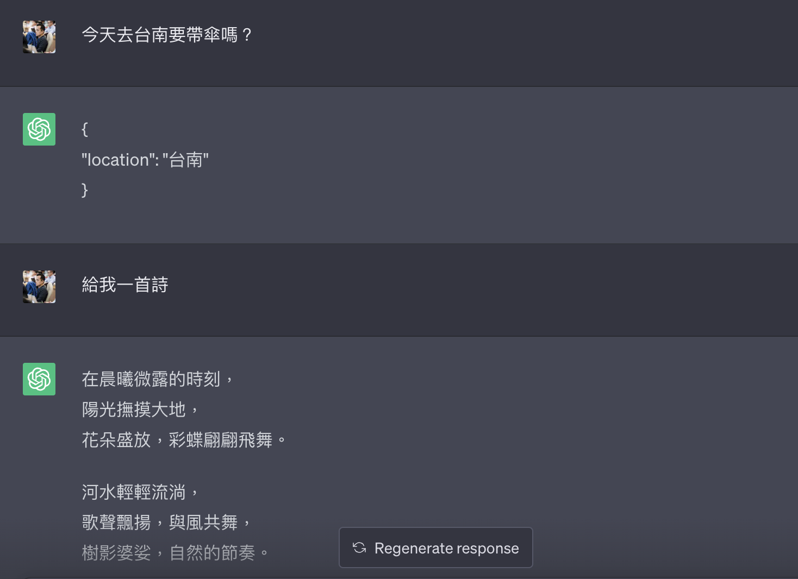
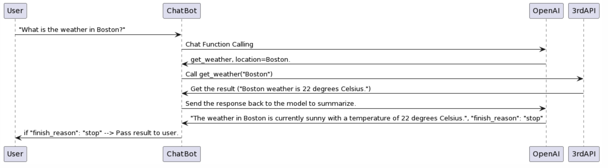
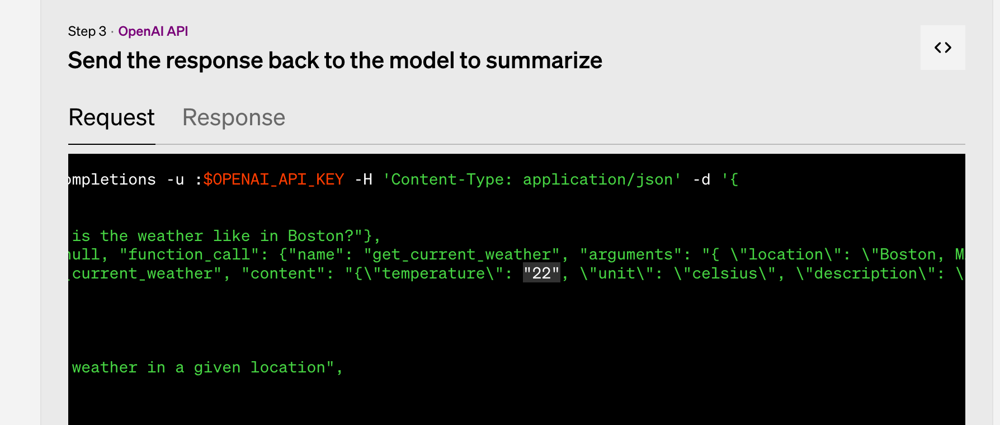

# 前提

OpenAI 在 06/13 發表了新的功能 "[Function calling](https://openai.com/blog/function-calling-and-other-api-updates)"，其實對 LLM 的開發上算是一個完整的新發展。 本篇文章將快速解釋一下這個更新將會帶來哪一些變革，並且也透過將 LINE 官方帳號的相關整合為案例，幫你打造一個旅遊小幫手。


# 關於 OpenAI 新的功能Function Calling 的細節

關於 "[Function calling](https://openai.com/blog/function-calling-and-other-api-updates)" 主要是拿來處理 Intent 的判斷，並且針對使用者的意圖給予相關的 JSON 輸出給開發者作為處理之用。 換成白話文來說，如果你今天想要做一個「天氣服務的 ChatGPT LINE Bot 」的話，那麼你該如何弄呢？

相關資料：

- 部落格 "[Function calling](https://openai.com/blog/function-calling-and-other-api-updates)" 
- API 文件 [ChatComplete](https://platform.openai.com/docs/api-reference/chat/create)


# 在 OpenAI Functions Calling 之前，要怎麼做？

根據 "[DeepLearning 提供一堂很好的 Prompt Engineering for Developers](https://learn.deeplearning.ai/chatgpt-prompt-eng/lesson/1/introduction)" 有提到，你可能要這樣做：

```
你現在是一個協助抓取使用者資訊的小幫手，如果使用者詢問了某個地區的天氣。你就幫我把地區抓出來透過以下格式呈現。 
---
{
   "location": "xxxx"
}
```



很多地方是聰明的，但是還是沒有處理非相關天氣詢問要拒絕。這裡可以透過 [ChatGPT Share](https://chat.openai.com/share/0dbd39c6-246a-4ca4-b941-2a103ec1daf0) 查看結果。如果是一個 NLU 的小幫手，在這個情況下可能要回覆 `{ "location" : ""}` 或是 NULL ，但是這樣會讓你的 Prompt 非常的冗長，而且通常很長的防禦Prompt (咒語)只能防禦一個階段。 那該怎麼辦呢？


# 那 OpenAI Functions Calling 怎麼幫助你呢？

這裡給一張流程圖： [PlantUML](https://www.plantuml.com/plantuml/uml/TP5BIyD058Nt-HM7MIcqMTHTGEq355SML5oMCRbj1kSHvjwXr5_lf6cnXRZAOxxpCUVUEOkEafmjYW-cYEa3LgsMPP0AwZE_mJ2a9Un9vqU4yLW6bk0VLN4Y-z1hHtxnKXt3U4g-5XCyLjfQutSeXkCh-uvaSv9EO4Ej-yJzu2ulrNUnMQnxTPPTfcxK0AlROa2kzCyao1GYSRA2C_pNWp6ReQ5T96AioB99N6RNIAatyirPrWNFX2zTVqF2yQSB3Td-WvDpEfeVAiVwglUnAS8mwXGZUR67RF3-WBsH5Xf2hgEe9KL2s8xUTWArDTvmkucaENXLGMLhTxMQVgyLpFO_5jCChJNpULOIa7AcBEQvTtBs5m00) 




## 第一步： 呼叫 Chat / Complete Function Calling

 從文章內  "[Function calling](https://openai.com/blog/function-calling-and-other-api-updates)" 可以提供一個很簡單的範例，你可以發現以下得呼叫方式跟原本使用 chat/ completion 沒有差別，但是回傳資訊差很多了。

```
curl https://api.openai.com/v1/chat/completions -u :$OPENAI_API_KEY -H 'Content-Type: application/json' -d '{
  "model": "gpt-3.5-turbo-0613",
  "messages": [
    {"role": "user", "content": "What is the weather like in Boston?"}
  ],
  "functions": [
    {
      "name": "get_current_weather",
      "description": "Get the current weather in a given location",
      "parameters": {
        "type": "object",
        "properties": {
          "location": {
            "type": "string",
            "description": "The city and state, e.g. San Francisco, CA"
          },
          "unit": {
            "type": "string",
            "enum": ["celsius", "fahrenheit"]
          }
        },
        "required": ["location"]
      }
    }
  ]
}'
```

也就是你可以透過詢問 `"What is the weather like in Boston?"` 讓 chatGPT 透過 `gpt-3.5-turbo-0613` (這邊要強調是 GPT3.5) 的模型來跑分析，直接回答給你 JSON 檔案。

```
{
  "id": "chatcmpl-123",
  ...
  "choices": [{
    "index": 0,
    "message": {
      "role": "assistant",
      "content": null,
      "function_call": {
        "name": "get_current_weather",
        "arguments": "{ \"location\": \"Boston, MA\"}"
      }
    },
    "finish_reason": "function_call"
  }]
}
```

這時候， OpenAI 的 API `絕對` 會回覆給你 JSON ，不需要透過各種黑魔防禦術（特殊 Prompt) 就可以達成。 如果他找得到相關資料，他就會幫你把資料抽取出來，並且放在 `arguments` 傳給你。


更多細節可以[參考 API 文件](https://platform.openai.com/docs/api-reference/chat/create)的部分：

```
Function_call / string or object / Optional

Controls how the model responds to function calls. "none" means the model does not call a function, and responds to the end-user. "auto" means the model can pick between an end-user or calling a function. Specifying a particular function via {"name":\ "my_function"} forces the model to call that function. "none" is the default when no functions are present. "auto" is the default if functions are present.
```


## 跟原本 Prompt 的差別

那你會想說，這樣跟原本透過特殊的 Prompt 有什麼差別？

### **不會有 JSON 以外的回傳：**

如果你這時候，忽然又插嘴一句說：「給我一首詩」，他還是會回傳給你 JSON 檔案。可能會告訴你沒有相關可以使用的 arguments。

### **多個 Functions 的處理：**

這也是最強大的，最好用的地方。請查看

```
curl https: //api.openai.com/v1/chat/completions -u :$OPENAI_API_KEY -H 'Content-Type: application/json' -d '{
"model": "gpt-3.5-turbo-0613",
"messages": [
    {
        "role": "user",
        "content": "What is the weather like in Boston?"
    }
],
"functions": [
    {
        "name": "get_current_weather",
        "description": "Get the current weather in a given location",
        "parameters": {
            "type": "object",
            "properties": {
                "location": {
                    "type": "string",
                    "description": "The city and state, e.g. San Francisco, CA"
                },
                "unit": {
                    "type": "string",
                    "enum": [
                        "celsius",
                        "fahrenheit"
                    ]
                }
            },
            "required": [
                "location"
            ]
        }
    },
    {
        "name": "get_current_date",
        "description": "Get the current time in a given location",
        "parameters": {
            "type": "object",
            "properties": {
                "location": {
                    "type": "string",
                    "description": "The city and state, e.g. San Francisco, CA"
                },
                "unit": {
                    "type": "string",
                    "enum": [
                        "celsius",
                        "fahrenheit"
                    ]
                }
            },
            "required": [
                "location"
            ]
        }
    }
]
}'
```

你會發現，上面的程式碼有兩個 function 等著判別。 `get_current_date` 跟 `get_current_weather` 。

- 如果你的問句是： `What is the weather like in Boston?` ，那他就會回傳給你 `get_current_weather`，然後給你 `location = Boston`。
- 反之，如果你問句是: `What time is it in Boston?` ，那他就會回傳給你 `get_current_date`，然後給你 `location = Boston`。


## 第二步 : 呼叫 3rd Party API

- 這邊就跳過，可以是各種 Open API 去找資料。
- 但是，可以透過 ChatGPT Plugin 的資料去找，將自己模擬成 ChatGPT Plugin 。

## 第三步： Send the summary to OpenAI

原本 https://openai.com/blog/function-calling-and-other-api-updates 資料有錯誒




```
curl https://api.openai.com/v1/chat/completions -u :$OPENAI_API_KEY -H 'Content-Type: application/json' -d '{
  "model": "gpt-3.5-turbo-0613",
  "messages": [
    {"role": "user", "content": "台北好玩地方在哪裡?"},
    {"role": "assistant", "content": null, "function_call": {"name": "get_current_poi", "arguments": "{ \"location\": \"台北\"}"}},
    {"role": "function", "name": "get_poi", "content": "{}"}
  ],
  "functions": [
    {
      "name": "get_current_poi",
      "description": "Get the current point interesting in a given location",
      "parameters": {
        "type": "object",
        "properties": {
          "location": {
            "type": "string",
            "description": "The city and state, e.g. San Francisco, CA"
          }
        },
        "required": ["location"]
      }
    }
  ]
}'
```

這裡會收到回覆(Response): 

```
{
  "id": "xxx",
  "object": "chat.completion",
  "created": 1686816314,
  "model": "gpt-3.5-turbo-0613",
  "choices": [
    {
      "index": 0,
      "message": {
        "role": "assistant",
        "content": "台北有很多好玩的地方，以下是一些推薦的地點：\n\n1. 101大樓：台北最著名的地標建築之一，是世界上最高的摩天大樓之一，可以在觀景台欣賞城市全景。\n\n2. 象山：台北的一座山峰，可以從山頂俯瞰整個城市，是非常適合登山和賞景的地方。\n\n3. 士林夜市：台北最著名的夜市之一，可以品嚐到各種美食和購物。\n\n4. 故宮博物院：收藏中國文化藝術品的博物館，展示了大量的歷史文物。\n\n5. 國立自然科學博物館：一個專門展示自然科學知識和展品的博物館，非常適合家庭和學生參觀。\n\n6. 北投溫泉：台北最著名的溫泉區之一，可以享受溫泉浸浴和放鬆身心。\n\n7. 龍山寺：台北最古老的寺廟之一，是信仰佛教的重要地方，也是一個參觀的旅遊景點。\n\n希望這些地方能讓您在台北有一個愉快的旅行！"
      },
      "finish_reason": "stop"
    }
  ],
  "usage": {
    "prompt_tokens": 104,
    "completion_tokens": 419,
    "total_tokens": 523
  }
}
```

本來以為 `"finish_reason": "stop"` 在回覆後檢查。並且設定， for loop 檢查，但是發現就算把資料傳空的給 OpenAI ，他也會根據他有的資訊開始回覆給你。


# Function Calling 可以帶來的應用

這裡快速摘要幾個可以帶來的新應用：

- **自幹自己的 ChatGPT Plugin:**
  -  [ChatGPT App在台灣上架！Plugins開放、一次搞懂怎麼用](https://www.gvm.com.tw/article/102881) 上架後就受到很多人歡迎，但是他還是相對「少數」，因為需要額外付費 $20 。所以使用的人還是相對少。
  - 透過 Function Calling 就可以打造出自己的 ChatGPT Plugin 在你喜歡的平台（LINE 官方帳號, slack ...)
- **更聰明的 Intent 識別機制 ：**
  - 因為這個 API 的速度還蠻快的，回覆的 token 也都不多。
  - 作為 NLU 的識別機制會相當的實用。並且可以確保回覆的 JSON format 相當的精確。
