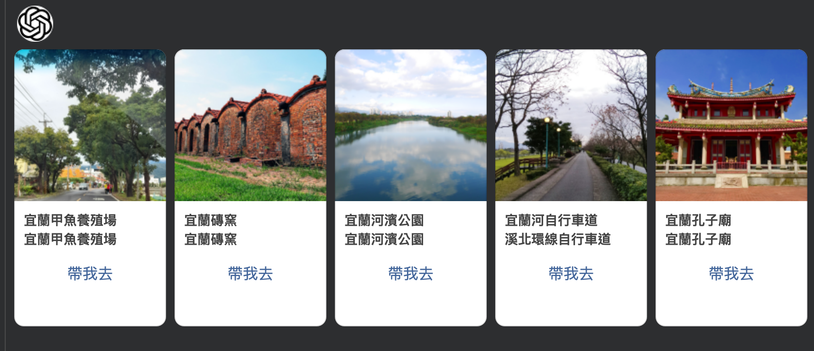
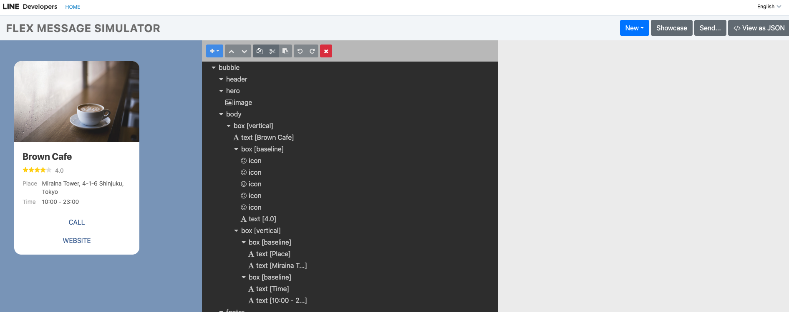
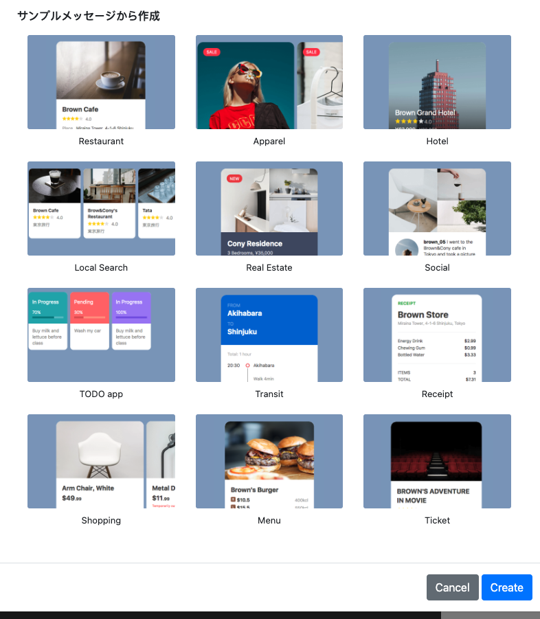
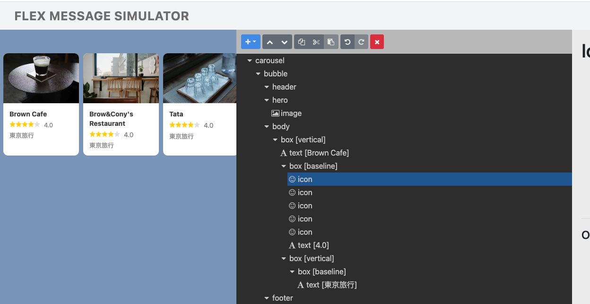
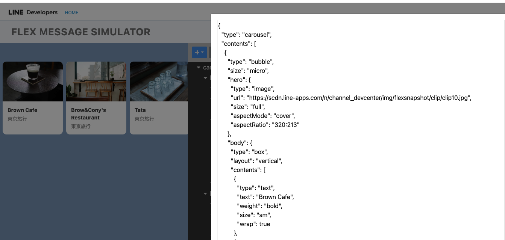
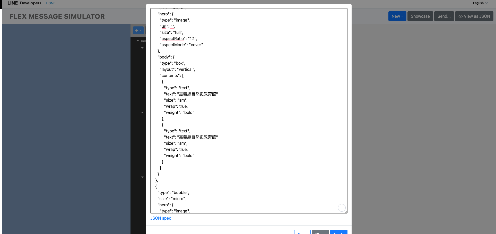
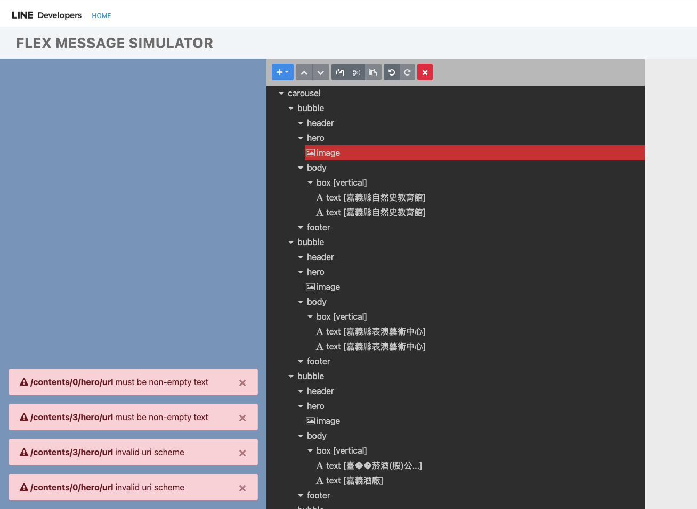

# 前提

LINE Bot 的開發上， [Flex Message 是一個強大又美觀的訊息顯示方式](https://engineering.linecorp.com/zh-hant/blog/2022-flex-message-v3)。並且可以發出[多種類型訊息格式](https://developers.line.biz/en/docs/messaging-api/using-flex-message-simulator/#predefined-layouts)。本篇文章分享了，如何透過快速版本設計來寫出你想要的形式。 本篇文章將透過一個流程，循序漸進告訴你如何完成上面的範例訊息，並且如果開發 FLEX Message 上的問題時，也可以透過 [FLEX Simulator](https://developers.line.biz/flex-simulator/) 來幫你除錯。


## 開始了，設計苦手

任何的前端苦手（像是我），都對於如何找到一個好 Flex 的格式內容感覺很辛苦。這時候可以考慮使用 [FLEX Simulator](https://developers.line.biz/flex-simulator/) 先做你的起手式。



([FLEX Message Simulator](https://developers.line.biz/flex-simulator/) 提供給你所見即所得的編輯方式）

這裡也推驗"[藉由 Flex Message Simulator 實現並發送測試用 Flex Message](https://engineering.linecorp.com/zh-hant/blog/how-to-send-flex-message-on-simulator)" 讓你對於 [FLEX Message Simulator](https://developers.line.biz/flex-simulator/) 有更深刻的了解。


### 透過 Showcase 挑選喜歡的樣板



這裡可以挑選喜歡的格式，我們先挑選出我們喜歡的 "Local Search" 版面。


## 透過 FLEX Simulator 修改



依照本次範例，我們不需要評比的星星。可以透過 [FLEX Message Simulator](https://developers.line.biz/flex-simulator/)  來直接移除（用剪刀) 。



修改好之後，按下右上角的 </> View as JSON 來查看相關資訊。這些可以讓你知道如何開始編譯你的程式碼。


## 開始弄到 Golang 程式碼

### 如果沒有要把 FLEX 套著資料，整包 JSON 直接丟下去用

如果要開始把 FLEX Message 弄到你開發的聊天機器人的話，可以先建議以下方式： 其中 `jsonString` 是

```
contents, err := linebot.UnmarshalFlexMessageJSON([]byte(jsonString))
		if err != nil {
			return err
		}
		if _, err := app.bot.ReplyMessage(
			replyToken,
			linebot.NewFlexMessage("Flex message alt text", contents),
		).Do(); err != nil {
			return err
		}

```

其中 `UnmarshalFlexMessageJSON` 可以直接把 JSON 直接轉換成 Golang code 裡面的元件，你可以再去修改，或是直接丟到訊息就好。


### 直接一個個的刻出來

<script src="https://gist.github.com/kkdai/dd0fa35461dba10ebb1cdf5c42a08f81.js"></script>

這裡貼上一段 code 可以直接看到，這是一個慢慢用內部定義的格式來打造 FLEX Message 。

- **優點：**
  - 很有彈性，甚至可以套用外部資料打造數個 FLEX Bubble Carousel 。
- **缺點：**
  - 就是需要一個個把格式填寫上去，不過使用 VS Code 的體驗，應該都可以快速選到才是。

## 發送 FLEX Message 失敗怎麼解決？

大概也是許多開發者的痛，就是當 FLEX Message 發送失敗的時候。到底要去哪裡查錯誤訊息？ 經常會發現 Log 也沒那麼清楚怎麼辦？

```
flexMsg := linebot.NewFlexMessage(ALT_TRAVEL_FLEX, flexContainerObj)
if _, err := bot.ReplyMessage(event.ReplyToken, flexMsg, linebot.NewTextMessage(sumMsg)).Do(); err != nil {
				log.Print(err)

				if out, err := json.Marshal(flexContainerObj); err != nil {
					log.Println("Marshal error:", err)
				} else {
					log.Println("---\nflex\n---\n", string(out))
				}
			}

```

這段程式碼給一個範例，當你發送訊息錯誤的時候。這時候，就把你的錯誤的 FLEX Message JSOM 印出來。然後一樣複製下來後，到 [FLEX Simulator](https://developers.line.biz/flex-simulator/) 一樣打開 "View as JSON" 然後放上 JSON 並且套用。






這時候可以知道你的 JSON 哪裡有問題，也可以查到。 這時候可以透過發生錯誤的元件，來回頭查看你的程式碼。


# 結語

 FLEX Message 真的是很強大，不論在桌面上，還是在手機端都可以顯示出漂亮的資料呈現。 但是透過程式來打造的話，又會因為格式過於自由變得有些迷惘。 希望這一篇文章可以讓每一個跟我一樣的前端（視覺）苦手，知道如何開發外，遇到問題也能夠快速解決。
