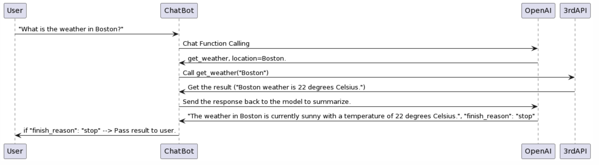

# 前提

透過 LLM （大型語言模型）的開發上，有許多很方便的工具可以幫助你快速地打造出 POC 。 這裡最知名的莫過於 [LangChain](https://github.com/hwchase17/langchain) ，除了支援眾多的大型語言模型之外，更支援許多小工具（類似: [Flowise](https://github.com/FlowiseAI/Flowise)) 。

本篇文章將介紹如何透過  [LangChain](https://github.com/hwchase17/langchain)  打造一個查詢股價 (stock price) 的小工具，並且提供一個可以快速打造的開源套件讓各位一起學習。 對了，本篇文章使用的[範例也是最新的 06/13 公佈的 OpenAI Function Calling 的功能](https://openai.com/blog/function-calling-and-other-api-updates)。除了可以快速判斷使用者 Intent 之外，更可以呼叫外部的 API 來查詢本來 OpenAI 無法了解的資訊（比如說現在的股價）。


透過使用 LLM 的 LINE Bot： 你可以使用任何敘述公司的文字，來找尋公司股價。 比如說：

- 蘋果公司，甲骨文... 等中文公司名稱。
- 甚至從英文完全找不出股票代碼的公司，比如說: CloudFlare --> NET

### 開源套件參考這個 [https://github.com/kkdai/linebot-langchain](https://github.com/kkdai/linebot-langchain)


# 為何要挑選 LangChain 作為開發 LINE Bot 的架構

這題目很大，很難一句話回答。

-  [LangChain](https://github.com/hwchase17/langchain)  是一個很方便打造 POC 概念的東西。搭配 Flowise 甚至可以讓 prompt 人員跟開發人員完全分開。
- 但是他畢竟還是類似黑箱子，有太多需要注意的地方。真的要上線，建議還是要透過 OpenAI 自己來開發。
- 不過 LangChain 開發出來的架構，可以無痛轉換到其他 LLM 就是了。

- 也有視覺化的工具類似: [Flowise](https://github.com/FlowiseAI/Flowise) 可以讓拉框架的人，跟 Prompt 的人分開。修改 Prompt 甚至不需要重新 deploy 


[Flowise](https://github.com/FlowiseAI/Flowise) 提供一個  [LangChain](https://github.com/hwchase17/langchain) 視覺畫前端，可以透過拉框架快速測試架構跟 Prompt ，開發 LINE Bot 可以直接串 API   。 甚至修改 Prompt 可以做到不需要改 API Call ，也不需要重新 Deploy 。


# 先來準備一個快速導入 Heroku 的 Python LINE Bot 套件

這邊有一些選擇方式：

- 你可以 Clone 這個 REPO [https://github.com/kkdai/linebot-langchain](https://github.com/kkdai/linebot-langchain)
- 或是直接部署到 [Heroku](https://dashboard.heroku.com/) 透過該網頁下面的 "Deploy" 按鈕（需要帳號)

如果是從頭開啟的專案，幾件事情需要注意：

- [app.json](https://github.com/kkdai/linebot-langchain/blob/master/app.json)

  - 主要敘述設定的 build packs ，這裡主要注意兩個項目：
  - **"repository":**  記得填寫正確，如果你有 Clone 過去，記得改成你的。
  - 裡面有三個參數，請參考 [README](https://github.com/kkdai/linebot-langchain/blob/master/README.md) 即可，有一個比較雷的地方是。
    -   [LangChain](https://github.com/hwchase17/langchain) 只支援系統參數 `OPENAI_API_KEY` 你設定成其他文字都會讀不到爆掉！
    -   [LangChain](https://github.com/hwchase17/langchain) 只支援系統參數 `OPENAI_API_KEY` 你設定成其他文字都會讀不到爆掉！
    -   [LangChain](https://github.com/hwchase17/langchain) 只支援系統參數 `OPENAI_API_KEY` 你設定成其他文字都會讀不到爆掉！
- [Profile](https://github.com/kkdai/linebot-langchain/blob/master/Procfile):
  - 這個不用改，記得使用 `web: uvicorn main:app --host=0.0.0.0 --port=${PORT:-5000}` 。
  - 如果你主程式 `main.py` 有改名字的話，記得跟著改。

- [requirements.txt](https://github.com/kkdai/linebot-langchain/blob/master/requirements.txt)
  - 這個不用改，照抄過去就好。

- [runtime.txt](https://github.com/kkdai/linebot-langchain/blob/master/runtime.txt)
  - 設定 [Heroku](https://dashboard.heroku.com/) 運行 Python 的版本，這邊建議使用 3.10.11 比較穩定。 不建議使用最新版本 3.11 (聽社群說很雷)


以上，雖然 [Heroku](https://dashboard.heroku.com/)  是一個需要付費的公司。但是要改到 [Render](http://render.com/) 應該也是沒問題。 不過能快速協助 deploy，又有穩定的伺服器很重要。


# 如果只是要接 OpenAI 在 LINE Bot 上的話

其實相對程式碼是比較簡單的，不過只有最簡單的串接功能。這邊稍微列出一下：

```python
import os
import openai

from dotenv import load_dotenv, find_dotenv
_ = load_dotenv(find_dotenv())  # read local .env file
openai.api_key = os.environ['OPENAI_API_KEY']


# A demo code how to call OpenAI completion
def get_completion(prompt, model="gpt-3.5-turbo"):
    messages = [{"role": "user", "content": prompt}]
    response = openai.ChatCompletion.create(
        model=model,
        messages=messages,
        temperature=0,
    )
    return response.choices[0].message["content"]
```

之後再來把 `get_completion(event.message.text)` 就可以。


# 來打造第一個 LangChain + LINE Bot 的範例： 記憶力

常聽到有人詢問， LangChain 到底有什麼方便的地方。我們先透過以下的範例來說明吧，以下透過相關程式碼。可以快速打造一個具有「記憶力」的聊天機器人。並且可以把你之前問題記住。

## 在 OpenAI API 該怎麼打造？

最常需要開發的，就是類似功能。但是原本 OpenAI 狀況下，這樣開發有點複雜。

- User: Hi, I am John.  
  - AI: Hello, John.
- User: what is 1+1?  
  - AI: 2.
- User: What is my name?
  - AI: I am sorry, you need to provide more detail.

由於 OpenAI 每次呼叫 API 給他，其實都是嶄新的聊天視窗。 想要做成像是 ChatGPT 這種方式可能就需要有「記憶力」，在 OpenAI 的 API 中其實需要使用 [Chat Completion](https://platform.openai.com/docs/api-reference/chat/create)，而且需要，每一筆慢慢填進去:

```json
{
  "model": "gpt-3.5-turbo",
  "messages": [
  {"role": "system", "content": "You are a helpful assistant."},
  {"role": "user", "content": "Hello!"}]
}

```

是不是很麻煩？ 

## 使用 LangChain 的 ConversationBufferWindowMemory

這裡有[完整程式碼](https://gist.github.com/kkdai/a99e1a78906a4c1eaac1fea1f440aa98)，我只列出重要的部分：

```python
# Langchain 串接 OpenAI ，這裡 model 可以先選 gpt-3.5-turbo
llm = ChatOpenAI(temperature=0.9, model='gpt-3.5-turbo')

# 透過 ConversationBufferWindowMemory 快速打造一個具有「記憶力」的聊天機器人，可以記住至少五回。
# 通常來說 5 回還蠻夠的
memory = ConversationBufferWindowMemory(k=5)
conversation = ConversationChain(
    llm=llm,
    memory=memory,
    verbose=False
)

@app.post("/callback")
async def handle_callback(request: Request):
    signature = request.headers['X-Line-Signature']

   ......
   
    for event in events:
        if not isinstance(event, MessageEvent):
            continue
        if not isinstance(event.message, TextMessage):
            continue

        # 將使用者傳來的訊息 event.message.text 當成輸入，等 LangChain 傳回結果。
        ret = conversation.predict(input=event.message.text)
```

#  LangChain + OpenAI Functions 的範例： 股價查詢

## 快速介紹什麼 OpenAI Functions Calling

可以參考“[Function calling OpenAI 說明文件](https://openai.com/blog/function-calling-and-other-api-updates)“  ，也可以參考我畫出的流程圖。

這裡給一張流程圖： [PlantUML](https://www.plantuml.com/plantuml/uml/TP5BIyD058Nt-HM7MIcqMTHTGEq355SML5oMCRbj1kSHvjwXr5_lf6cnXRZAOxxpCUVUEOkEafmjYW-cYEa3LgsMPP0AwZE_mJ2a9Un9vqU4yLW6bk0VLN4Y-z1hHtxnKXt3U4g-5XCyLjfQutSeXkCh-uvaSv9EO4Ej-yJzu2ulrNUnMQnxTPPTfcxK0AlROa2kzCyao1GYSRA2C_pNWp6ReQ5T96AioB99N6RNIAatyirPrWNFX2zTVqF2yQSB3Td-WvDpEfeVAiVwglUnAS8mwXGZUR67RF3-WBsH5Xf2hgEe9KL2s8xUTWArDTvmkucaENXLGMLhTxMQVgyLpFO_5jCChJNpULOIa7AcBEQvTtBs5m00)



更多細節可以參考我的另外一篇文章「[關於 OpenAI 新功能: Function Calling](https://www.evanlin.com/go-openai-func/)」

## 先來打造 Functions Tools

在  [LangChain](https://github.com/hwchase17/langchain) 裡面把  [OpenAI Function calling OpenAI](https://openai.com/blog/function-calling-and-other-api-updates)“  當成是一個 Tools (Agent) 來呼叫，可以參考 [LangChain 官方的範例程式](https://github.com/hwchase17/langchain/blob/83eea230f3f0a3b21caba9917f6e2750445db9f5/docs/extras/modules/agents/tools/how_to/tools_as_openai_functions.ipynb#L4) 。 快速來看一下：

```
# 很重要！！！ 一定要使用這個 model ，不然會雷的超怪的！
# 很重要！！！ 一定要使用這個 model ，不然會雷的超怪的！
# 很重要！！！ 一定要使用這個 model ，不然會雷的超怪的！
model = ChatOpenAI(model="gpt-3.5-turbo-0613")

# MoveFileTool 是一個基本的 tool Agent，負責移動檔案的。
from langchain.tools import MoveFileTool, format_tool_to_openai_function

tools = [MoveFileTool()]

# 取得 MoveFileTool 所有的 functions 接口
functions = [format_tool_to_openai_function(t) for t in tools]

# 透過 OpenAI 提供的 Predict Message 來呼叫 functions
message = model.predict_messages(
    [HumanMessage(content="move file foo to bar")], functions=functions
)
```

那我們來打造抓取股票資訊的工具 [stock_tools.py](https://github.com/kkdai/linebot-langchain/blob/master/stock_tool.py)

```python
import yfinance as yf

def get_stock_price(symbol):
    ticker = yf.Ticker(symbol)
    todays_data = ticker.history(period='1d')
    return round(todays_data['Close'][0], 2)
```

以上是一個簡單的抓取股價的 functions ，接下來是定義這個 BaseTools

```
class StockPriceCheckInput(BaseModel):
    """Input for Stock price check."""

    stockticker: str = Field(...,
                             description="Ticker symbol for stock or index")


class StockPriceTool(BaseTool):
    name = "get_stock_ticker_price"
    description = "Useful for when you need to find out the price of stock. You should input the stock ticker used on the yfinance API"

    def _run(self, stockticker: str):
        # print("i'm running")
        price_response = get_stock_price(stockticker)

        return price_response

    def _arun(self, stockticker: str):
        raise NotImplementedError("This tool does not support async")

    args_schema: Optional[Type[BaseModel]] = StockPriceCheckInput
```

其中兩個重要的就是：

- **name = "get_stock_ticker_price"**: 
  - 定義相關 func call 名稱。
- **description = "Useful for when you need to find out the price of stock. You should input the stock ticker used on the yfinance API"**
  - 這個敘述其實很重要，因為 OpenAI 會真的去讀取你裡面的敘述。來學習該如何抓取使用者輸入的文字。所以這邊需要講的清楚一點，不能打錯也不能隨便打。

## 跟 LINE Bot 主要程式碼串接起來

可以參考 main.py ，這裡節錄重要的部分：

```
from stock_tool import StockPriceTool
from stock_tool import get_stock_price

# Langchain (you must use 0613 model to use OpenAI functions.)
# Langchain (you must use 0613 model to use OpenAI functions.)
# Langchain (you must use 0613 model to use OpenAI functions.)
model = ChatOpenAI(model="gpt-3.5-turbo-0613")

# Prepare openai.functions format.
tools = [StockPriceTool()]
functions = [format_tool_to_openai_function(t) for t in tools]

.....

    for event in events:
        if not isinstance(event, MessageEvent):
            continue
        if not isinstance(event.message, TextMessage):
            continue

        # Use OpenAI functions to parse user intent of his message text.
        hm = HumanMessage(content=event.message.text)
        ai_message = model.predict_messages([hm], functions=functions)

        # parse args parsing result from OpenAI.
        _args = json.loads(
            ai_message.additional_kwargs['function_call'].get('arguments'))

        # Call the 3rd party API get_stock_price to get stock price.
        tool_result = tools[0](_args)
```

首先先讓  [LangChain](https://github.com/hwchase17/langchain) 知道怎麼跟你的 tool 串接

```
tools = [StockPriceTool()]
functions = [format_tool_to_openai_function(t) for t in tools]
```

這裡就是讓 OpenAI 幫你把問題變成 API 的資訊 （假設問 Google 股價)

`AIMessage(content='', additional_kwargs={'function_call': {'name': 'get_stock_ticker_price', 'arguments': '{\n  "stockticker": "GOOGL"\n}'}}, example=False)`

就會直接轉換成 `GOOGL` 這個股票代號。也因為知道是 `get_stock_ticker_price` 會對應到 `tools[0]`這邊其實可以支援多個 Functions，但是支援多個代表你要判斷要呼叫哪一個。

```
tool_result = tools[0](_args) # 就跟 get_stock_price(`GOOGL`)
```

這樣就可以完成了，如果多個 Tools 判斷會比較困難。 但是往往這才是  [LangChain](https://github.com/hwchase17/langchain) 可以帶給你方便的地方。


# 結語

近期完了不少的 [LangChain](https://github.com/hwchase17/langchain)  的相關範例，並且感受了透過 [Flowise](https://github.com/FlowiseAI/Flowise)  來打造相關應用的方式。 覺得 LINE Bot 的開發將會幫助各位更容易貼近使用者。打造出一個「專一」「好用」的聊天機器人，並且讓 LINE 官方帳號來幫助你的生意邁向生成式 AI 的時代吧！！
