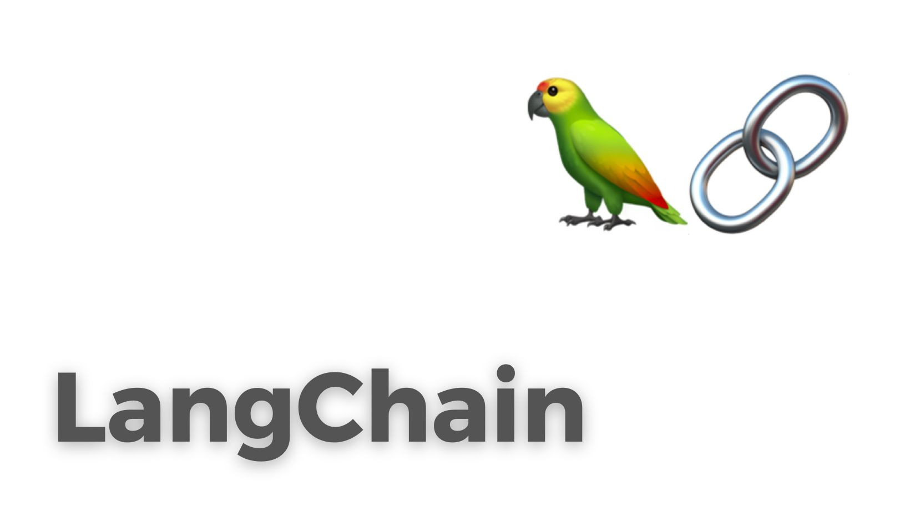
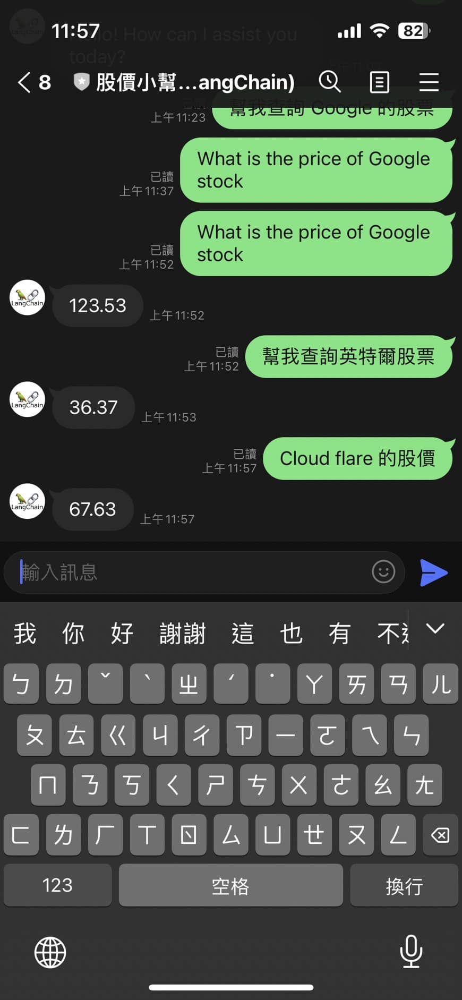

# 前提

透過 LLM （大型語言模型）的開發上，有許多很方便的工具可以幫助你快速地打造出 POC 。 這裡最知名的莫過於 [LangChain](https://github.com/hwchase17/langchain) ，除了支援眾多的大型語言模型之外，更支援許多小工具（類似: [Flowise](https://github.com/FlowiseAI/Flowise)) 。

本篇文章將介紹如何透過  [LangChain](https://github.com/hwchase17/langchain)  打造一個查詢股價 (stock price) 的小工具，並且提供一個可以快速打造的開源套件讓各位一起學習。




透過使用 LLM 的 LINE Bot： 你可以使用任何敘述公司的文字，來找尋公司股價。 比如說：

- 蘋果公司，甲骨文... 等中文公司名稱。
- 甚至從英文完全找不出股票代碼的公司，比如說: CloudFlare --> NET

### 開源套件參考這個 [https://github.com/kkdai/linebot-langchain](https://github.com/kkdai/linebot-langchain)


## 先來準備一個快速導入 Heroku 的 Python LINE Bot 套件

這邊有一些選擇方式：

- 你可以 Clone 這個 REPO [https://github.com/kkdai/linebot-langchain](https://github.com/kkdai/linebot-langchain)
- 或是直接部署到 [Heroku](https://dashboard.heroku.com/) 透過該網頁下面的 "Deploy" 按鈕（需要帳號)

如果是從頭開啟的專案，幾件事情需要注意：

- [app.json](https://github.com/kkdai/linebot-langchain/blob/master/app.json)

  - 主要敘述設定的 build packs ，這裡主要注意兩個項目：
  - **"repository":**  記得填寫正確，如果你有 Clone 過去，記得改成你的。
  - 裡面有三個參數，請參考 [README](https://github.com/kkdai/linebot-langchain/blob/master/README.md) 即可，有一個比較雷的地方是。
    -   [LangChain](https://github.com/hwchase17/langchain) 只支援系統參數 `OPENAI_API_KEY` 你設定成其他文字都會讀不到爆掉！
    -   [LangChain](https://github.com/hwchase17/langchain) 只支援系統參數 `OPENAI_API_KEY` 你設定成其他文字都會讀不到爆掉！
    -   [LangChain](https://github.com/hwchase17/langchain) 只支援系統參數 `OPENAI_API_KEY` 你設定成其他文字都會讀不到爆掉！
- [Profile](https://github.com/kkdai/linebot-langchain/blob/master/Procfile):
  - 這個不用改，記得使用 `web: uvicorn main:app --host=0.0.0.0 --port=${PORT:-5000}` 。
  - 如果你主程式 `main.py` 有改名字的話，記得跟著改。

- [requirements.txt](https://github.com/kkdai/linebot-langchain/blob/master/requirements.txt)
  - 這個不用改，照抄過去就好。

- [runtime.txt](https://github.com/kkdai/linebot-langchain/blob/master/runtime.txt)
  - 設定 [Heroku](https://dashboard.heroku.com/) 運行 Python 的版本，這邊建議使用 3.10.11 比較穩定。 不建議使用最新版本 3.11 (聽社群說很雷)


以上，雖然 [Heroku](https://dashboard.heroku.com/)  是一個需要付費的公司。但是要改到 [Render](http://render.com/) 應該也是沒問題。 不過能快速協助 deploy，又有穩定的伺服器很重要。


# 如果只是要接 OpenAI 在 LINE Bot 上的話

其實相對程式碼是比較簡單的，不過只有最簡單的串接功能。這邊稍微列出一下：

```python
import os
import openai

from dotenv import load_dotenv, find_dotenv
_ = load_dotenv(find_dotenv())  # read local .env file
openai.api_key = os.environ['OPENAI_API_KEY']


# A demo code how to call OpenAI completion
def get_completion(prompt, model="gpt-3.5-turbo"):
    messages = [{"role": "user", "content": prompt}]
    response = openai.ChatCompletion.create(
        model=model,
        messages=messages,
        temperature=0,
    )
    return response.choices[0].message["content"]
```

之後再來把 `get_completion(event.message.text)` 就可以。


# 來打造第一個 LangChain + LINE Bot 的範例： 記憶力

常聽到有人詢問， LangChain 到底有什麼方便的地方。我們先透過以下的範例來說明吧，以下透過相關程式碼。可以快速打造一個具有「記憶力」的聊天機器人。並且可以把你之前問題記住。

## 在 OpenAI API 該怎麼打造？

最常需要開發的，就是類似功能。但是原本 OpenAI 狀況下，這樣開發有點複雜。

- User: Hi, I am John.  
  - AI: Hello, John.
- User: what is 1+1?  
  - AI: 2.
- User: What is my name?
  - AI: I am sorry, you need to provide more detail.

由於 OpenAI 每次呼叫 API 給他，其實都是嶄新的聊天視窗。 想要做成像是 ChatGPT 這種方式可能就需要有「記憶力」，在 OpenAI 的 API 中其實需要使用 [Chat Completion](https://platform.openai.com/docs/api-reference/chat/create)，而且需要，每一筆慢慢填進去:

```json
{
  "model": "gpt-3.5-turbo",
  "messages": [
  {"role": "system", "content": "You are a helpful assistant."},
  {"role": "user", "content": "Hello!"}]
}

```

是不是很麻煩？ 

## 使用 LangChain 的 ConversationBufferWindowMemory

這裡有[完整程式碼](https://gist.github.com/kkdai/a99e1a78906a4c1eaac1fea1f440aa98)，我只列出重要的部分：

```python
# Langchain 串接 OpenAI ，這裡 model 可以先選 gpt-3.5-turbo
llm = ChatOpenAI(temperature=0.9, model='gpt-3.5-turbo')

# 透過 ConversationBufferWindowMemory 快速打造一個具有「記憶力」的聊天機器人，可以記住至少五回。
# 通常來說 5 回還蠻夠的
memory = ConversationBufferWindowMemory(k=5)
conversation = ConversationChain(
    llm=llm,
    memory=memory,
    verbose=False
)

@app.post("/callback")
async def handle_callback(request: Request):
    signature = request.headers['X-Line-Signature']

   ......
   
    for event in events:
        if not isinstance(event, MessageEvent):
            continue
        if not isinstance(event.message, TextMessage):
            continue

        # 將使用者傳來的訊息 event.message.text 當成輸入，等 LangChain 傳回結果。
        ret = conversation.predict(input=event.message.text)
```


# 結語

