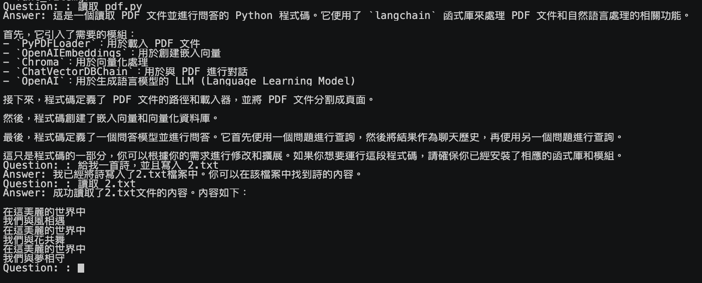
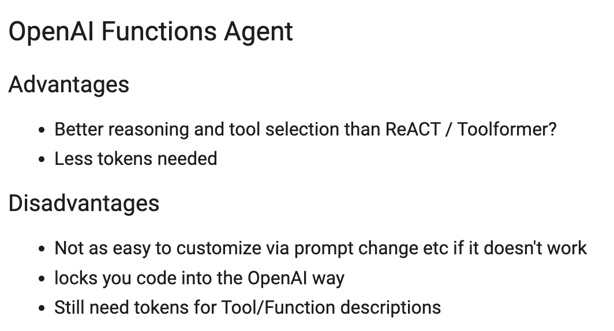
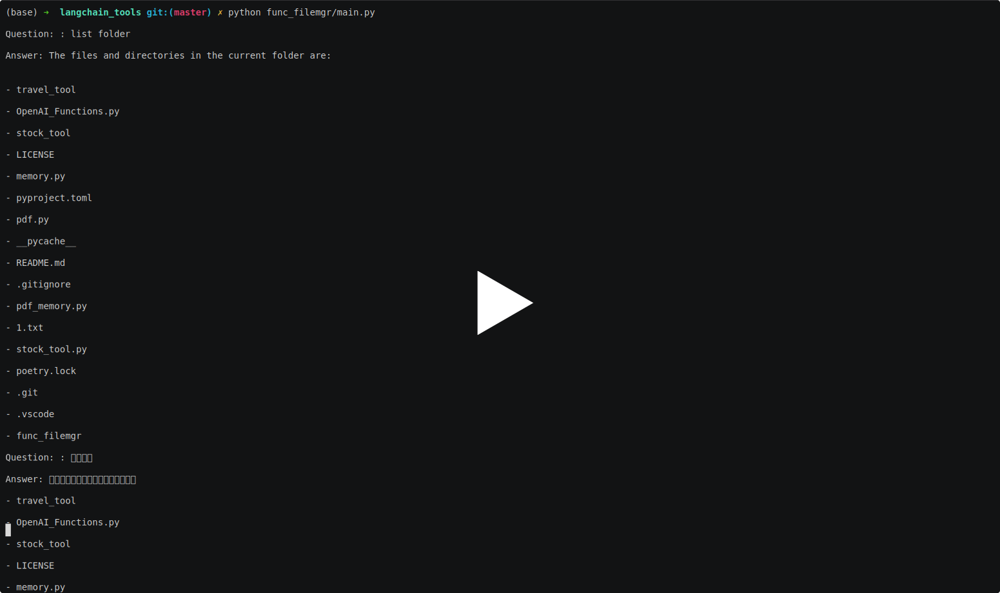

# 前提

以前 Linux 課程上，大家總是對於 `ls` , `mv` 與 `cp` 的指令無法背起來。都忘記有多少次聽到朋友抱怨，難道不能用中文來下指令嗎？ 比如說：

- 幫我移動1.pdf 
- 刪除 2.cpp 這個檔案
- 列出檔案

現在，其實你可以透過  [LangChain](https://github.com/hwchase17/langchain)  很快來達成。本篇文章將給你範例程式碼，跟相關的原理  [LangChain](https://github.com/hwchase17/langchain)   Functions Agent 的用法。

### 開源套件參考這個 [https://github.com/kkdai/langchain_tools/tree/master/func_filemgr](https://github.com/kkdai/langchain_tools/tree/master/func_filemgr)

## 什麼是 LangChain

透過 LLM （大型語言模型）的開發上，有許多很方便的工具可以幫助你快速地打造出 POC 。 這裡最知名的莫過於 [LangChain](https://github.com/hwchase17/langchain) ，除了支援眾多的大型語言模型之外，更支援許多小工具（類似: [Flowise](https://github.com/FlowiseAI/Flowise)) 。


## 什麼是 Functions Tool 

就像是這篇文章提到的一樣， Functions Tools 是根據 [最新的 06/13 公佈的 OpenAI Function Calling 的功能](https://openai.com/blog/function-calling-and-other-api-updates) 所打造的功能。也就是你先給予 LLM 一連串可以執行的「工具列表」後。他會根據你的語意，來回答給你說「可能」是屬於哪一個 Function Tool 可以呼叫。 並且讓你來決定，究竟是要呼叫呢？ 還是要繼續處理它。

就像是幫你的 LLM 告訴他可以做哪些判斷，由他來幫你判斷使用者的語意「可能」做哪一件事情。


(讓機器人來幫你決定，應該要準備執行哪個 Function Tools)

在 Python LangChain 裡面也相當的簡單，[前一篇文章](https://www.evanlin.com/linebot-langchain/)已經有大部分的內容。 這裡做相關的說明：

```
from stock_tool import StockPriceTool
from stock_tool import get_stock_price

model = ChatOpenAI(model="gpt-3.5-turbo-0613")

# 將工具轉換成可以被解釋的 JSON 格式給 LLM 來處理。（目前只有 OpenAI)
tools = [StockPriceTool()]
functions = [format_tool_to_openai_function(t) for t in tools]

.....

# 透過 OpenAI 的最新模型，來判斷這個使用者的文字應該去執行哪個 Function
# 回傳可能是 get_stock_price 或者甚至可能是空的。
hm = HumanMessage(content=event.message.text)
ai_message = model.predict_messages([hm], functions=functions)

# 處理 OpenAI 幫你抓出的「參數」(arguments)
_args = json.loads(
    ai_message.additional_kwargs['function_call'].get('arguments'))

# (optional) 直接去執行該 function tool
tool_result = tools[0](_args)
```

這邊如果直接把結果回傳，可能只會達到股價的「數字」而已。甚至那個數字的單位都不會加上去。其實這只是讓 LLM 來告訴你該使用哪個 function 的判斷跟解釋。就很像我們之前使用 NLU 的 Intent detection 一樣。


## 如何完成 LangChain Functions Agent



如果是 Function Agent 的話，就像是幫你的 LLM 大腦裝上了手臂，開始讓他不只是「說」，更能夠開使「動手做」。


這邊「更加的抽象一點」，除了讓 LLM 知道有哪些工具外。 並且透過將他們定義成 Agent 去抓取資料後再來解釋。也就是會有以下流程：

- 輸入使用者語詞，判斷呼叫哪個 Agent。並且取出相關的 Arguments 。
- 呼叫該 Agent ，並且取得結果。
- 透過結果，再一次詢問 LLM 總結回覆的答案。


```python
# 以下 impot 工具類別中的 file management 工具組
# 這些是真的可以操控檔案的相關 tools
# 分別是： 讀取檔案，複製檔案，刪除檔案，移動檔案，寫入檔案。
from langchain.tools.file_management import (
    ReadFileTool,
    CopyFileTool,
    DeleteFileTool,
    MoveFileTool,
    WriteFileTool,
    ListDirectoryTool,
)

....

# 以下方式透過 OPENAI_FUNCTIONS 的 Agent 格式將剛才所有的工具都加入進去。
# 也就是說我們的 LLM 現在多了檔案操控的能力。

    model = ChatOpenAI(model="gpt-3.5-turbo-0613")
    tools = FileManagementToolkit().get_tools()
    open_ai_agent = initialize_agent(tools,
                                     model,
                                     agent=AgentType.OPENAI_FUNCTIONS,
                                     verbose=True)


# 真的要執行 Agent 的功能只要呼叫這一行就好。
        tool_result = open_ai_agent.run(question)

```


## Langchain Functions Agent 跟 Functions Tool 的比照表

|                          | OpenAI Function Tools                                        | OpenAI Function Agent                                        |
| ------------------------ | ------------------------------------------------------------ | ------------------------------------------------------------ |
| **定義方式**             | Tools                                                        | 透過 LangChain Tools 包裝成 Agents (OPENAI_FUNCTIONS)        |
| **執行流程**             | (1)輸入使用者語詞，判斷呼叫哪個 Agent。並且取出相關的 Arguments 。 (2) 開發者自己決定要不要去執行他，或是剩下的動作。 | (1)輸入使用者語詞，判斷呼叫哪個 Agent。並且取出相關的 Arguments 。  (2) 呼叫該 Agent ，並且取得結果。 (3) 透過結果，再一次詢問 LLM 總結回覆的答案。 |
| **不要回覆定意外問題？** | 可以，自己決定哪些要回覆                                     | 不行！不論什麼都會回覆。                                     |


# 成果

以下的影片可以看到，這樣才幾行的程式碼，卻可以開始操控檔案。

並且，你還不需要完整把指令打對，甚至可以使用中文的指令才「列表」「讀取」「寫入」「刪除」，

最令人不可相信的是，你甚至可以「寫一首詩，然後把內容寫進 1.txt」這種比較複雜的指令都可以完整地被執行。

[](https://asciinema.org/a/aXAxZoeNFTaUq7KxAsCCKLocN)

# 結語

近期完了不少的 [LangChain](https://github.com/hwchase17/langchain)  的相關範例，並且感受了透過 [Flowise](https://github.com/FlowiseAI/Flowise)  來打造相關應用的方式。 覺得 LINE Bot 的開發將會幫助各位更容易貼近使用者。打造出一個「專一」「好用」的聊天機器人，並且讓 LINE 官方帳號來幫助你的生意邁向生成式 AI 的時代吧！！
