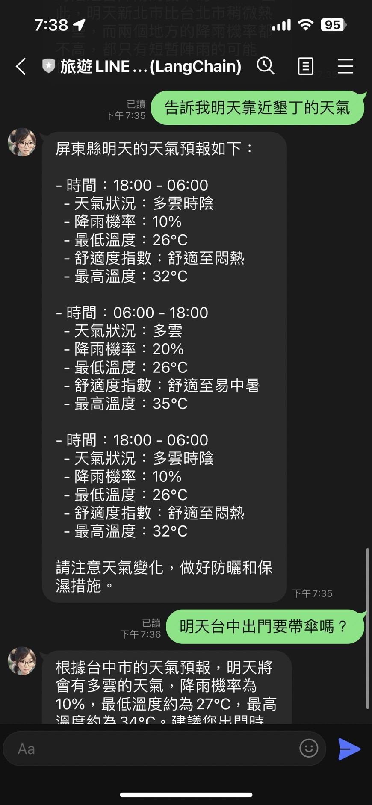

# 前提

接下來，我們將介紹如何透過 LangChain 來打造一些實用的 LINE Bot 。第一個我們先透過旅遊小幫手的概念，來幫大家串接關於氣象的 LangChain Function Agent吧。

本篇文章將要帶給各位一些概念：

- 如何用 LangChain 來串接 中央氣象局的 Open API Data
- 如何在 LLM 的對話中來處理一些特別數值的輸入。
- 如何活用 LLM 對話的聰明性，來活用 LangChain Function Agent 。

這裡也列出一系列，我有撰寫關於 LangChain 的學習文章：

- [[學習心得][Python] 透過 LangChain 來處理特殊的中央氣象局資料]()

- [[學習心得\][Python] 透過 LangChain 的 Functions Agent 達成用中文來操控資料夾](https://www.evanlin.com/langchain-function-agent/)
- [[學習心得\][Python] 透過 LangChain 打造一個股價查詢 LINEBot - 股價小幫手](https://www.evanlin.com/linebot-langchain/)[](https://www.evanlin.com/langchain-function-agent/)

## 直接看如何使用程式碼 [https://github.com/kkdai/langchain_tools/blob/master/travel_tool/](https://github.com/kkdai/langchain_tools/blob/master/travel_tool/)

# 如何用 LangChain 來串接 中央氣象局的 Open API Data

要申請中央氣象局 OpenAPI Data ，依照以下流程:

- 到[官方網站](https://opendata.cwb.gov.tw/userLogin)註冊
- 註冊之後，透過[取得授權碼](https://opendata.cwb.gov.tw/user/authkey)。
- 透過官方 [OpenAPI 頁面](https://opendata.cwb.gov.tw/dist/opendata-swagger.html#/%E9%A0%90%E5%A0%B1/get_v1_rest_datastore_F_C0032_001)，來使用 （其實只要用一般天氣預報（全地區）就足夠了）


接下來來透過 ChatGPT 來協助撰寫相關資料：

- 透過 Execute 結果中的 CURL `

```bash
  curl -X 'GET' \
    'https://opendata.cwb.gov.tw/api/v1/rest/datastore/F-C0032-001?Authorization=你的授權碼' \
    -H 'accept: application/json'
```

- 然後去ChatGPT 問說，就可以取得 get_weather_data ，這邊記住我們只有使用地點。原因如下：

  - 雖然會傳回未來三天的氣象資料，但是 LLM 可以幫我們整理，並且篩選。
  - 三天的資料也可以幫助我們來處理更多詢問，不需要再查詢的時候就修改。

  ```python
  def get_weather_data(location_name=None):
  
      url = 'https://opendata.cwb.gov.tw/api/v1/rest/datastore/F-C0032-001'
  
      headers = {'accept': 'application/json'}
  
      query = {
          'Authorization': cwb_token}
  
      if location_name is not None:
          query['locationName'] = location_name
  
      response = requests.get(url, headers=headers, params=query)
  
      if response.status_code == 200:
          return response.json()
      else:
          return response.status_code
  ```

## 轉換成 LangChain Function Agent

參考之前其他的 Tool Agent 的寫法，可以很快速改成以下方式。

```python
cwb_token = os.getenv('CWB_TOKEN', None)

# From CWB API
# https://opendata.cwb.gov.tw/dist/opendata-swagger.html#/%E9%A0%90%E5%A0%B1/get_v1_rest_datastore_F_C0032_001
class WeatherDataInput(BaseModel):
    """Get weather data input parameters."""
    location_name: str = Field(...,
                               description="The cities in Taiwan.")


class WeatherDataTool(BaseTool):
    name = "get_weather_data"
    description = "Get the weather data for Taiwan"

    def _run(self,  location_name: str):
        weather_data_results = get_weather_data(
            location_name)

        return weather_data_results

    def _arun(self, location_name: str):
        raise NotImplementedError("This tool does not support async")

    args_schema: Optional[Type[BaseModel]] = WeatherDataInput
```

# 如何在 LLM 的對話中來處理一些特別數值的輸入。

如果你依照以上的方式來寫，你會發現你執行天氣的結果都會失敗。尤其是查詢台北市的天氣。如果回去看原來的 Open API Spec 


誒？！ 原來是固定輸入的資料，而且資料名稱用「臺北市」？！那該怎麼辦呢？

你不能要求每次叫使用者輸入「臺北市」，更不要自己去改那些輸入。（那就太不 LLM 了）。那該如何處理呢？

## 讓 LLM 了解你的輸入範圍，並且知道該如何調整。

既然知道，地址只能輸入一個區間的資料。並且有限定的「用字」（也就是 臺) 。其實可以透過 Function 的敘述來讓 LLM (OpenAI) 來讀懂。

```
location_name: str = Field(...,
                           description="The cities in Taiwan, it must be one of following 臺北市, 新北市, 臺中市, 臺南市, 雲林縣, 南投縣, 屏東縣, 嘉義市, 嘉義縣")

```

只要透過對於 Argument 的敘述更加的細膩，LLM(OpenAI) 就會讀懂他的含義來幫你解決。比如說這樣的敘述：

- 台北市 --> 就會輸入 「臺北市」（同理台中)
- 墾丁 --> 因為不在裡面，他會猜測墾丁可能在屏東縣附近。就會輸入「屏東縣」。

這樣是不是我們需要的呢？


# 如何活用 LLM 對話的聰明性，來活用 LangChain Function Agent 。

 

這邊用以上兩個截圖給各位一些想法，也證實了透過 LLM 是可以很強大的來讓你的聊天機器人更聰明。

- `明天台北市跟新北市白天哪裡比較容易下雨`:
  - 這會呼叫兩次，一次查「臺北市」另外一次查「新北市」的氣象資訊。然後 LLM 會幫你整理相關資訊，並且比較裡面的「降雨機率」。
  - 同理也可以知道哪裡溫度比較高。
- `告訴我明天靠近墾丁的天氣`:
  - 這會去查詢「屏東縣」的資料。
- `明天台北需要帶傘嗎？`:
  - 這就是 LLM 最聰明的事情，以前還需要透過 NLU 的處理方式。現在都不需要了，直接知道你要找氣象局。並且幫你分析究竟需不需要帶傘。


# 結語

還記得 2018 年，在 [iThome 演講的題目裡面](https://www.slideshare.net/EvansLin/modern-web-2016-using-golang-to-build-a-smart-im-bot)就有提到，Intent 跟 Entity 的重要性。也表示不論那時候多麼先進的 NLU 引擎都很難處理許多內容。但是 2022 年的年底，自從 OpenAI 的模型公開後，我們就發現了許多嶄新的應用。更加上許多殺手型的運用（Function Calling) 看來讓許多的開發者可以換了新的腦袋來思考問題。

