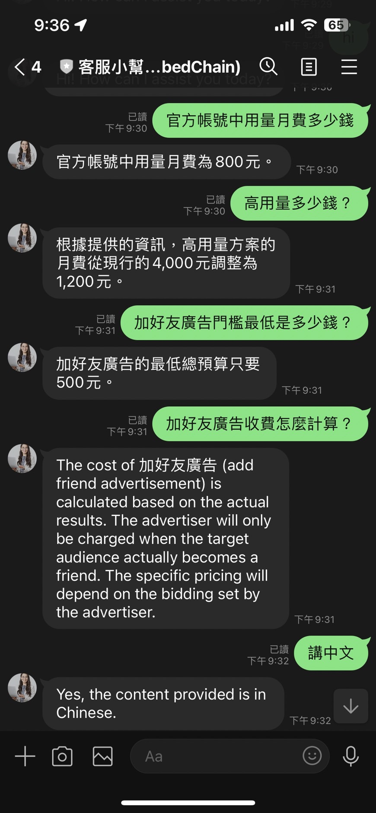
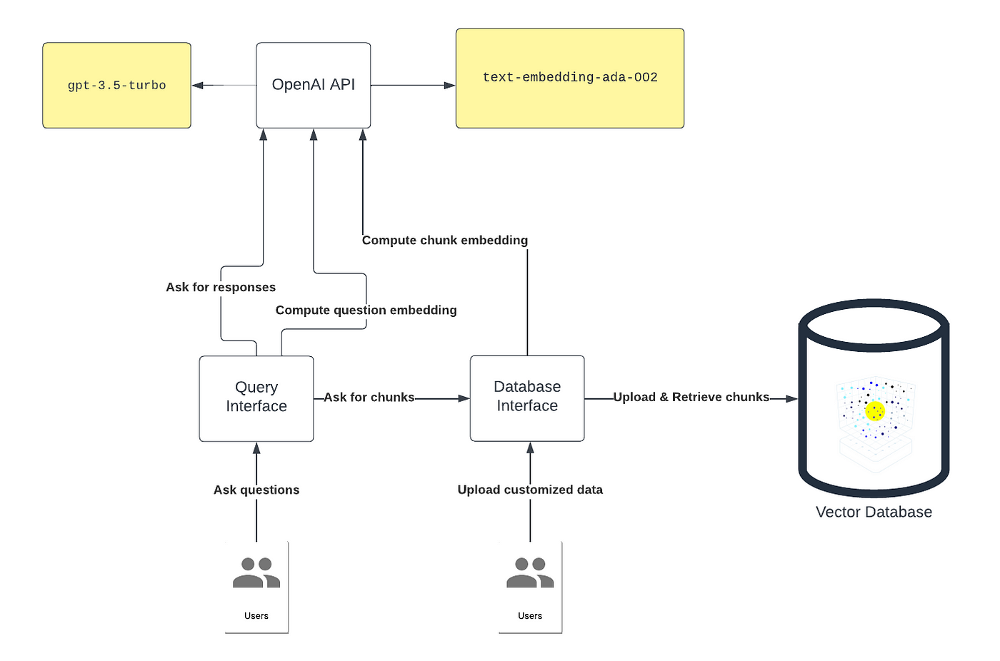
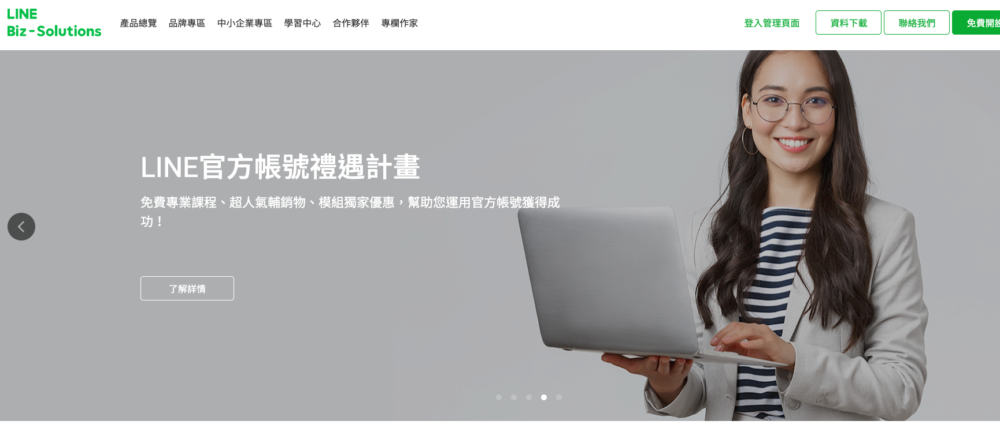

透過這個 [EmbedChain](https://github.com/embedchain/embedchain) 可以抓取許多種資料，這個圖片是測試他去抓取 「[2023年LINE官方帳號方案價格調整，重點一次掌握](https://tw.linebiz.com/column/LINEOA-2023-Price-Plan/?filter-scale=brand-customers)」網頁上的資料來回覆給使用者。

- **官方帳號在哪一天調整價錢？** 官方帳號價格將在 2023 年 9 月 1 日調整。
- **中用量方案的價格？** 中用量方案的價格是每月 800 元。

# 前提

許多人都想要打造出客服聊天機器人 LINE Bot ，但是透過 NLU 來打造客服 LINE Bot 其實成本很高。這裡會推薦給各位透過 LangChain  加上 EmbedChain 這個套件，可以打造低成本與簡易版本的客服 LINE Bot 。 本篇文章將快速告訴各位，如何透過 [EmbedChain](https://github.com/embedchain/embedchain) 來打造

這裡也列出一系列，我有撰寫關於 LangChain 的學習文章：

- [[學習心得][Python] 透過 LangChain 來處理特殊的中央氣象局資料]()

- [[學習心得\][Python] 透過 LangChain 的 Functions Agent 達成用中文來操控資料夾](https://www.evanlin.com/langchain-function-agent/)
- [[學習心得\][Python] 透過 LangChain 打造一個股價查詢 LINEBot - 股價小幫手](https://www.evanlin.com/linebot-langchain/)

#  EmbedChain 解決了那些問題

先預設本篇文章讀者，已經是懂的使用 LLM (Large Language Model) 來打造客服機器人。之前你需要先建立客服機器人的參考資料庫，（因為大部分 LLM (e.g. OpenAI) ) 不知道如何回覆你的問題。

需要的架構可以這裡參考文章 [Enhancing ChatGPT With Infinite External Memory Using Vector Database and ChatGPT Retrieval Plugin](https://betterprogramming.pub/enhancing-chatgpt-with-infinite-external-memory-using-vector-database-and-chatgpt-retrieval-plugin-b6f4ea16ab8)



如上圖，快速整理架構如下：

- 需要把客服文件透過切割成一群群的文字區塊
- 將文字區塊透過 Embedding 技術放入 LLM 的向量空間，暫存在 Vector Database。 （會變成一個很長的數字陣列 e.g. {{1212,121213123,1232312,12312,213434,}{123123,....}}
- 客戶詢問問題的時候，也去針對他的問題切割後作成 Embedding 。並且找尋最接近的文件。
- 將文件區塊給 LLM 整理後回覆給客戶。

即便你使用了 LangChain 來包裝整個架構，你還是會遇到相關問題：

- 選擇 [Vector Store](https://api.python.langchain.com/en/latest/modules/vectorstores.html)
- 打造不同文件的 Document Loader
  - [PDF Loader](https://python.langchain.com/docs/modules/data_connection/document_loaders/how_to/pdf)
  - Web loader 這邊複雜一點，需要透過 [BeatifulSoup 爬下網頁，抓取需要的內容](https://github.com/embedchain/embedchain/blob/main/embedchain/loaders/web_page.py)。
  - 如果是 [YouTube 也是很複雜： 找出字幕 -> 抓下來](https://github.com/embedchain/embedchain/blob/main/embedchain/loaders/youtube_video.py) 
- 將文字切割過後放入 Embedding 。

那有方式可以更快速解決這樣的架構問題嗎？ 接下來就要跟大家   [EmbedChain](https://github.com/embedchain/embedchain)  。

# 如何透過 EmbedChain 打造客服 LINE Bot

這裡列出幾個簡單流程：

- 準備打造客服 LINE Bot需要的素材
- 建立 EmbedChain LINE Bot
- 測試與調整

以下我們將透過  [EmbedChain](https://github.com/embedchain/embedchain)  來打造一個回覆 LINE Biz-Solution 基本資訊的客服機器人。



(資料來源： [LINE Biz-Solution](https://tw.linebiz.com/))

## 準備打造客服 LINE Bot需要的素材

這裡列出一些經常被詢問的問題網頁：

-  [2023年LINE官方帳號方案價格調整，重點一次掌握](https://tw.linebiz.com/column/LINEOA-2023-Price-Plan/?filter-scale=brand-customers)

-  [善用官方帳號「漸進式訊息」範本，輕鬆完成客製化訊息，讓好友離不開你！](https://tw.linebiz.com/column/stepmessage/?filter-category=service-information)

-  [1+1>2，用LAP廣告放大你的LINE官方帳號優勢](https://tw.linebiz.com/column/LAP-Maximize-OA-Strategy/)


##  建立 EmbedChain LINE Bot

使用上也很簡單:

1. 安裝  [EmbedChain](https://github.com/embedchain/embedchain) 
   `pip install embedchain`

2. 加上相關程式碼
   ```
   from embedchain import App
   
   naval_chat_bot = App()
   
   # Embed Online Resources 將 LINEBiz 內容放進去
   naval_chat_bot.add("web_page", "https://tw.linebiz.com/column/LINEOA-2023-Price-Plan/")
   naval_chat_bot.add("web_page", "https://tw.linebiz.com/column/stepmessage/")
   naval_chat_bot.add("web_page", "https://tw.linebiz.com/column/LAP-Maximize-OA-Strategy/")
   
   # Embed Local Resources
   naval_chat_bot.add_local("qna_pair", ("Who is Naval Ravikant?", "Naval Ravikant is an Indian-American entrepreneur and investor."))
   
   naval_chat_bot.query("What unique capacity does Naval argue humans possess when it comes to understanding explanations or concepts?")
   # answer: Naval argues that humans possess the unique capacity to understand explanations or concepts to the maximum extent possible in this physical reality.
   ```

## 測試與調整

 目前測試下來發現的問題還不少：

- 常常跑出英文
- 容易跑出不知道答案在哪裡

# 結語

用  [EmbedChain](https://github.com/embedchain/embedchain)   來打造客服機器人算是可以達成 POC 概念的呈現，但是如果要正式上線的話，建議還是要透過 [LangChain](https://github.com/hwchase17/langchain) 來透過 vector stores 加上 Embedding 來打造（其實也是他裡面的方式）。這邊有更多的資訊，會再慢慢更新上來。
