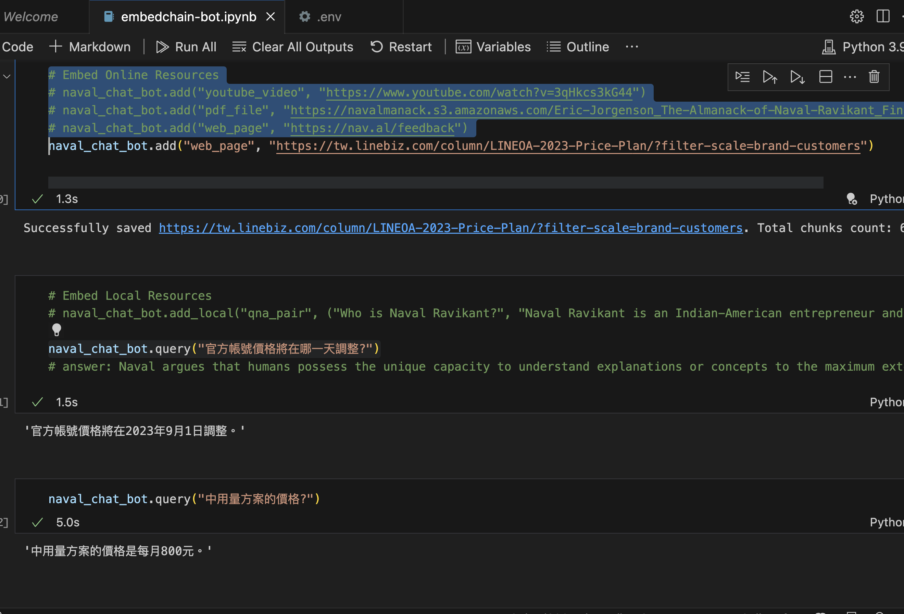

透過這個 [EmbedChain](https://github.com/embedchain/embedchain) 可以抓取許多種資料，這個圖片是測試他去抓取 「[2023年LINE官方帳號方案價格調整，重點一次掌握](https://tw.linebiz.com/column/LINEOA-2023-Price-Plan/?filter-scale=brand-customers)」網頁上的資料來回覆給使用者。

- **官方帳號在哪一天調整價錢？** 官方帳號價格將在 2023 年 9 月 1 日調整。
- **中用量方案的價格？** 中用量方案的價格是每月 800 元。

# 前提

許多人都想要打造出客服聊天機器人 LINE Bot ，但是透過 NLU 來打造客服 LINE Bot 其實成本很高。這裡會推薦給各位透過 LangChain + EmbedChain 這個套件，可以打造低成本與簡易版本的客服 LINE Bot 。

這裡也列出一系列，我有撰寫關於 LangChain 的學習文章：

- [[學習心得][Python] 透過 LangChain 來處理特殊的中央氣象局資料]()

- [[學習心得\][Python] 透過 LangChain 的 Functions Agent 達成用中文來操控資料夾](https://www.evanlin.com/langchain-function-agent/)
- [[學習心得\][Python] 透過 LangChain 打造一個股價查詢 LINEBot - 股價小幫手](https://www.evanlin.com/linebot-langchain/)

# 如何透過 EmbedChain 打造客服 LINE Bot

這裡列出幾個簡單流程：

- 準備打造客服 LINE Bot需要的素材
- 建立 EmbedChain LINE Bot
- 測試與調整

## 準備打造客服 LINE Bot需要的素材

## 直接看如何使用程式碼 

[https://github.com/embedchain/embedchain](https://github.com/embedchain/embedchain)

# 

# 結語

