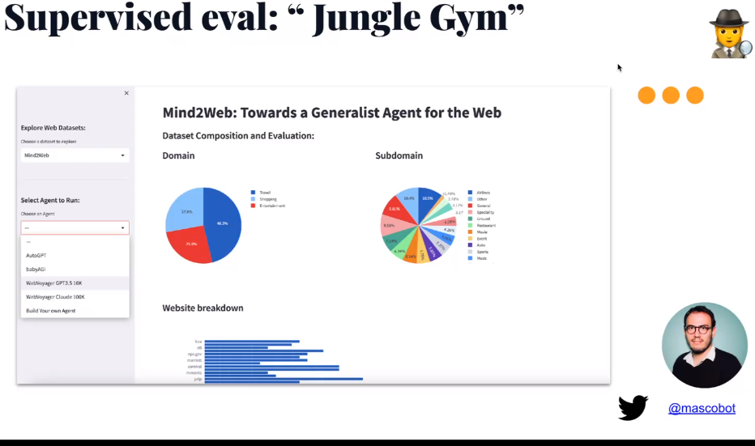

Weblink: [https://www.crowdcast.io/c/m2ooh0uy9syg]( https://www.crowdcast.io/c/m2ooh0uy9syg)

## Speak1: Swyx - smol developer

https://docs.google.com/presentation/d/1d5N3YqjSJwhioFT-edmyjxGsPBCMb1uZg0Zs5Ju673k/edit#slide=id.g254e571859c_0_133

**Article:**

- https://stratechery.com/2018/techs-two-philosophies/
- https://www.latent.space/p/agents
- https://lilianweng.github.io/posts/2023-06-23-agent/

## Speaker2:  Alex - Agent Eval

https://docs.google.com/presentation/d/1bo5uxaS4JMNt99VmsRdeTFLo9qSIByJiViIVakzF9NQ/edit#slide=id.g22b104eecb9_0_2

- 很難 debug agent failure:
  - failure token
  - CAPCHA 

- 三種 Evaluation 方式

- 抓下一堆 dataset

- Alex: [https://twitter.com/alexreibman](https://twitter.com/alexreibman)
- Gurkaran: [https://twitter.com/aigsingh](https://twitter.com/aigsingh)
- dare: [https://twitter.com/dariusemrani](https://twitter.com/dariusemrani)
- Jesse Hu <https://twitter.com/huyouare>

## Q&A

1. What is the most affordable (free, local?) LLM for specific Agent Executor / 
   Agent task like decision making, tool selection...?
   - Mpt7b

2. In my experience, the OpenAI functions work really well in deciding what tool(s) to use even in multi-step scenarios. Do you think that a train-of-thought process is used behind the scenes, like ReACT or MLKR? And how useful are they now?
   1. 可以考慮看看 few shot

# 其他

## Agent Hackathon

https://lablab.ai/event/ai-agents-hackathon

## AgentEval  (第一名)

<iframe width="560" height="315" src="https://www.youtube.com/embed/sjEMBY3Ngbk" title="YouTube video player" frameborder="0" allow="accelerometer; autoplay; clipboard-write; encrypted-media; gyroscope; picture-in-picture; web-share" allowfullscreen></iframe>

## 最後有 OpenAI CEO 演講

<iframe width="560" height="315" src="https://www.youtube.com/embed/tGe6syxT4C4" title="YouTube video player" frameborder="0" allow="accelerometer; autoplay; clipboard-write; encrypted-media; gyroscope; picture-in-picture; web-share" allowfullscreen></iframe>

