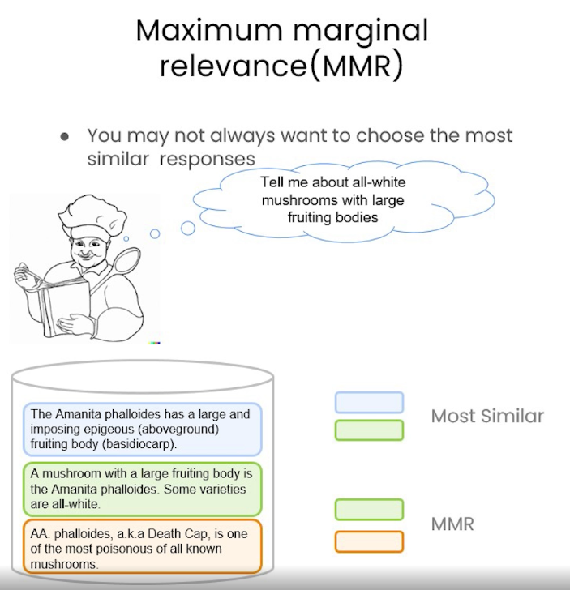

# 前提：

之前在 DeepLearning.ai 開放新的課程「[LangChain Chat with Your Data](https://learn.deeplearning.ai/langchain-chat-with-your-data)」，裡面有許多相當實用的案例分享。這裡要分享一個關於容易誤解的問題。 


## 案例一： 追求過於近似，但是卻忘記重要訊息的搜尋法


這裡有載入四份文件，你有發現他故意重讀檔案一兩次，意圖去讓資料不正確。


想要去查詢「是否有關於 Regression 資料在“第三章”」的時候，由於資料混亂。也會傳回第一章的結果，因為就是有混亂的問題。造成他無法注意“第三章”，而是只注意到 "regression"  這個字。



這時候要使用 "Maximum Marginal Relevance (MMR)" 的方式來尋找資料，而不要找最接近的資料。

```
vectordb.max_marginal_relevance_search(query,k=2, fetch_k=3)
```


```query = "What is the bitcoin?"
query = "What is the bitcoin?"
vectordb.similarity_search(query, k=2, filter={"page": 1})
```

透過  `filter` 你可以去指定許多參數，從哪一份文件，從哪切割的內容，甚至是內容對照。


