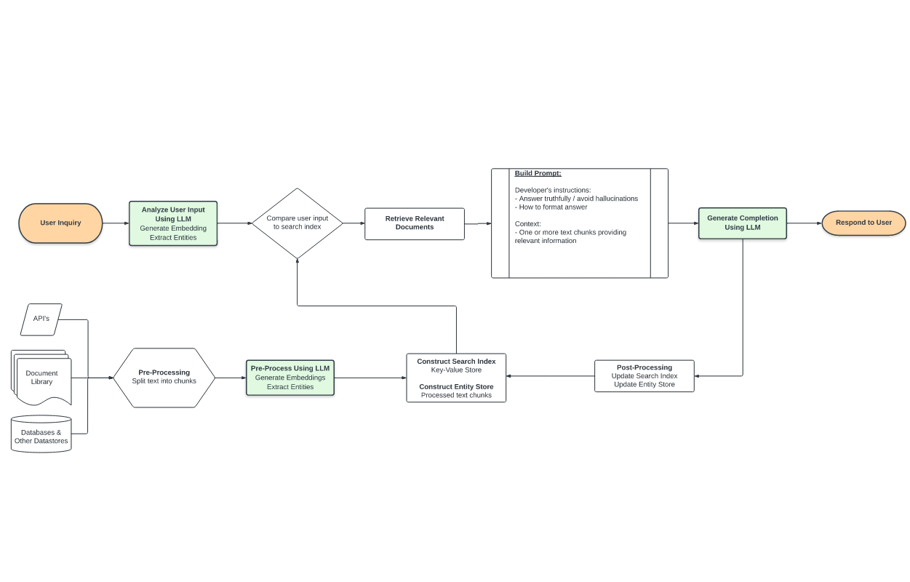
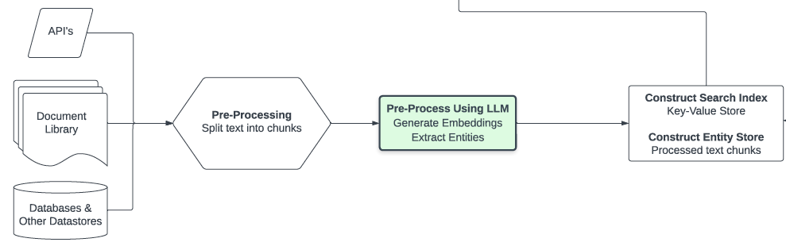
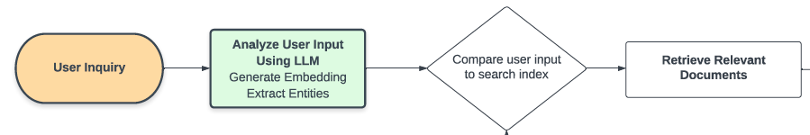

在網路上尋找關於 RAG 跟 LangChain 相關的文章，偶然發現這篇好文： [Knowledge Retrieval Architecture for LLM’s (2023)](https://mattboegner.com/knowledge-retrieval-architecture-for-llms/)

# 摘要：

這一篇專門在講怎麼做一個 LLM Retrieval Architecture (中文不太會翻 XD)
從最簡單的 [OpenAI Cookbook repo](https://github.com/openai/openai-cookbook/blob/main/examples/Question_answering_using_embeddings.ipynb?ref=mattboegner.com) 到， RAG, RETRO 到 REALM 架構都有提到。

也有提出之前資料假象的問題，找了兩篇論文來討論 [HyDE](https://arxiv.org/abs/2212.10496?ref=mattboegner.com) 跟 [GenREAD](https://arxiv.org/abs/2209.10063?ref=mattboegner.com) 。

# 詳細解釋

## 查詢大型資料的問題：

- 要小心 4000 token 的限制

- Token 越多，處理速度越慢。

## 解決方式

-  **(R: Retrieval)**（上圖）透過外部資料的導入
  - 許多外部資料， txt/pdf/API 透過切開來後透過 Embedding 放入某些向量空間的 Embedding Store 之中。

- （上圖）使用者問的問題，也透過 Embedding 來找到相關資料。 比如說： 問哪裡可以找到鍛鍊跟減肥的場地，就會跟健身房場地的「向量空間」相當的接近。
- **(A: Augment)** 增強：
  -  將相關內容，跟使用者的問題，一起放在 Prompt 中去詢問。但是為了讓提問的答案效果會更好，可能需要有相關增強的相關語句。比如說：
    - `請用中文回覆`
    - `請不要回覆你不知道的答案`
    - `必要時候，請給我追問語句`
  - 相關資料可以看： [OpenAI Cookbook repo](https://github.com/openai/openai-cookbook/blob/main/examples/Question_answering_using_embeddings.ipynb?ref=mattboegner.com) 
- **G: Generative) 生成:**
  - 就是把相關資料丟入 LLM 去生成解答。

# 優化設計

- 透過 [GPT Index](https://gpt-index.readthedocs.io/en/latest/guides/primer.html?ref=mattboegner.com) 來衡量你使用的 LLM 回覆。而且這種優化設計，

# 相關資料

-  [論文：HyDE](https://arxiv.org/abs/2212.10496?ref=mattboegner.com) 
- [論文：GenREAD](https://arxiv.org/abs/2209.10063?ref=mattboegner.com) 。
-  [OpenAI Cookbook repo](https://github.com/openai/openai-cookbook/blob/main/examples/Question_answering_using_embeddings.ipynb?ref=mattboegner.com) 
- [GPT指數](https://github.com/jerryjliu/gpt_index?ref=mattboegner.com)
- 用於語義搜索和其他 NLP 應用的[Haystack庫](https://docs.haystack.deepset.ai/docs/intro?ref=mattboegner.com)
- [知識密集型 NLP 任務的檢索增強生成](https://arxiv.org/abs/2005.11401?ref=mattboegner.com)
- [浪鏈](https://github.com/hwchase17/langchain?ref=mattboegner.com)
- [如何使用 GPT3、嵌入和數據集對文檔實施問答](https://simonwillison.net/2023/Jan/13/semantic-search-answers/?ref=mattboegner.com)
- [FAISS](https://github.com/facebookresearch/faiss?ref=mattboegner.com)用於向量相似度計算
- [生成而不是檢索：大型語言模型是強大的上下文生成器](https://arxiv.org/abs/2209.10063?ref=mattboegner.com)
- [實施代碼](https://github.com/wyu97/GenRead?ref=mattboegner.com)
