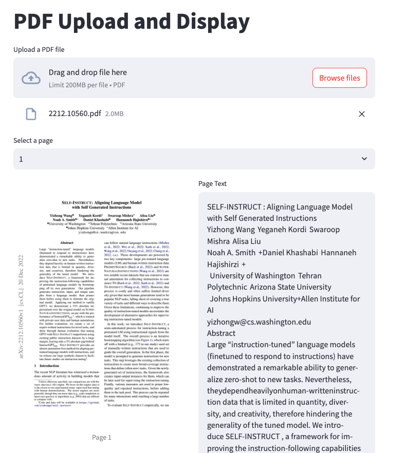

## 小專案 Online PDF Viewer and Parse Data compare： 

 - [https://github.com/kkdai/pdf_online_editor](https://github.com/kkdai/pdf_online_editor)
 - 比對你準備要導入的檔案，透過 PyPDF 

最近由於在弄 LangChain 花了很多時間在玩 Python ，不過很多東西之前沒注意過。這裡稍微筆記一下：

- [PyPDF2 有 CVE 問題](https://nvd.nist.gov/vuln/detail/CVE-2023-36464)，其實切回[PyPDF](https://github.com/py-pdf/pypdf)
- 可以用 `pip freeze` 跟 `pipreqs`搭配使用來打造 `requirements.txt`
- Heroku 可以透過 `Aptfile` 來達到安裝 apt get 套件的方式：
  - 導入 `"url": "heroku-community/apt"` buildpack
  - 加入 `Aptfile`  裡面放你需要的套件清單 (e.g. pyimage 需要  `poppler-utils`)
  - 參考: [How to add apt packages to Heroku](https://www.nikitakazakov.com/heroku-apt-packages)

