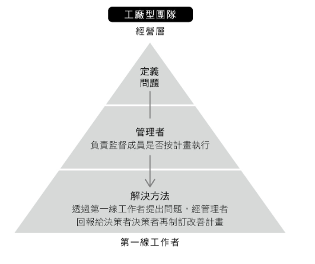
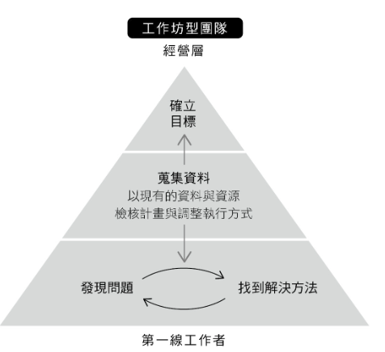

<div><a href="https://moo.im/a/jmMRSV" title="高效團隊都在用的奇蹟式提問"></a></div>


```
高效團隊都在用的奇蹟式提問
激發互動+建立心理安全感的最強提問公式，會議不沈默，討論不冷漠，每次協作都有成效
問いかけの作法 チームの魅力と才能を引き出す技術
 共 4 人評分
作者： 安齋勇樹  
譯者： 林佑純  
出版社：天下雜誌出版 
```

#### 買書推薦網址：

- Readmoo: [購買網址](https://moo.im/a/jmMRSV)

# 前言:

這是 2023 年第七本讀完的書。偶然間看到這本書，想到老闆每次跟我 1 on 1 的時候都會提醒我要透過有效率的提問方式來做到團隊管理的方式，就不自主想買下這本書。 日本書籍經常有的特典，就是又薄又經典，可以很快速了解重點。 很適合我閱讀效率。


# 內容摘要：

```
一個公式Ｘ四個原則，以引導取代領導，
扭轉討論發散、沉默、沒效率的無力感，
掌握有效提問點方法，激發最高生產力。

你在主持會議、帶領小組討論時，是否經常碰到這樣的窘境：
請大家發言，結果是一片恐怖的死寂；
徵詢意見，大家你看我、我看你，就是每一個開口；
明明在討論新企劃，最後卻變成產品檢討⋯⋯

發散、沒進度、沒想法，不只讓負責人壓力山大，更嚴重影響團隊生產力。
這一切都可以改變！你需要「奇蹟式提問」。

本書作者安齋勇樹服務超過三千家企業導入「奇蹟式提問」建立具備心理安全感基礎的強大團隊。他發現，組織成員對於所屬團體常有「沒人提出好點子」、「沒有團隊精神」的無力感，這種無力感一旦蔓延，往往導致個人和團體停滯成長。

他以心理學與組織管理學為基礎，結合實戰經驗，歸納出「奇蹟式提問」的技巧，無論是在主持會議、小組討論，或是一對一溝通，都能透過這個方法，提升與人連結的能力，強化團隊生產力。
```

## 從工廠團隊到工作坊形團隊

- 認知團隊潛力
- 溝通不良，誰的錯？
- **工廠型團隊：**
  - 主管導向
  - 從上到下
  - 依規定做事



- **工作坊型團隊：**
  - 從下到上
  - 自發性找尋問題，尋找解法
  - 經營層協助確定目標




- 動機： 參考這本書 [讀書心得-動機、單純的力量(DRIVE: The Surprising Truth About What Motivates Us)](https://www.evanlin.com/e8-ae-80-e6-9b-b8-e5-bf-83-e5-be-97-e5-8b-95-e6-a9-9f-e3-80-81-e5-96-ae-e7-b4-94-e7-9a-84-e5-8a-9b-e9-87-8fdrive-the-surprising-truth-about-what-motivates-us/)

```
這故事就是「三個砌磚工人」，在中世紀的某個歐洲小鎮，於建築工地有三名工人在工作。當被問到「你在做什麼呢？」時，各個工人分別如此回答：

第一個工人說：「我在堆磚頭。」
第二個工人說：「我在賺錢啊。」
第三個工人開朗地抬起頭來說：「我在建造本鎮將流傳後世的大教堂啊！」

```

來源：https://www.managertoday.com.tw/articles/view/59101?utm_source=copyshare 
©經理人


## 奇蹟提問的公式與原則

- 提問會引導回答：
  - **單純事件提問** -> 回想 
  - **一年前吃什麼** -> 搜尋資料
  - **有推薦的店家嗎？** --> 分享資訊
- **提問的四個原則：**
  - 尊重成員個性，不否定。
    - 為什麼這樣做？ --> 你這樣做想強調的是什麼？
    - 我明白了 --> 為什麼會這樣想？
  - 適度限制，給予思考空間。
    - 有什麼想法？ --> 目前專案中，什麼讓你覺得浪費時間？
  - 避免過度嚴肅，給人樂意回答。
    - 你有好主意嗎？ --> 如果要你拒絕提案，你的理由會是什麼？
  - 適度打破既定的規則。
    - 如何讓使用者更方便? --> 什麼樣的產品不太方便，但是你想擁有他？

## 提問公式：

### 觀察：

- 與會人士姿勢
- 為何特別在意某些內容？
- 根據哪些價值觀的發言？

### 組合：

- 會議中的角色
  - 提案型
  - 激勵型
  - 組織型
  - 共感型
- 結合問題三步驟：
  - 定義未知問題
  - 調整方向
  - 給予限制

### 提問

- 好提問，吸引注意力
  - 前情提要加提問
  - 共感突破武裝
    - 如果我們一起承擔風險，你想要選擇哪個方案？
  - 煽動情感
    - 我相信你的專業，想聽聽意見。
  - 留白空間：
    - 大家還記得今天會議主題嗎？ (停三秒)...... 今天會議是....
- 追蹤反饋：
  - 


# 心得:


