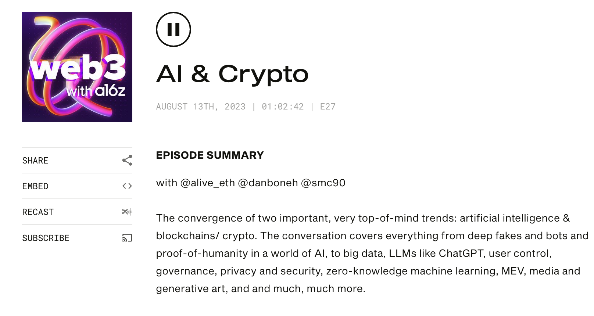

## 資料來源

中文翻譯新聞： [https://news.cnyes.com/news/id/5292495](https://news.cnyes.com/news/id/5292495 ) 

原文來自 [podcast](https://web3-with-a16z.simplecast.com/episodes/ai-crypto-centralization-decentralization) 是前 Google Tensorflow 核心開發者之一 - Ali Yahya，很推薦聽 。

## 想法

裡面提到一些想法蠻有趣的，透過四個面向來講解未來商機： （相互排斥，現狀挑戰，如何合作形成新的商業模式，AI與社交圖譜)
我挑幾個有趣的提出

1. 透過 zk 加密的方式 ([ZKML](https://worldcoin.org/blog/engineering/intro-to-zkml), [中文文章](https://www.blocktempo.com/base-layer2-to-mint-free-nft-path-to-mainnet/)) ，來讓 LLM 可以達到分散式 AI 訓練。並且可以讓原來的人才拿到正確資料。 （這邊我不是很懂 zk / zkml ，有空再來了解） 

```
可以設想這樣一種情況：Alice 有一個想要保護的模型。她想把模型以加密的形式發送給 Bob，Bob 現在收到加密模型，需要在這個加密模型上運行自己的數據。如何做到這一點呢？那就要利用所謂的全同態加密計算加密數據。如果用戶擁有加密模型和明文數據，那麼就可以在明文數據上運行加密模型，接收並獲得加密結果。你將加密結果發回給 Alice，她就能解密並看到明文結果。
```


2.  以往音樂平台透過 blockchain 加密讓創作者可以跟大家交流，現在透過 LLM AI 每個參與者都可以變成「創作者」。他們也有了新的交流模式。