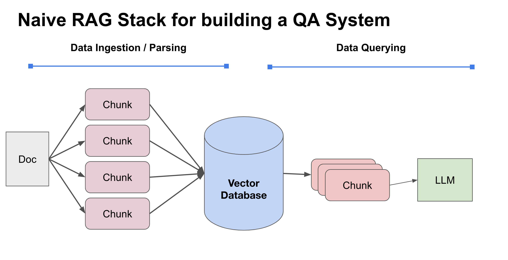
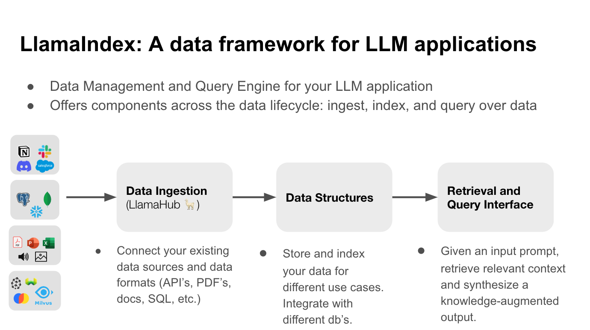

<iframe width="560" height="315" src="https://www.youtube.com/embed/UUT7t_8rCHQ?si=j3mpsRdP9Opl6OlI" title="YouTube video player" frameborder="0" allow="accelerometer; autoplay; clipboard-write; encrypted-media; gyroscope; picture-in-picture; web-share" allowfullscreen></iframe>

投影片: [https://docs.google.com/presentation/d/1wTEt3sy7ZHk3rYO3nFYhPZEFrfpG70l6WzY12wIaycE/edit?usp=sharing](https://docs.google.com/presentation/d/1wTEt3sy7ZHk3rYO3nFYhPZEFrfpG70l6WzY12wIaycE/edit?usp=sharing)

## 簡單摘要:

RAG (Retrieval Augmented Generation) 主要講的是透過查詢資料，透過 LLM 做為結果的生成回覆。

準備資料: 讀取資料，切割成 chunk ，加上 Embedding  ，放入 Vector DB
讀取資料: 輸入轉換成 Embedding 比對 Vector ，找出 Chunk ，放入 LLM 來生成回答

### 困難點:

1. 檢索(Retrieval) 的資料不夠好，就算你 model 用 gpt20 (講者真的這樣說）也沒救。
2. 如何在系統層上面做到即時資料更新?

### 改善方式:

- 挑選好切割工具(parser) : 推薦 [LlamaHub](https://llamahub.ai/) ，[Unstructured-IO/unstructured](https://github.com/Unstructured-IO/unstructured)
- 加強檢索的資料（放一些 metadata) : e.g. 頁碼，章節敘述 ....
- 建立一個 data pair (doc_hash_id, ver_num)，更新比較快。

**產品介紹： LlamaIndex [https://www.llamaindex.ai/](https://www.llamaindex.ai/)**

- 支援多種 Loader: [Llama hub](https://llamahub.ai/)
- 支援 Document Update:
  - https://gpt-index.readthedocs.io/en/stable/core_modules/data_modules/index/usage_pattern.html#handling-document-update
    - [Metadata Extraction](https://gpt-index.readthedocs.io/en/stable/core_modules/data_modules/index/metadata_extraction.html)
    - [Document Management](https://gpt-index.readthedocs.io/en/stable/core_modules/data_modules/index/document_management.html)

## 關於 Llama-Index 教學資源

<iframe width="560" height="315" src="https://www.youtube.com/embed/cNMYeW2mpBs?si=NHRdp-Znbv2STbWg" title="YouTube video player" frameborder="0" allow="accelerometer; autoplay; clipboard-write; encrypted-media; gyroscope; picture-in-picture; web-share" allowfullscreen></iframe>

