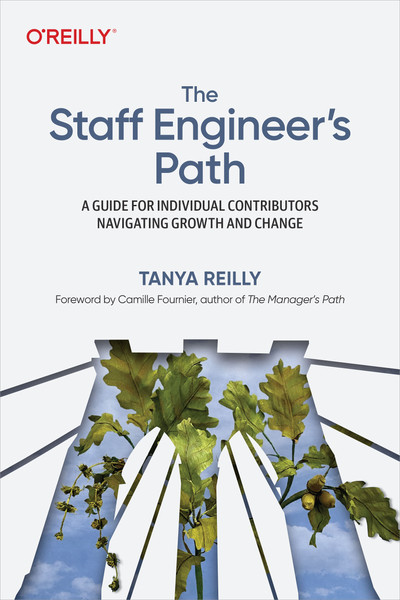
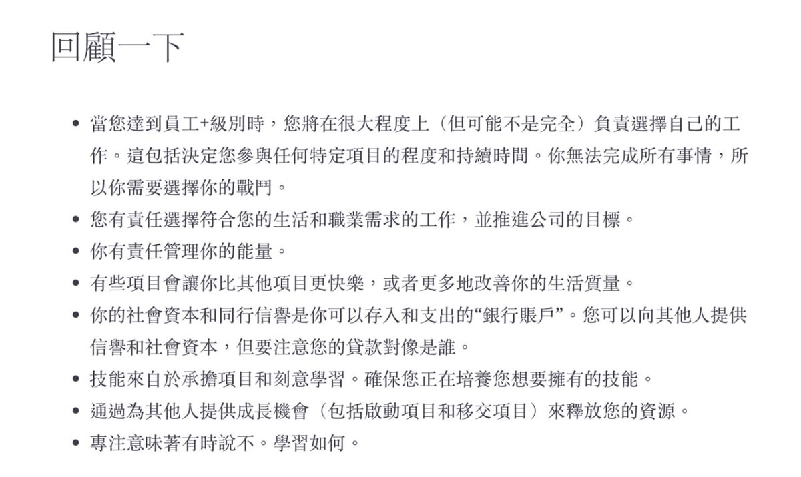
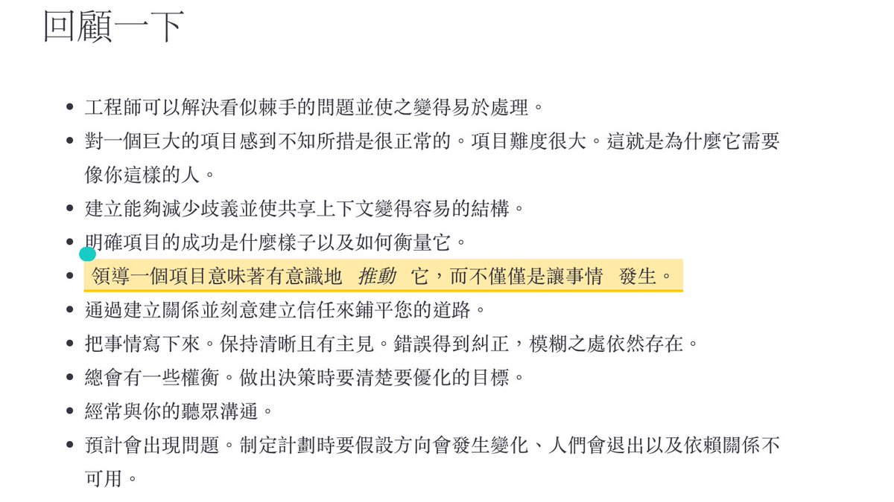
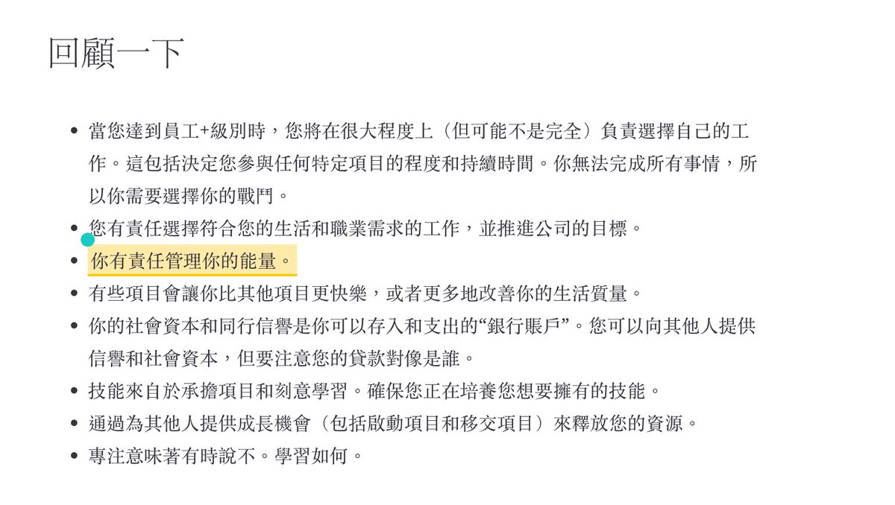
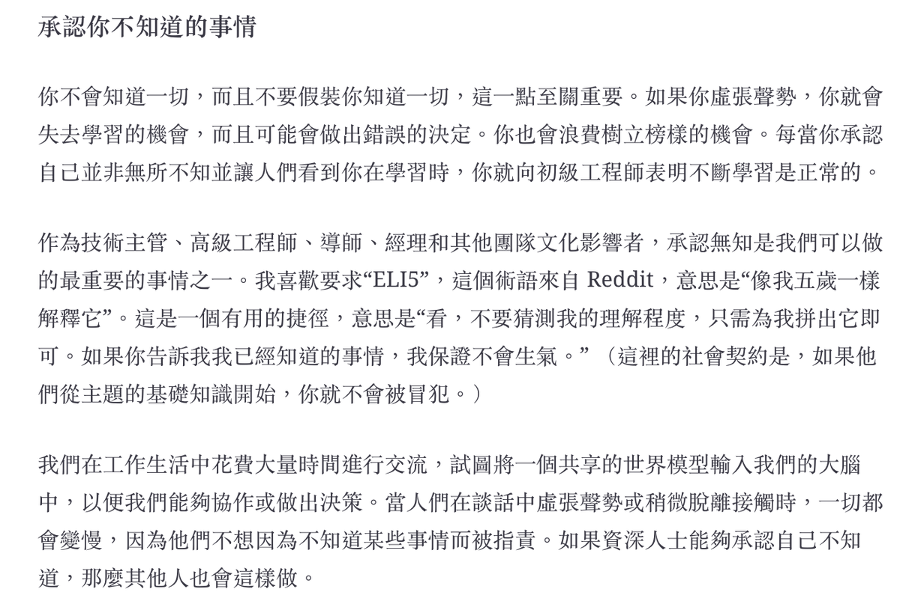
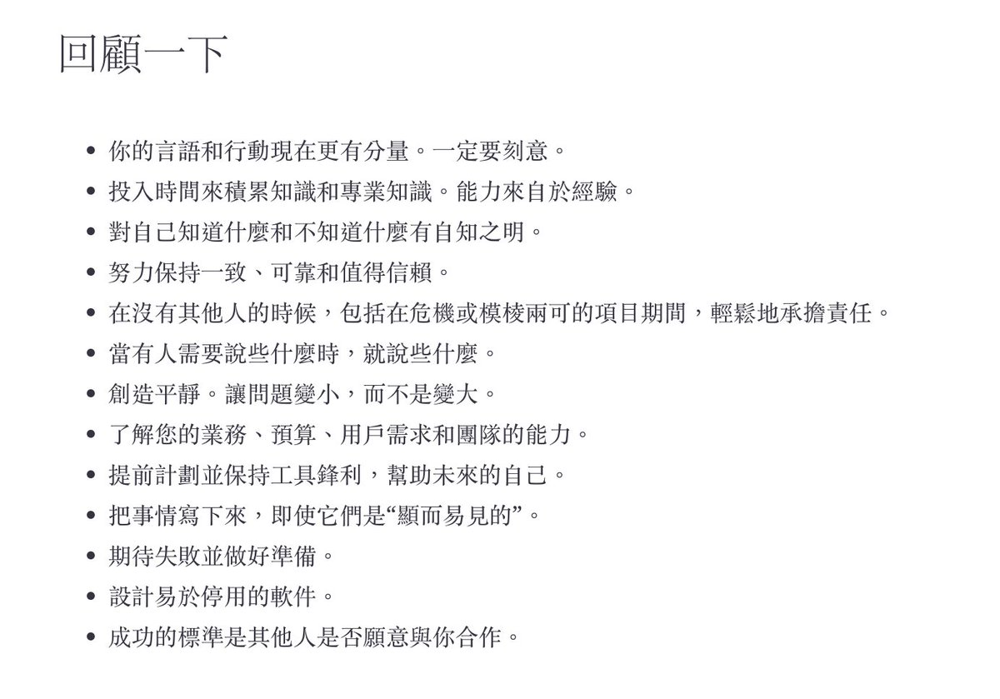
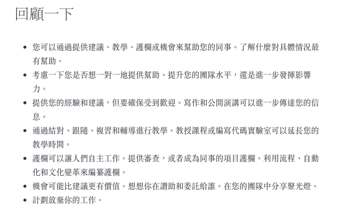
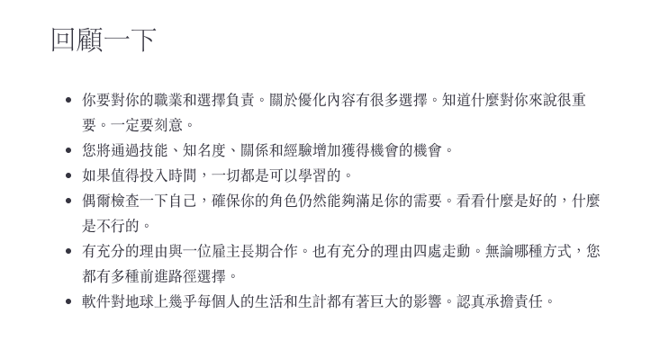

```
The Staff Engineer's Path
By Tanya Reilly

TOPICS: Leadership and Management
PUBLISHED BY: O'Reilly Media, Inc.
PUBLICATION DATE: September 2022
```

#### 網址：

- Amazon: [購買網址](https://www.amazon.com/Staff-Engineers-Path-Individual-Contributors/dp/1098118731)
- Oreilly E-Learning 線上閱讀: [網址](https://learning.oreilly.com/library/view/the-staff-engineers/9781098118723/)

# 前言:

最近被牛牛推坑這本書，覺得相當的有趣。 也覺得裡面有相當有趣的內容，近期應該會整理一下讀書心得。


# 內容摘要：

```
For years, companies have rewarded their most effective engineers with management positions. But treating management as the default path for an engineer with leadership ability doesn't serve the industry well--or the engineer. The staff engineer's path allows engineers to contribute at a high level as role models, driving big projects, determining technical strategy, and raising everyone's skills.

This in-depth book shows you how to understand your role, manage your time, master strategic thinking, and set the standard for technical work. You'll read about how to be a leader without direct authority, how to plan ahead to make the right technical decisions, and how to make everyone around you better, while still growing as an expert in your domain.

By exploring the three pillars of a staff engineer's job, Tanya Reilly, a veteran of the staff engineer track, shows you how to:

- Take a broad, strategic view when thinking about your work
- Dive into practical tactics for making projects succeed
- Determine what "good engineering" means in your organization

```

### Creating the big picture

[](https://pbs.twimg.com/media/F4tbfaIasAE4MoA.jpg)

感覺是個理想職業 (大心)


### 有限的時間

[](https://pbs.twimg.com/media/F40tmDPbwAAZixe.jpg)

[](https://pbs.twimg.com/media/F40tmndbgAAscw3.jpg)

管理能量跟更有效的 dive 相當的重要..


### 你現在是一個榜樣 (Role Model)

[](https://pbs.twimg.com/media/F5TkEpobsAAd6rt.png)

我喜歡要求“ELI5”，這個術語來自 Reddit，意思是“像我五歲一樣解釋它”。這是一個有用的捷徑，意思是“看，不要猜測我的理解程度，只需為我拼出它即可。如果你告訴我我已經知道的事情，我保證不會生氣。” （這裡的社會契約是，如果他們從主題的基礎知識開始，你就不會被冒犯。）


### 作為一個組織的榜樣

[](https://pbs.twimg.com/media/F5To1t7a0AA1xOi.jpg)
作為一個組織的榜樣，你應該注意的部分： from "The Staff Engineer Path"


### 展現你的影響力部分

[](https://pbs.twimg.com/media/F5ZCpqaa8AA8b3L.png)

- 文章與公開演講比起 1 on 1 可以幫助人
- 想要私下給個別建議，不如寫成通用的文章
- 建立制度高過於自己下來當審核者

### 最後關於生涯規劃的部分

[](https://pbs.twimg.com/media/F5ZGLhFasAASH3H.png)

- 挑選自己想做的來投資
- 不要設限，盡可能投資有最大回報
- 找尋自己最好的職涯指引


# 心得:

