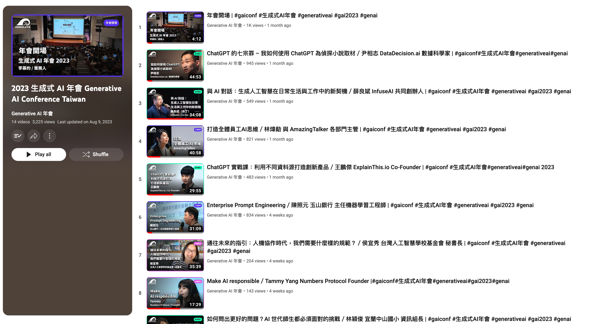

(影片playlist: [https://www.youtube.com/playlist?list=PLlHO_3K3NaJczxCPMOcG_c8j8e1e05Dkg](https://www.youtube.com/playlist?list=PLlHO_3K3NaJczxCPMOcG_c8j8e1e05Dkg))

https://www.youtube.com/playlist?list=PLlHO_3K3NaJczxCPMOcG_c8j8e1e05Dkg 2023 生成式 AI 年會 Generative AI Conference Taiwan 在 08/11 已經上線了。
今年的 GAI 年會有不少蠻有深度的議題，我覺得可以找時間慢慢了解。分享幾個我覺得很酷的:

### **非技術相關：**

- 打造全體員工AI思維／林煒勛 與 AmazingTalker 各部門主管 https://www.youtube.com/watch?v=KFsSAEV1_vk&list=PLlHO_3K3NaJczxCPMOcG_c8j8e1e05Dkg&index=5 
  - 少見各部門上台分享，似乎是很有「話題性」的分享。
- 如何問出更好的問題？AI 世代師生都必須面對的挑戰／林穎俊 宜蘭中山國小 資訊組長 https://www.youtube.com/watch?v=rXxCsv7cZdI&list=PLlHO_3K3NaJczxCPMOcG_c8j8e1e05Dkg&index=9&t=947s
  - 林組長如何透過 chatGPT 在小學五六年級教導，還有遇到哪些問題。 也分享他對於未來 LLM 對於教育的看法。
- 商用詠唱進階 & 黑魔法防禦術 - 提升與保護你的 AI 應用／李慕約 生成式 AI 年會策展人 https://www.youtube.com/watch?v=UPN2VD0cV4s&list=PLlHO_3K3NaJczxCPMOcG_c8j8e1e05Dkg&index=15&t=1588s
  上次 @jason.tai  帶來的分享，裡面有一些相關的應用。 如何有意識地去測試你系統 prompt 的安全。

**### 技術相關:**

- Enterprise Prompt Engineering／陳照元 玉山銀行 主任機器學習工程師 https://www.youtube.com/watch?v=R3oTpyoPh70&list=PLlHO_3K3NaJczxCPMOcG_c8j8e1e05Dkg&index=7&t=2s
  - 技術深度算是我認為最多相關應用，蠻適合在 CB 或是 LINE Bank 相關應用。 更多內容我有寫在 
- ChatGPT 實戰課：利用不同資料源打造創新產品／王鵬傑 https://www.youtube.com/watch?v=2gNV9-zzyRc&list=PLlHO_3K3NaJczxCPMOcG_c8j8e1e05Dkg&index=6
  - 蠻多 LLM + LINE Bot 相關應用，蠻有趣的。 
