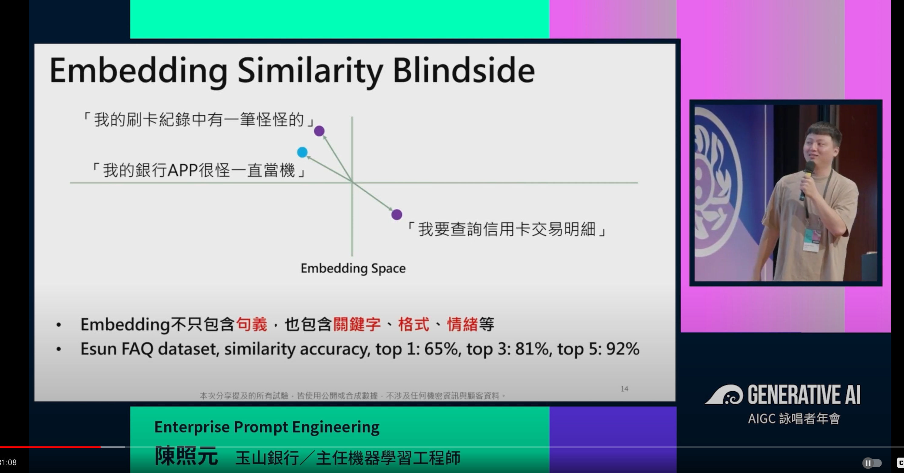
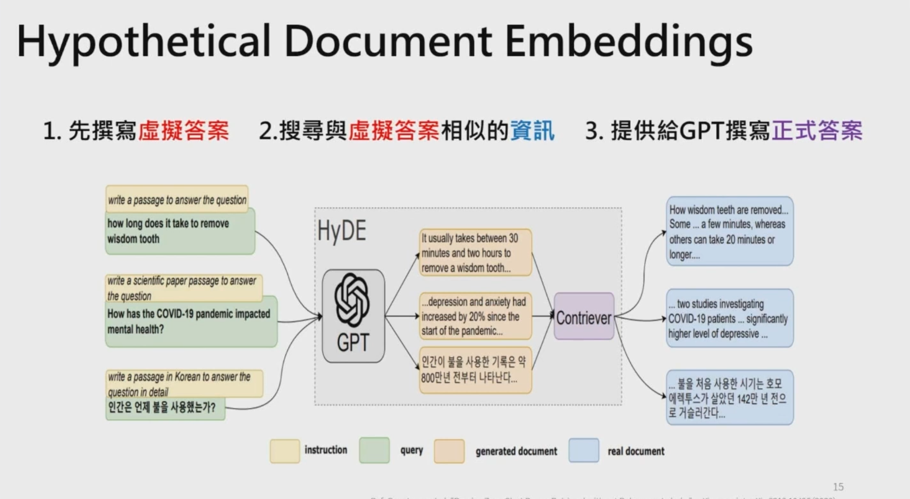
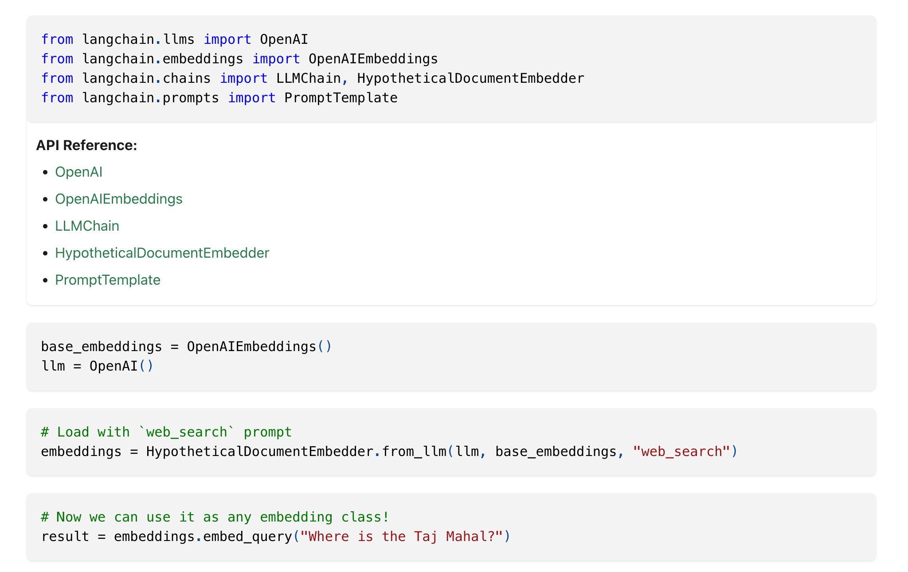
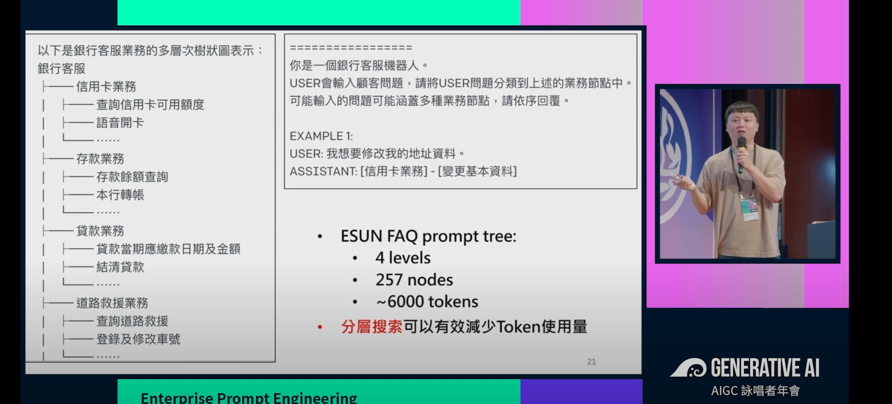
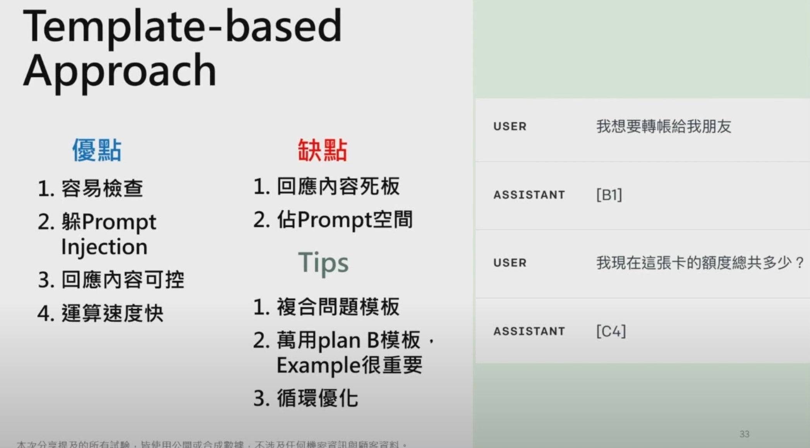
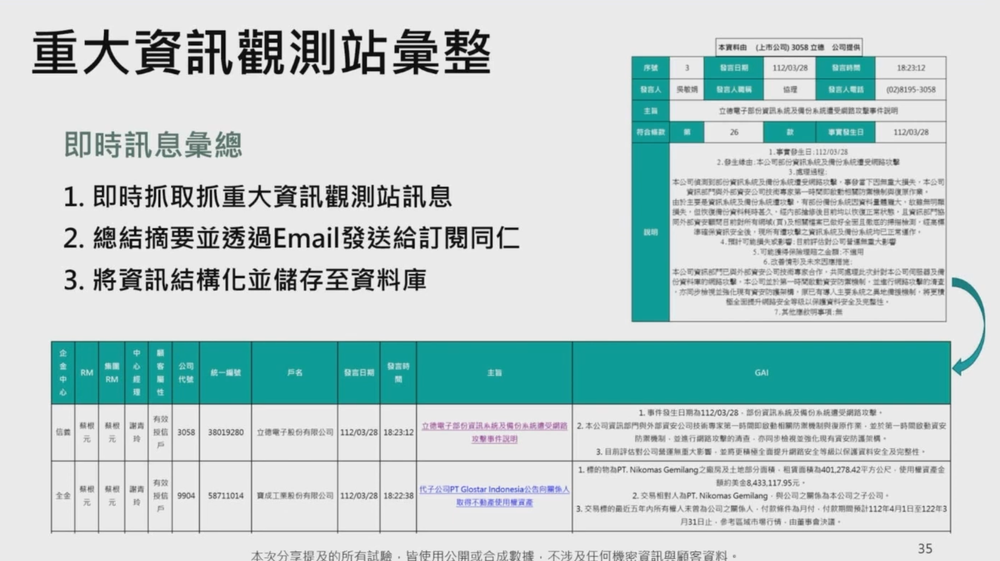
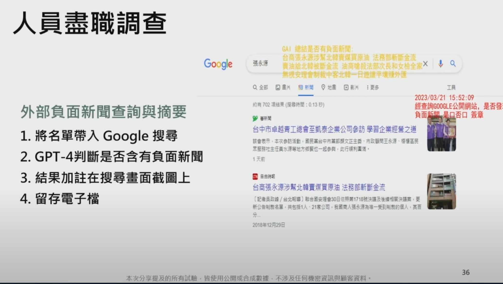
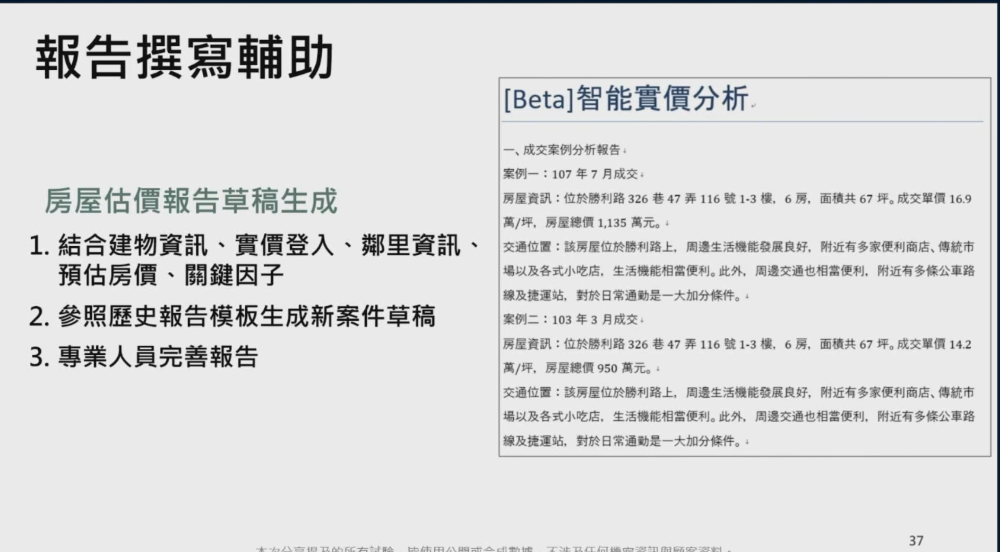

<iframe width="560" height="315" src="https://www.youtube.com/embed/R3oTpyoPh70?si=cMVtbSHPrFzwqOQB" title="YouTube video player" frameborder="0" allow="accelerometer; autoplay; clipboard-write; encrypted-media; gyroscope; picture-in-picture; web-share" allowfullscreen></iframe>

# 摘要：

本篇文章主要針對 GAI 年會上玉山銀行的分享，將一些重點記錄下來。加上網友與自己查看跟 LangChain 可能可以使用到的地方。


## 主要問題：

玉山銀行如何透過 Prompt Engineering 做到銀行客服小幫手。 相似問題在於，經常出現問題本身拿來做 Embedding 的時候，因為問題不好，造成無法透過 Embedding 的方式找到比較好的向量相似解答。





## 解決方式:



HyDE (Hybrid Diagnostic Engine) 稍微查出解釋：

```
起因
在許多情況下，我們需要理解和解釋 AI 模型的行為。這尤其對於大型語言模型來說非常重要，因為這些模型的行為可能會影響到重要的決策過程。然而，由於這些模型的複雜性，理解它們的行為並不容易。這就是 HyDE 在 LLM 中的起因。

解釋
HyDE 是一種混合診斷引擎，它結合了基於模型的診斷和基於數據的診斷。基於模型的診斷依賴於對系統的理論理解，而基於數據的診斷則依賴於從實際運行數據中學習。

在 LLM 中，HyDE 可以用來解釋模型的行為。例如，它可以幫助我們理解模型為何會產生特定的輸出，或者為何會在某些情況下表現得比其他情況更好。這種理解可以幫助我們改進模型，並使其更適應特定的任務。

HyDE 的主要優點是它可以處理大量的數據和複雜的模型。此外，它還可以處理不確定性，這在許多實際情況中是非常重要的。

總的來說，HyDE 在 LLM 中提供了一種強大的工具，可以幫助我們理解和解釋模型的行為。
```

### 如何透過 LangChain 來實作 HyDE

[https://python.langchain.com/docs/use_cases/question_answering/how_to/hyde](https://python.langchain.com/docs/use_cases/question_answering/how_to/hyde)



簡單來說，透過宣告 `embedding` 是透過 HyDE 產生的。這樣透過 embedding 在搜尋的時候。可以自動產生比較有意義（可能是）的問題。

### 更多的研究

LangChain的MultiVector Retriever有實作這個部分, 可以用LLM產生Hypothetical questions並建embedding

[https://python.langchain.com/docs/modules/data_connection/retrievers/multi_vector](https://python.langchain.com/docs/modules/data_connection/retrievers/multi_vector)


是否透過 HyDE 就可以完美提供一個良好的銀行用戶端 ChatBot? 事實上最後完成架構為

### 完成架構


如何達到良好的回覆方式？

### 更進階的方式： （銀行業適用）



- 透過分類數達到快速分類，並且提供相關的回覆答案 template (如下圖)




#### 優缺點：

- 優點：
  - 避免 Prompt Injection
  - 回應快 4 chars
- 缺點：
  - 死板（銀行業可以）
  - Prompt 會反覆佔空間。


## 相關 Prompt 應用






DD 


