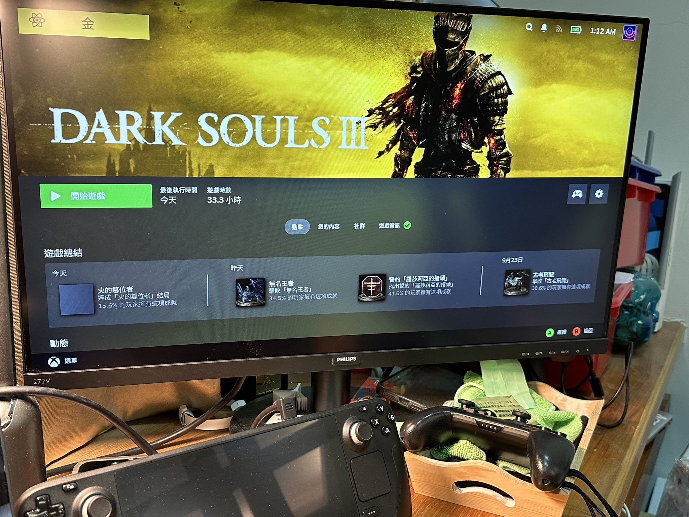
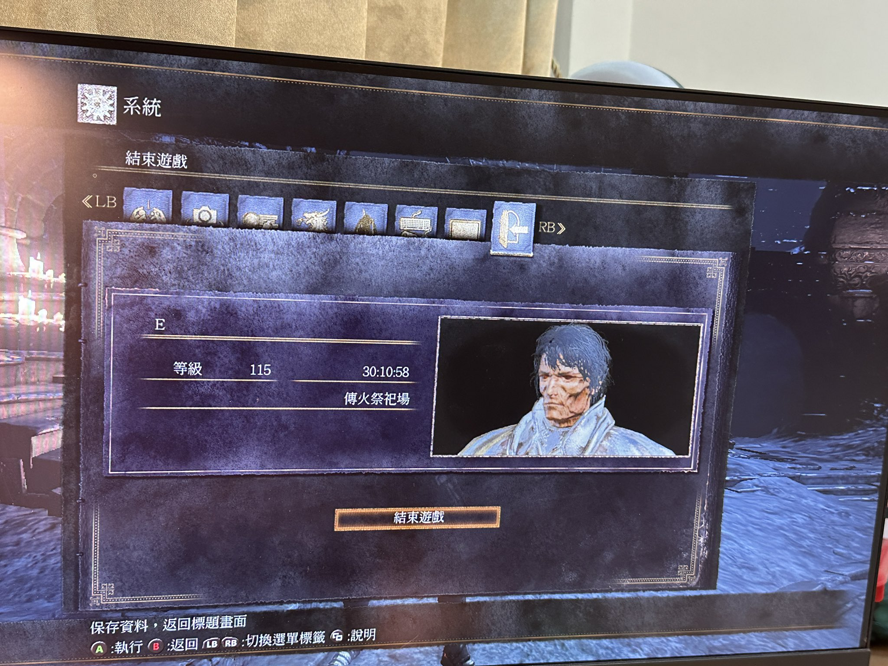
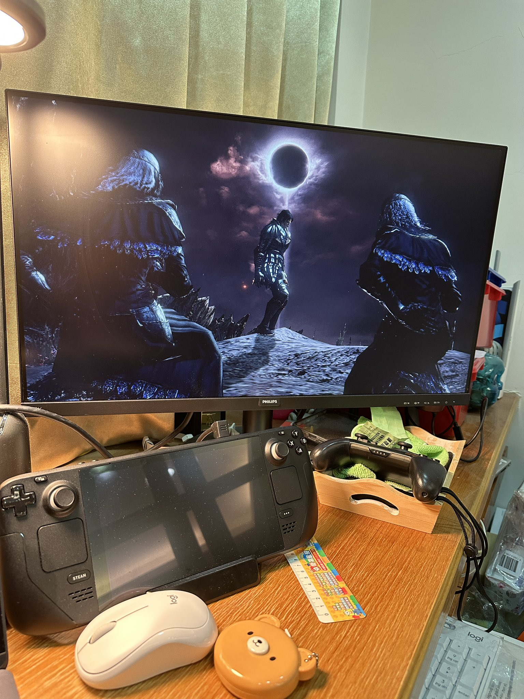
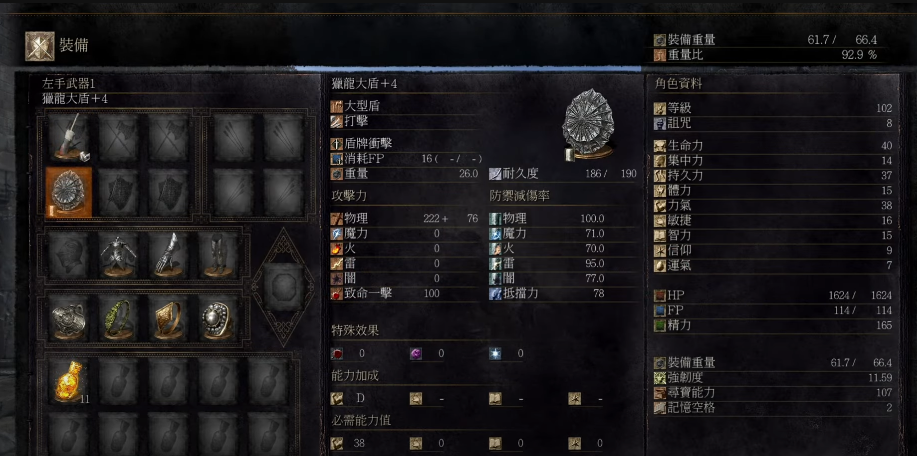
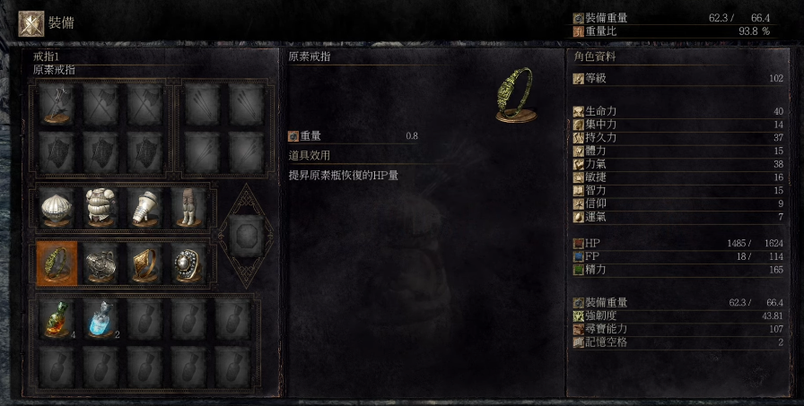

# 前情提要:

魂3 趁著這一波特價，就馬上入手 steam 版本（對，我買過ps5版本）。

然後還破關了，最後無名王者還是用 SD 掌機模式打掉的。真的超好玩！

# 攻略清單：

#### 強烈建議參考： [攻略清單](https://youtube.com/playlist?list=PLr3pkfv5E4ITmPh8V9jOUevODE91tA3NC&si=P0-nHiKc9ryHL4Zk)

- 會有完整的跑圖流程，可以讓你不會少任何重要的物品。
- 有打王建議的配備，讓你打王有爽度，沒難度。

## 建議配備：

### 推圖建議：

- 一手法杖，使用 隱形身軀 (智力無論如何要點到 15)。 一開始還很硬派的說不用隱身。 結果推到中期真的很容易卡圖過不去。
- 冰狗鎚，重點戰技: 忍耐 (減傷 45%，增加韌性) 

**打無名王者建議：**

無名王者其實真的是本傳的最強 boss (薪王太嫩)，除了有兩階段之外。 第二階段的雷屬攻擊真的很強。所以一定要有 獵龍大盾來幫忙扛。不然很容易一發就帶走。

- 流放者大刀 + 獵龍大盾（大推）
  -  獵龍大盾可以有效的避免手殘來擋雷屬性攻擊。
- 戒指四個： 哈達爾，元素戒指，親愛戒指，減物理傷害戒指
- 然後身上其實可以脫光，閃躲比較快，因為有減物理傷害戒指在扛。

**打薪王推薦:**

- 冰狗鎚
- 洋蔥騎士整套
- 戒指四個： 哈達爾，元素戒指，親愛戒指，減物理傷害戒指

薪王的傷害太低，真的裝備撐起來。就可以拼命用「忍耐」槌死薪王。加上可以叫人幫忙，完全沒難度。
