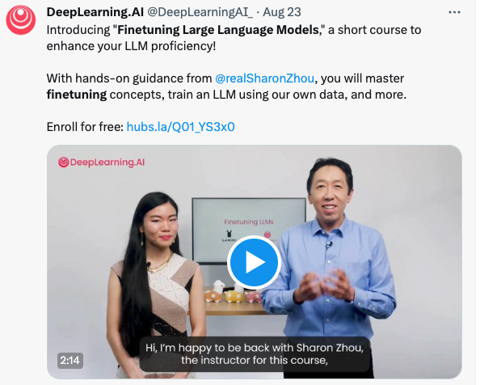
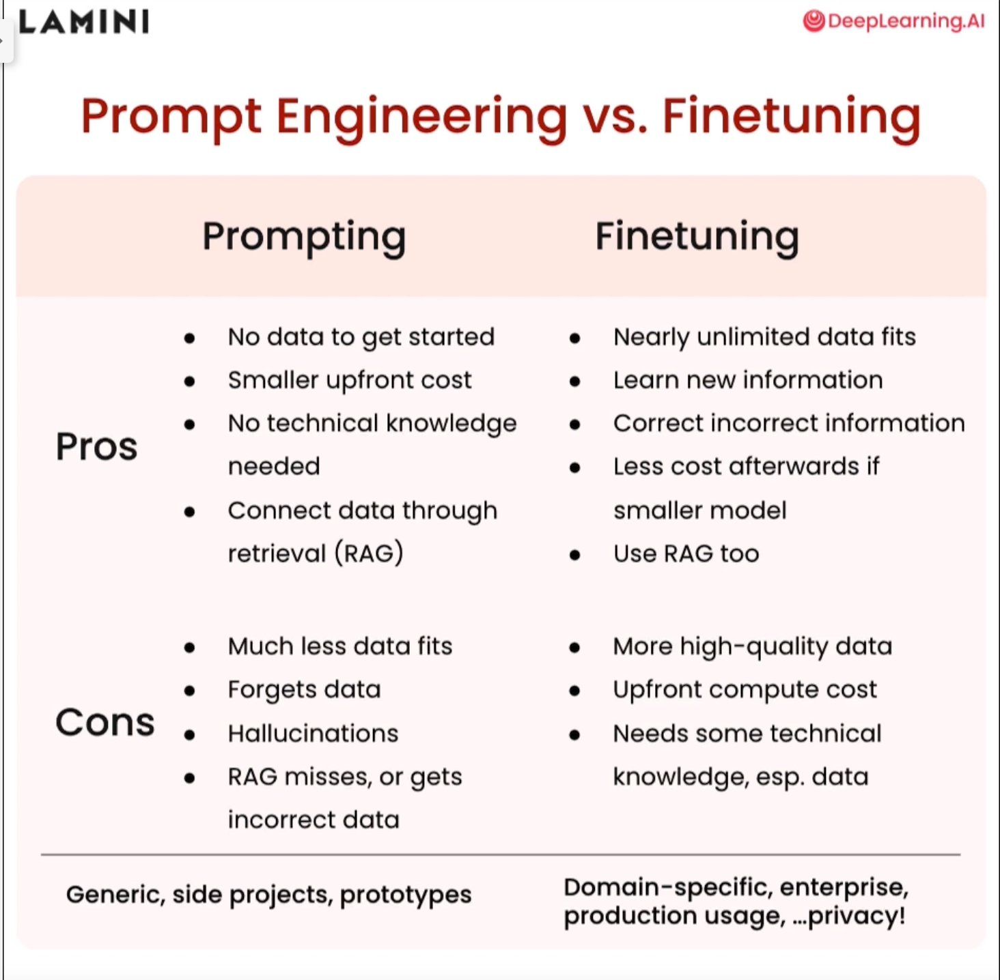
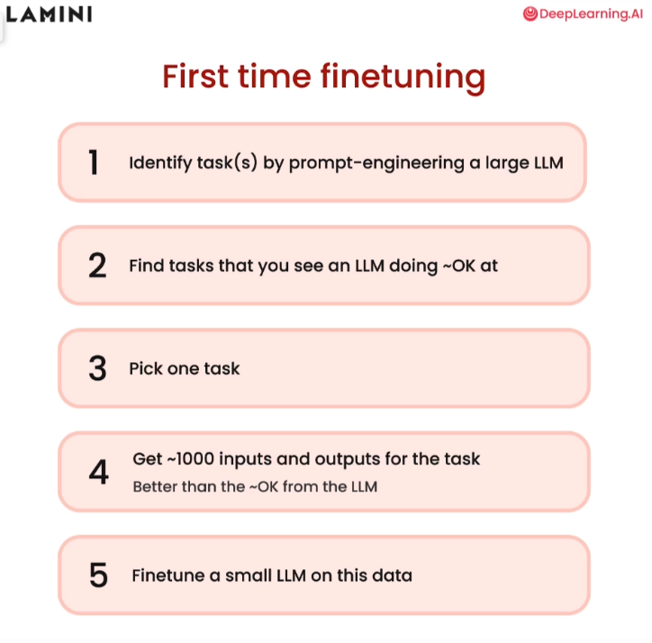

## 起因

OpenAI 3.5 發布 Fine-Tuning API 後，另外一邊 Andrew Ng 馬上上線相關課程：
[https://deeplearning.ai/short-courses/finetuning-large-language-models/](https://deeplearning.ai/short-courses/finetuning-large-language-models/)

## Why Finetune

附上大家容易有疑慮的比較圖：為何弄 Fine-Tune 為何不透過 Vector Prompting

- 確認原本 LLM 不能完成
- 尋找 gold samples
- 確認可以比較好結果
- Finetune it.

