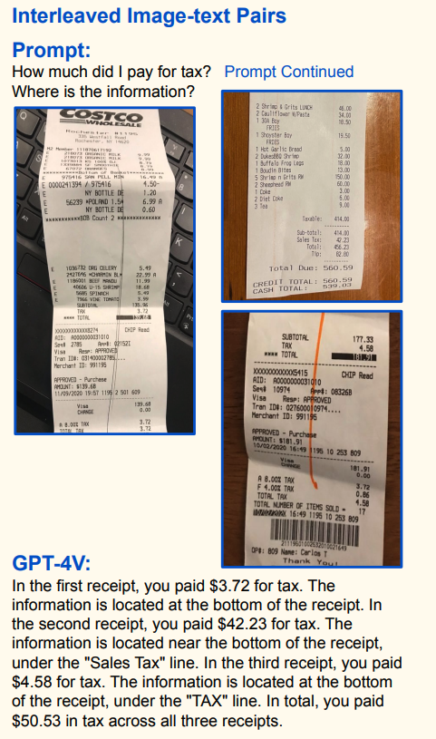

（論文： [https://arxiv.org/abs/2309.17421](https://arxiv.org/abs/2309.17421) ）

## 前情提要

這篇由微軟在 09/29 發表的論文，搶先測試了不少 GPT-4V 的功能。並且列出許多有趣的使用場景，最後用了「LＭM 的黎明」作為整篇論文的標題。 論文不算短（166頁)，但是都是應用案例讓人讀的很開心，很興奮。

### 案例1: 給一張照片跟 menu ，就能知道那罐啤酒應該要多少錢。

### 案例2: 給一張發票（收據），就能知道要付多少稅金？然後在哪裡?

### 案例3: 給一個證件，叫他識別後直接給 JSON

### 案例4:  使用不同的 Planning (Tree of Thought) 來做 OCR ，其實可以讓結果更好。

### 案例5: 計算基本的數學圖學問題，好像可以解決推友的問題

