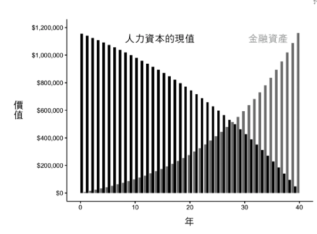
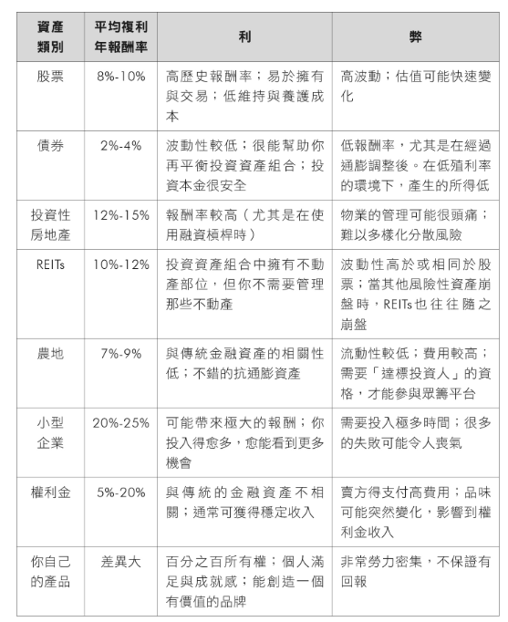
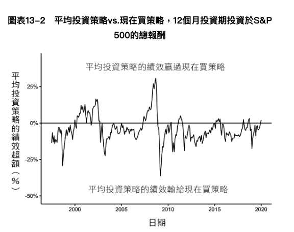
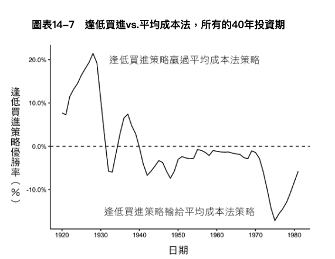
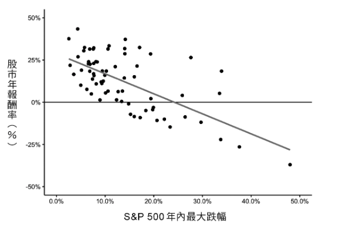

<div><a href="https://moo.im/a/EFIQTW" title="持續買進"></a></div>


```
持續買進 - 資料科學家的投資終極解答，存錢及致富的實證方法
Just Keep Buying: Proven Ways to Save Money And Build Your Wealth
作者： 尼克．馬朱利  
原文作者： Nick Maggiulli 
出版社：商業周刊 
```

#### 買書推薦網址：

- Readmoo: [購買網址](https://moo.im/a/EFIQTW)

# 前言:

這是 2023 年第13本讀完的書。  這是一本朋友間在推薦的書籍，都在推薦這本書對於投資的重要。也是有朋友專注在 「voo and chill」讓經常動搖的我相當的羨慕，這一本書也是不斷地敲醒自己對於投資的目的與想法。於是就開始來好好瞭解這一本書到底如何讓人願意「持續買進」。


# 內容摘要：

```
★聽說「逢低買進」是投資穩賺策略？
錯！最強資料科學家告訴你：
千萬別為了抄底，浪費時間在市場外觀望，
「持續買進」才是致富不敗法則！

★《原子習慣》、《致富心態》作者一致強推，
出版即登亞馬遜投資類暢銷冠軍、
BookAuthority評選2022年最佳財經書

●當資料科學家研究起股市……
「等待抄底好時機」、「不要把雞蛋放在同一個籃子裡」、「低買高賣」……投資世界充滿了豐富的詞彙、睿智的專家，提出各種穩賺策略。你是不是深感認同，全盤接受？

然而，身兼資料科學家和財富管理專家的尼克．馬朱利表示，這時候，你需要依賴數據與證據，而不是盲信與猜測。因為各種長久存在的看法並不總是對的，不適用於每個人或每種情況。

馬朱利出身普通家庭，上大學前連股票是什麼都不知道，每天擔心錢不夠用，因此對金錢產生嚴重焦慮感，讀過許許多多投資書及文章，並忠實遵循了作法，然而他對未來的恐懼絲毫沒有消失。為了解開金錢的迷團，他拿出身為數據科學家的專業分析股票市場，創辦「金錢與數據部落格」（OfDollarsAndData.com），持續發表以數據分析為基礎的投資理財文章，將看來枯燥的數據化為生動又人人能懂的故事，成為財經界最有特色的部落格。
```

## 存錢？借錢？退休部分：

### 你應該存多少錢？

- 把你所能存款的錢都存下來。

### 雙倍投資概念 (The 2x Rule)

- 進行大筆花費的時候，就要將相對的金額放入投資（存款）項目。
- 比如說買百萬名車，就要先有百萬的錢進入投資。

### 何時該舉債

- 降低風險
- 為了取得高於借款的報酬
- 學貸是值得的，且便宜的貸款，一定要借。

### 購屋的時機

- 你計劃在這個地點待上十年
- 你有穩定的私人與職業生活
- 你買得起

### 何時可以退休?

- 存一筆錢，並且每一年花 4% 並且三十年不會花玩得程度。
- 另類說法：
  - 如果總金額放在股市，有 4% 的年報酬獲利這樣三十年間都可以依靠年化報酬來支撐自己的日常支出。

## 關於投資

### 需要投資的主要原因:

- 為了將來儲蓄
- 對抗通膨 (2~5%)
- 以財務資本取代你的人力資本（就是被動手入來超過你的主動收入）
  

- 各種生財工具的利與弊



- 投資大盤，不要投資個股。
  - 根據數據統計：   1926 ~ 2016 只有 4% 的股票高於大盤的報酬。
  - 但是 1950 年後掛盤的公司 28853 其中有 22469 (78%) 的公司已經不在了。
- 多早該買？
  - 越早越好！
- 平均投入跟現在買的報酬差異
  - 平均而言，每一個 12 個月的投資期，平均投資策略表現比「現在買」要低 4%。 在 1997 ~ 2020 所有的 12個月的投資期中，有 76% 的績效表現比「現在買」績效表現要差。**（通常要持有超過 10 年以上)**
  - 通常在「市場崩跌」的時候，「平均投資」的報酬會高於「現在買」。但是市場崩盤的時候，投資人最不熱切投資。



### 為何你不該等到低再買？

- 逢低買入（如果你能正確抓到），短期來説是遠遠高過平均成本。
- 但是時間拉長 ， 有 70% 以上都是逢低買入比較差？為什麼？ 因為所謂的低點出現時間並不多，而平均成本可以讓資金持續投入。
- 持續存錢來期待逢低買入，最後是會徒勞無功的。 只要投資時間夠長，持續買入會報酬會高過逢低買入。（更重要的是，根本沒有人知道所謂的「真正的低點」，而且股市崩盤的時候，也不會有人想買。）



### 為何你不應該害怕市場波動?

- 想要最大化報酬，要儘量地避免市場跌幅超過 15% ，但是你沒有投資小精靈，你無法正確地抓到重新入場的時機。
- 後續也會提到，反覆進入市場所產生的稅金其實會讓你支出更多的獲利。
- 1950 年後，當年跌幅超過 10% (或是更多的)，最後當年其實都有正報酬。



### 如何在危機入市?

- 下跌 33% 需要漲回 50% 才能回本。
- 但是將他帶入年化報酬：
  - 只要五年來說，年化報酬 8% 你就有機會回本。
- 但是要看對市場，以日本來說極有可能 20 年都沒有回本。但是即便是日本股市，如果時間拉長 1980 ~ 2020 ，還是會有正報酬。
  - 市場不好，不是不會回本只是要花更久的時間。（也就是機會成本)

### 何時賣出？

- 平衡投資組合
  - 建議是把個股平衡成大盤。
- 擺脫一個集中（或是虧損）的部位
  - 沒有更好的標的，應該不要貿然的出脫虧損部位。
  - 停利也要思考，畢竟不會知道飛多高。
- 支應你的財務需求
  - 這是最期待的方式，唯一賣出是因為你想要支付實際的財務需求。


## 最重要的資產

- 時間是你最重要的資產，而且越來越貴。
- 提早投資，持續投入才能讓獲利持續增長。
- 你總是能賺到更多金錢，但是更多金錢無法幫你買到時間。


# 心得:

這是一本標題就是主要目的的書籍，「持續買進」聽起來很但是會有一堆人有不同的想法。為什麼不在下跌的時候要賣出，然後最後買入就好？為何不在大崩盤得時候，空手呢？  如果要買進，就近要買一些什麼？ 要一次全部投入？還是分批的買入呢？

這一些身為投資人經常有的疑問，這一本書會用相當淺顯易懂的方式，按部就班地解釋給你了解關於這一些的道理， 到了最後，你會真心的了解，並且接受為何「持續買進」會是讓你獲利最高的資產處理方式？ 

透過許多歷史的數據告訴你，如果要避開下跌能獲利多少？ 也透過數據告訴你如果持續擁有到底有多少的獲利可以到來？

當然「持續買進」的原理，也是針對於大盤來闡述這個原理，正是因為看好景氣是會循環的而你手中的部位總是會慢慢回來。

你在崩盤時候應該要做的，反而是應該要持續買進，並且在接近年限(-30%) 的區段要考慮加碼來投入。因為不論如何，在大崩盤的之後的反彈往往也是最驚人的數據。對於你來說，只要沒有過度的槓桿在其中，透過活用資金的處理來說都是要持續買入最為正常的選項。

你是真正的投資大盤？ 還是也是個見高就追，見低就砍？ 建議你也要買這一本書來看看。
