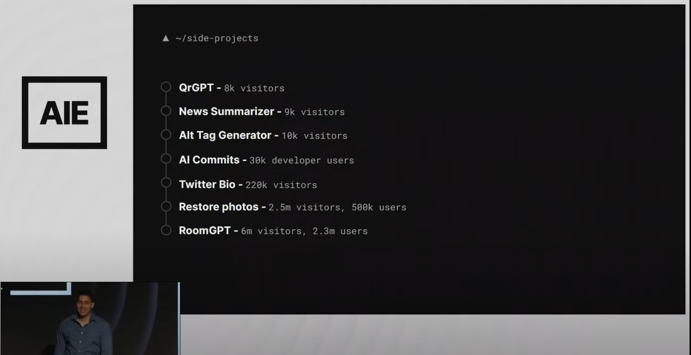
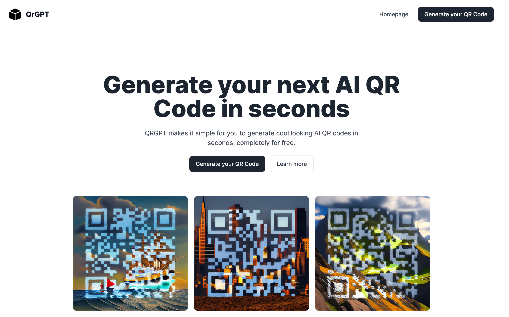
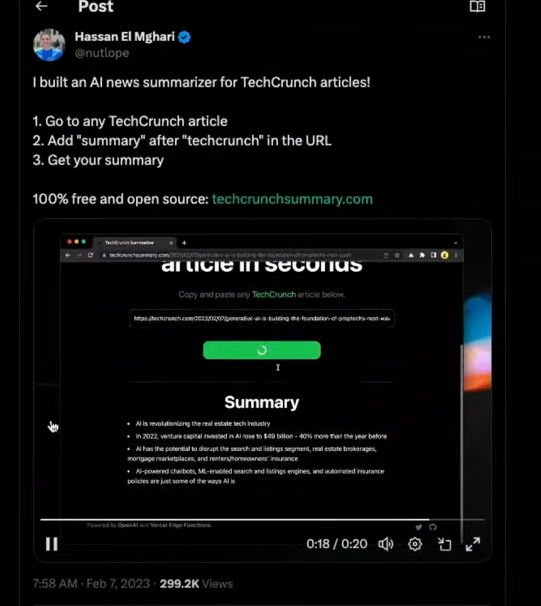
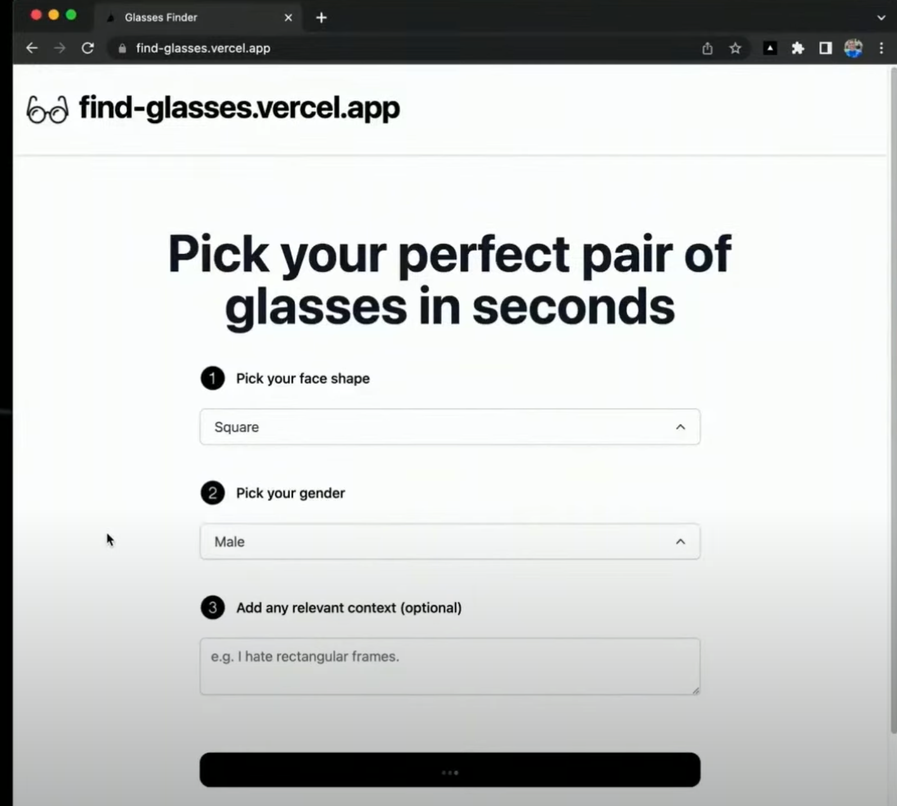
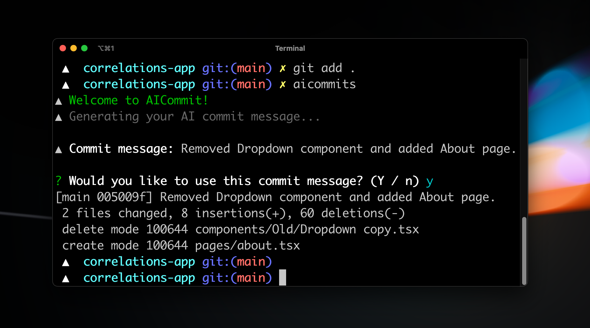

<iframe width="560" height="315" src="https://www.youtube.com/embed/qw4PrtyvJI0?si=tMzTzc0QHt9iroS5&amp;start=8275" title="YouTube video player" frameborder="0" allow="accelerometer; autoplay; clipboard-write; encrypted-media; gyroscope; picture-in-picture; web-share" allowfullscreen></iframe>

## 前情提要

AI Engineer - Summit 有趣議程分享
“Hassan El Mghari, AI Engineer, Vercel, “The Weekend AI Engineer”
https://youtu.be/qw4PrtyvJI0?t=8632
Hassan 分享他如何在過去兩年開發 AI 相關應用，裡面有幾個蠻有趣的

- [https://github.com/nutlope](https://github.com/nutlope)

  

## 相關 side project

### QRGPT:  幫你做任何生成式 AI QR Code

- [https://www.qrgpt.io/](https://www.qrgpt.io/)
- [https://github.com/Nutlope/qrGPT](https://github.com/Nutlope/qrGPT)

### TechCruch Summary (收到律師函被拿下）： 輸入網址，直接給文章摘要

### 幫忙找眼鏡 - Find-Gasses 

網址： [https://find-glasses.vercel.app/](https://find-glasses.vercel.app/)

### AI Commit Message 

github: [https://github.com/Nutlope/aicommits](https://github.com/Nutlope/aicommits)
