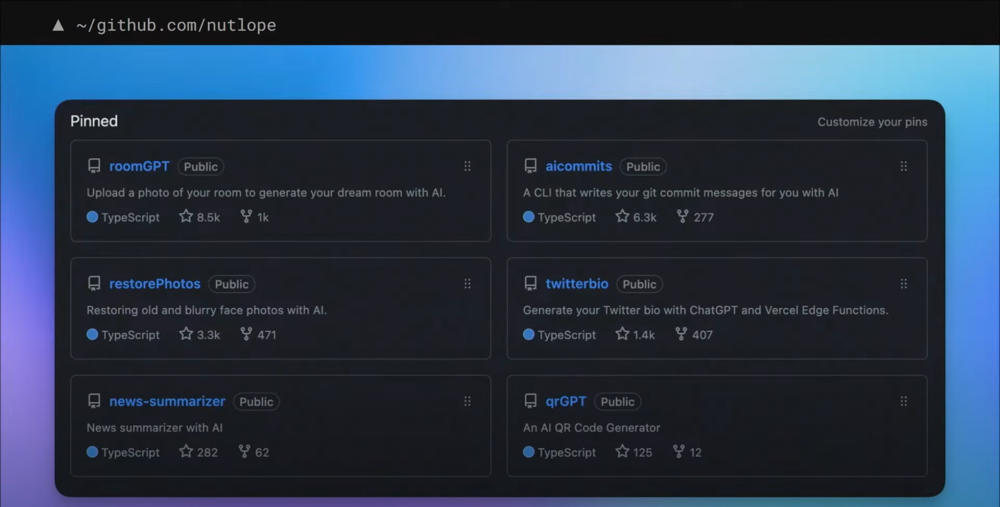

<iframe width="560" height="315" src="https://www.youtube.com/embed/qw4PrtyvJI0?si=tMzTzc0QHt9iroS5&amp;start=8275" title="YouTube video player" frameborder="0" allow="accelerometer; autoplay; clipboard-write; encrypted-media; gyroscope; picture-in-picture; web-share" allowfullscreen></iframe>

## 前情提要

[AI Engineer - Summit](https://www.ai.engineer/summit/schedule) 有趣議程分享
“Hassan El Mghari, AI Engineer, Vercel, “The Weekend AI Engineer”
https://youtu.be/qw4PrtyvJI0?t=8632
Hassan 分享他如何在過去兩年開發 AI 相關應用，裡面有幾個蠻有趣的

- [https://github.com/nutlope](https://github.com/nutlope)

  

## 相關 side project

### QRGPT:  幫你做任何生成式 AI QR Code

- [https://www.qrgpt.io/](https://www.qrgpt.io/)
- [https://github.com/Nutlope/qrGPT](https://github.com/Nutlope/qrGPT)

### TechCruch Summary (收到律師函被拿下）： 輸入網址，直接給文章摘要

### 幫忙找眼鏡 - Find-Gasses 

網址： [https://find-glasses.vercel.app/](https://find-glasses.vercel.app/)

### AI Commit Message 

github: [https://github.com/Nutlope/aicommits](https://github.com/Nutlope/aicommits)

## Twitter Bio generator using ChatGPT

Website: [https://threadcreator.com/tools/twitter-bio-generator](https://threadcreator.com/tools/twitter-bio-generator)

## 讓你照片更清晰 - Restoring old Photos

Architecture

- Website: [https://www.restorephotos.io/](https://www.restorephotos.io/)
- Github: [https://github.com/Nutlope/restorePhotos](https://github.com/Nutlope/restorePhotos)

 

## 重新裝潢家裡 - RoomGPT 

- Website: [https://www.roomgpt.io/]( https://www.roomgpt.io/)
- Github: [https://github.com/Nutlope/roomGPT](https://github.com/Nutlope/roomGPT)

# 其他人分享的文章

- From 布丁(hlb)

  - Day 1

    - Pydantic is all you need https://www.youtube.com/live/veShHxQYPzo?si=z3b1OHPqk3EOeIcO&t=11825, deck: https://tome.app/fivesixseven/pydantic-is-all-you-need-cllufwp8p08qoo75rx0omiybh, by Jason Liu
    - The Hidden Life of Embeddings https://www.youtube.com/live/veShHxQYPzo?si=h_LSxYK9LOqzuilV&t=13957, by Linus Lee, AI Lead of Notion

    Day 2

    - Move Fast, Break Nothing https://www.youtube.com/live/qw4PrtyvJI0?si=qNU0zljp_L8TTYo5&t=1531, by Dedy Kredo, CPO of CodiumAI
    - Climbing the Ladder of Abstraction https://www.youtube.com/live/qw4PrtyvJI0?si=mBV_4fRALkwNQEB1&t=3367, by Amelia Wattenberger, Design of Adept
    - 120k players in a week: Lessons from the first viral CLIP app https://www.youtube.com/live/qw4PrtyvJI0?si=0DfWVl3PBrhffSx2&t=9594, by Joseph Nelson, CEO of Roboflow
    - Pragmatic AI With TypeChat https://www.youtube.com/live/qw4PrtyvJI0?si=aaf-xSCH14S3wdDt&t=15538, Daniel Rosenwasser, TypeScript PM of Microsoft
    - Open Questions for AI Engineering https://www.youtube.com/live/qw4PrtyvJI0?si=TRx6cfn7NisrbGY4&t=24951, Simon Willison, Creator of Datasette; Co-creator of Django

-  [AI Engineer Summit 特輯 by ihower](https://ihower.tw/blog/archives/11794)
