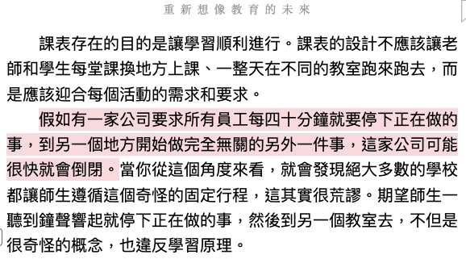

<div><a href="https://moo.im/a/cjosvL" title="重新想像教育的未來"></a></div>


```
重新想像教育的未來 - 世界教育部長肯．羅賓森最後演講，對教育、環保、文化的深刻洞見
作者： 肯．羅賓森  凱特．羅賓森  
原文作者： Sir Ken Robinson  Kate Robinson  
譯者： 廖建容  
出版社：天下文化 
```

#### 買書推薦網址：

- Readmoo: [購買網址](https://moo.im/a/cjosvL)

# 前言:

這是 2023 年第14本讀完的書。  對於 肯．羅賓森 (Sir Ken Robinson) 你可能有看過他在 TED 上面的演講（據說是 TED 目前最多人看過的影片）。關於「學校是否扼殺了創意！」。  肯．羅賓森 是一個致力於教育的偉大教育家，並且透過許多演講與書籍來分享關於教育的看法，這一本是他最後一本創作（因為身體因素，後期都是女兒協助完成）。 


<div style="max-width:854px"><div style="position:relative;height:0;padding-bottom:56.25%"><iframe src="https://embed.ted.com/talks/lang/zh-tw/sir_ken_robinson_do_schools_kill_creativity" width="854" height="480" style="position:absolute;left:0;top:0;width:100%;height:100%" frameborder="0" scrolling="no" allowfullscreen></iframe></div></div>

# 內容摘要：

```
▎教育，需要重新想像

現行教育體制有如「工業化農場」，過度看重服從、測驗和考上名校，
更甚於健康快樂、創造力和學習，忽視孩子的焦慮、壓力和迷茫。

如同我們正在破壞自然資源的多樣性，現行教育體制也在毀滅人類天賦的多樣性。

教育是活的系統，為活生生的人培育心智和心靈。
教育必須使學生了解周遭的世界，以及自己擁有的獨特天賦，
才能提高孩子的成就，使他們能在即將承接的世界發光發熱。

父母和老師是孩子最重要的擁護者；大人對孩子的信任必須高過對教育體系的信任。
當土壤對了，農牧系統就會順利發展；當教育對了，孩子便會順利成長。

一個教育制度能夠成功，不是因為考試，而是個體受到肯定，天賦的多元性受到重視。

在校園裡創造創意性的連結，用跨越年齡、跨越課程、多學科的方式學習，顧及個人的興趣，
以及每個人選擇的獨特路徑，不再教出一代又一代一模一樣的孩子，讓成長、發展和學習自然發生。

這就是像田地一樣充滿生機的「野化教育」，
讓孩子在健康的土壤學習與成長，不再看重標準化，而是發展多樣性。

教育的目標是培養八個核心能力：好奇心、創造力、評判力、溝通力、合作力、同情心、內心的平靜和公民權。
使學生離開校園之後，有能力迎接一生中必然要面對的個人、文化、經濟和社會的挑戰。

▎學校，需要重新想像

學校不該扼殺創意，而要成為活潑的學習場域，幫助學生真正認識自己的獨特天賦和興趣。

學校不該把學科分成「主科」（像是國文、數學、英文與科學）和
「副科」（像是藝術、音樂、體育）。「智商」並非「智力」的全貌。
人類的智力是多元的，鼓勵孩子發展多元智力，
才能發揮創造力。智力的最高形式，是創造性思考。

學校就像一個健康蓬勃的生態系統；
看重老師、跨學科教學、課表有彈性、以正確角度看待評量，
才能達成個人化學習的目標。

學校是廣義的文化生態系統的一部分。
優秀的農民會培育植物的自然生態系統，
同樣的，優秀的學校會致力與外界的更大社群有更緊密的連結。

▎未來，需要重新想像

強大的想像能力讓人類創造出影響深遠的成就，
改變了地球的面貌，但同時也把我們帶到懸崖邊緣。

這個時代的挑戰既真實又急迫，而且人類就是問題的源頭。
氣候變遷危機和地球困境是我們漠視大自然的結果。
要迎接地球與人類存亡的挑戰，我們必須發揮創造力，
讓經濟的發展能夠多元與永續，使生態系能夠平衡與蓬勃發展。

人類既然創造了目前居住的世界，就一定有辦法改造它。
長期以來我們一直用同樣的方式，不斷消耗人類資源和地球自然資源；
必須立刻解決這兩個問題，才能想望未來。
```

## 人類的優勢

人類天生的能力：

- 想像力
- 創造力
  - 過程
  - 原創
  - 價值

許多相關的創造力，在於現今社會許多不同媒體與事物的變革上。

## 你比你所想的更豐富

智力是多元的：

- 在某些層面比較強，相較出來的其他層面就會比較弱。
- 相關的智力也跟天生的環境有關。

智力是動態的：

- 根據不同事情，不同環境的刺激。會有相關智力的表現。
- **將智力與學習科目綁在一起，就會忽略了「創造力」**

創造力的迷思：

- 不是只有藝術相關的才是創造力，任何科目與項目都跟創造力有關。
- 創造力來自於環境，各種遺傳也會影響著創造力的呈現方式。

教育的盲點：

- 試著有條理地整理他們需要的知識，但是卻忘記了他們喜愛的事物。
- 如何培養著相關創造力的產生。
- 教育需要了解每一個學生：
  - 你了解的周遭世界
  - 因為你而存在的內在世界（創造力與智力

教育主要的方向：

- 個人：
  - 了解並尊重每一個人，讓孩子樂於接受教育。
- 文化：
  - 肯定自己的文化，了解其他文化與做法。
- 經濟
- 社會

## 八個重要的能力：

#### 好奇心： 提處問題與探索世界運作方式的能力。

#### 創造力： 產生新的想法和付諸實踐的能力。

- 試著引導孩子們去探索，產生興趣。

#### 判斷力： 分析資訊和想法，形成合理的論點與判斷力。

- 幫助孩子們如何去尋找正確，並且來具有批判性思考。

#### 溝通力：以不同方式清楚自信地表達想法和感受的能力。

#### 合作力： 以建設性方式與他人共事的能力。

#### 同情心： 對他人感同身受並因此採取行動的能力。

#### 內心的平靜：與內在感受連結和培養內在和諧平衡的能力。

#### 公民權： 以正向行動投入社會以及參與社會維繫過程的能力。


## 從工廠到農場的教育： 野化教育

**工廠教育：**

- 大量生產的方式
- 線性生產
- 每個人（老師）有自己負責的項目（科目）
- 預先定義，一成不變，嚴格控管

**工廠化教育的缺點：**

- 把孩子當成商品來教育（到大學），但是往往在「成品」之前，他們的人生以經開始了一大半。
- 透過固定化的教育，許多孩子變得更不快樂。

**野化教育：**

- 好的農夫不會限制生長的框架
- 反而會準備最好土壤，讓植物去成長茁壯。
- 優秀的學校會專注於創造讓孩子成長茁壯，發光發熱的條件。

<div style="max-width:854px"><div style="position:relative;height:0;padding-bottom:56.25%"><iframe src="https://embed.ted.com/talks/lang/zh-tw/sir_ken_robinson_bring_on_the_learning_revolution" width="854" height="480" style="position:absolute;left:0;top:0;width:100%;height:100%" frameborder="0" scrolling="no" allowfullscreen></iframe></div></div>


## 讓學校變成生態系統：

- 尊重生態系統的多樣性（孩子們的多樣性）

- 看重老師，就像孩子本身是教育的主體一樣。 老師也是教育裡面完全無法被剝奪的一環。老師就像是一個良好有經驗的農夫，需要被尊重與給予良好的待遇。

  - 老師的價值在於促進學習動機。（不是讓孩子拿高分）
  - 老師需要針對不同的學生給予不同的誘因與促進他們學習的動機。

  

  

- 透過個人化教育：

  - 多樣性
  - 多面向，多元的智力發展
  - 更有彈性。
    - **如果有一家公司 40 分重要規定員工要做不同的事情，可能會倒閉。但是學校正在這樣做！**




<div style="max-width:854px"><div style="position:relative;height:0;padding-bottom:56.25%"><iframe src="https://embed.ted.com/talks/lang/zh-tw/sir_ken_robinson_how_to_escape_education_s_death_valley" width="854" height="480" style="position:absolute;left:0;top:0;width:100%;height:100%" frameborder="0" scrolling="no" allowfullscreen></iframe></div></div>


# 心得:

如果說這是一本來自於「肯．羅賓森」的一本書，不如說這是他一輩子在做的事情的總結。就像他的三場改變數千萬人的 TED 演講一樣。整本書圍繞著這三個重要的概念
