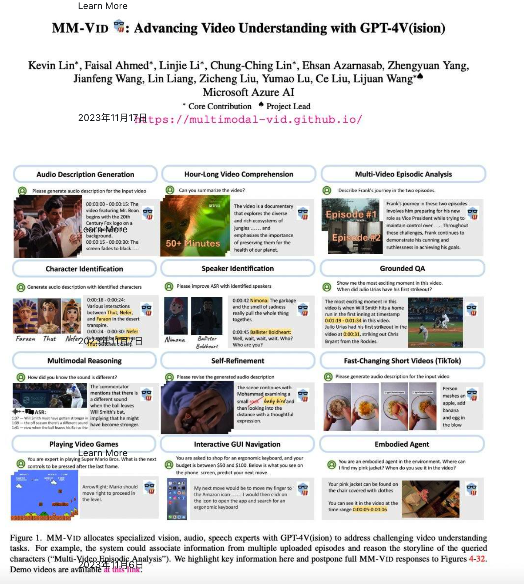
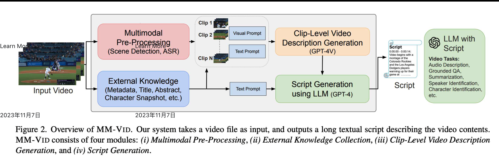

#### [論文名稱：MM-VID : Advancing Video Understanding with GPT-4V(ision)](https://huggingface.co/papers/2310.19773)

MM-VID : Advancing Video Understanding with GPT-4V(ision)

微軟對於 LMM 火力展示又來了，他們公開一套框架叫做 MM-VID 。

可以對於 Multiple Model 更強大的綜合應用。

 不論是看動影片劇情，找尋某個片段。更有影片與聲音的綜合理解功能。第二張圖是架構，基本上透過兩個方面來綜合理解: 

\- 每一個 clip 的理解 (GPT-4V)

\- 對於Metadata 的理解 (GPT-4)

最後產生總結與推論的相關工作
