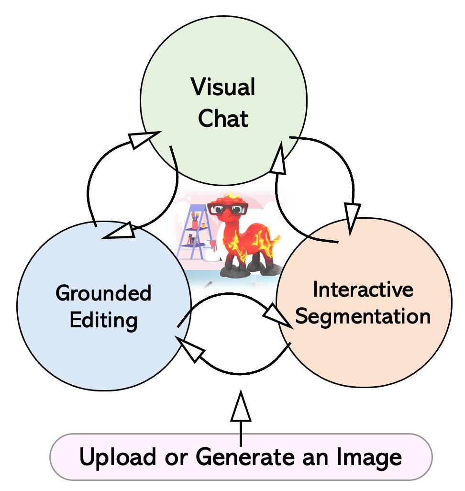
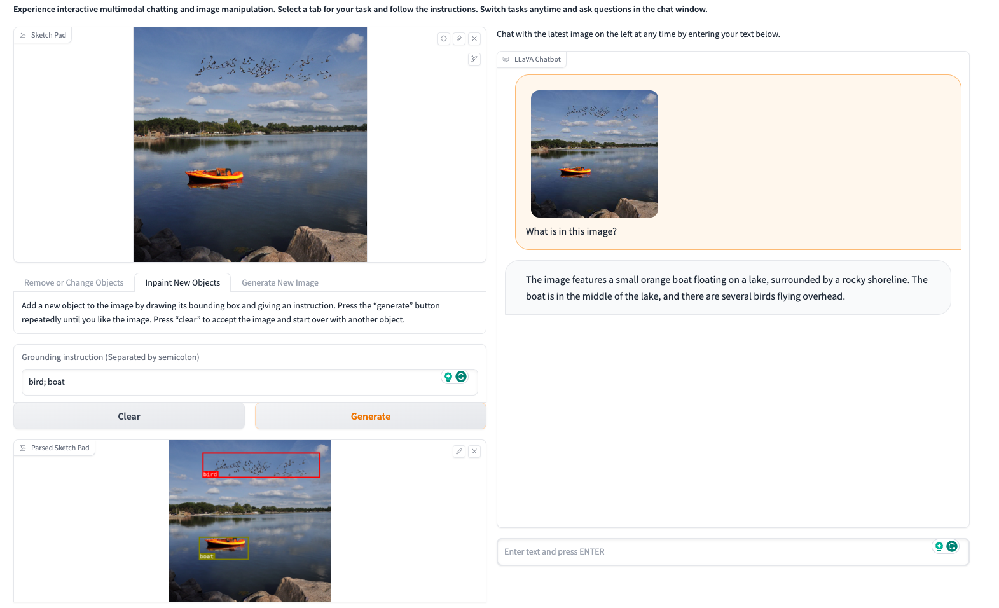

## 前提：

LLaVA-Interactive
週末又在看微軟發表的新的 POC (還有論文) ， LLaVA ( (Large Language-and-Vision Assistant: 可以讓你對一圖片透過 LLM 跟他對話，聽說是 GPT-4V 面向的能力），而微軟更依據這個打造黃金三角:

\- Visual Chat: 針對圖像來理解
\- Grounded Editing: 針對原有圖像的修改
\- Interactive Segmentation:  透過一些互動的修改

你可以針對圖片去修改，重新生成後，再來針對新產生的圖片去理解並且去做 Visual Chat 。

論文, Github 跟 demo 都在
https://llava-vl.github.io/llava-interactive/

註解： LLaVA 是根據這個 repo 
https://github.com/haotian-liu/LLaVA

## 相關論文摘要：

LLaVA-Interactive是一個用於多模態人工智能互動的研究原型系統。該系統可以通過接收多模態用戶輸入並生成多模態回應，與用戶進行多輪對話。LLaVA-Interactive不僅僅局限於語言提示，還可以通過視覺提示對人類意圖進行對齊。該系統的開發非常節省成本，因為它結合了LLaVA的視覺聊天、SEEM的圖像分割以及GLIGEN的圖像生成和編輯等三個多模態技能，而無需進行額外的模型訓練。通過展示多種應用場景，我們展示了LLaVA-Interactive的潛力，並激發了未來在多模態互動系統方面的研究。

## 實際展示：

- 左邊上傳一張湖邊的圖片

- 透過畫線的方式去修改（增加鳥跟船）。

- 然後在右邊可以去根據新產生的圖片去聊天跟理解。

