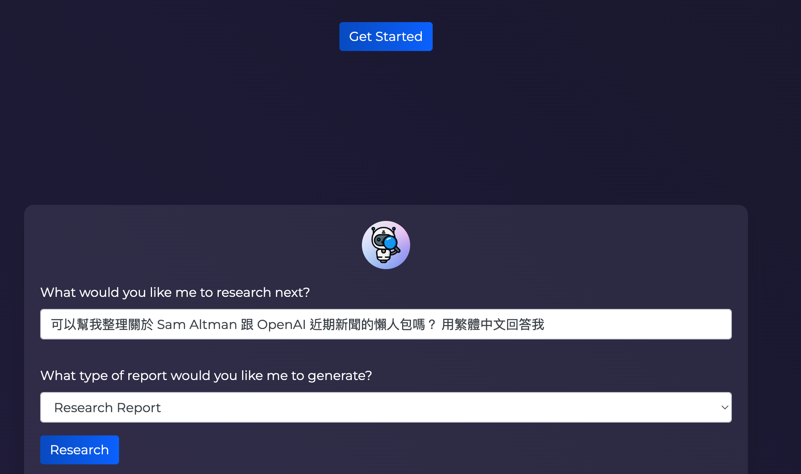
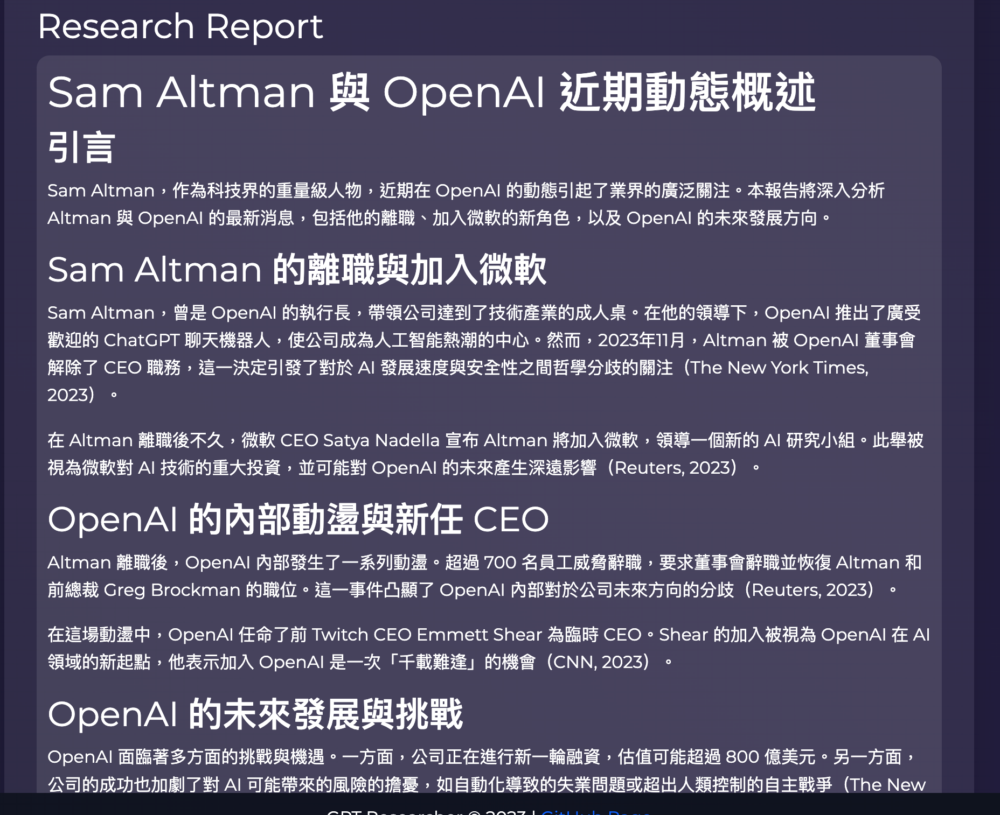
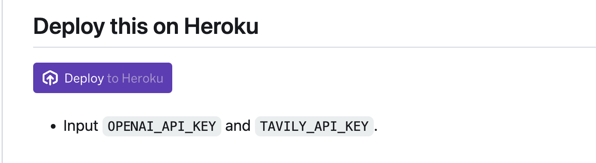

## 前提：

同事喬治日報上面推薦的  [https://github.com/assafelovic/gpt-researcher](https://github.com/assafelovic/gpt-researcher) 真的很好用，搭配   [https://app.tavily.com/home](https://app.tavily.com/home) 超讚

來問問 Sam Altman 最近到底發生什麼事情，懶人包馬上出來。
不太好本地端部署，為了部署在 Heroku 稍微修改一些部署端的設定。






# 實作

分享一下關於部署需要注意的，跟如何如何更改部署流程在雲端的 FaaS 服務上。

## TL;DR 直接按下去部署 Heroic

[https://github.com/kkdai/gpt-researcher](https://github.com/kkdai/gpt-researcher)



## 本地端部署起來

其實真的要部署起來，沒有那麼簡單。首先 local 要克服相關的 python 版本的問題。像是 Python 版本需要 `3.11` 以上。 

### PYENV 控制版本

透過 pyenv 控制 python 版本真的很方便，很多時候 LLM 大多使用 python `3.9` 。但是有一些人會使用 `3.10` 甚至是 `3.11`

- `pyenv versions`：可以列出已經安裝在本地端的所有版本。 可以透過 `pyenv install 3.11.6` 來安裝版本。
- `pyenv local 3.xx.xx`: 本地端，這個 shell session 切換版本。
- `pyenv global 3.xx.xx`:  讓系統預設版本變換。


## 部署到 Heroku

由於這個專案，有提供 `Dockerfile` 其實要本地端部署還是簡單一點。如果希望可以讓更多人使用，可以試試看放在 Heroku 上面。以下分享幾個需要修改的地方。


### 關於浮動 port

有使用 Cloud Platform 的人都知道，雲端上面 FaaS (Function As A Services) 無法讓你任意選擇開啟的 PORT 。通常會使用 `$PORT` 帶下去啟動。 關於這部分，可能要檢查一些地方：

#### Dockerfile 套用 $PORT

原有版本在 [https://github.com/assafelovic/gpt-researcher/blob/master/Dockerfile]( https://github.com/assafelovic/gpt-researcher/blob/master/Dockerfile) 

```
FROM python:3.11.4-slim-bullseye as install-browser

RUN apt-get update \
    && apt-get satisfy -y \
    "chromium, chromium-driver (>= 115.0)" \
    && chromium --version && chromedriver --version

......

EXPOSE 8000
CMD ["uvicorn", "main:app", "--host", "0.0.0.0", "--port", "8000"]
```

最後一行的 `CMD ["uvicorn", "main:app", "--host", "0.0.0.0", "--port", "8000"]` 由於要帶入環境變數 `$PORT` 修改如下：

```
CMD uvicorn main:app --host 0.0.0.0 --port  $PORT
```

而 `EXPOSE 8000` 也可以改成 `EXPOSE 5000` (非必須)。


#### 檢查程式內是否有 hard code PORT

原本的 [https://github.com/assafelovic/gpt-researcher/blob/master/main.py](https://github.com/assafelovic/gpt-researcher/blob/master/main.py) 會固定使用 8000 port 要修改。

```
from backend.server import app
import os
port = int(os.environ.get("PORT", 5000))

if __name__ == "__main__":
    import uvicorn

    uvicorn.run(app, host="0.0.0.0", port=port)
```


#### 讓 Heroku 知道要去跑 Docker build 

建立一個檔案 `heroky.yml` ，然後很簡單加上以下內容。

```
build:
  docker:
    web: Dockerfile
```


#### 最後如何讓他可以一鍵部署 - Using Heroku Deployment

```
{
    "name": "GPT Researcher",
    "description": "GPT Researcher is an autonomous agent designed for comprehensive online research on a variety of tasks.",
    "env": {
        "TAVILY_API_KEY": {
            "description": "The API key for Tavily service",
            "required": true
        },
        "OPENAI_API_KEY": {
            "description": "The API key for OpenAI service",
            "required": true
        }
    },
    "stack": "container",
    "formation": {
        "web": {
            "quantity": 1
        }
    }
}
```


這邊有幾個需要注意的，條列說明：

- `env` 設定固定的系統參數。 這裡是 `TAVILY_API_KEY` 跟 `OPENAI_API_KEY`

- 告訴 Heroku 要跑 container stack ：`"stack": "container",`

- 最後讓他知道裡面有幾個 services :

  ```
   "formation": {
          "web": {
              "quantity": 1
          }
      }
  ```


# 大功告成：

還蠻簡單的吧？ 其實 Heroku 運算能力還蠻夠的，要部署一些服務也蠻簡單的。


