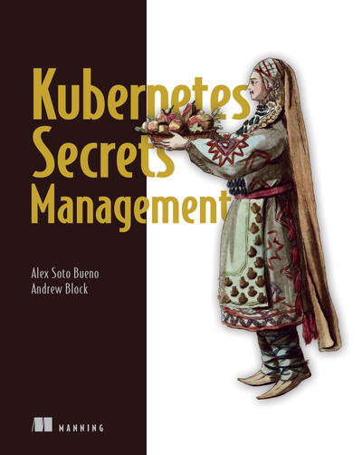
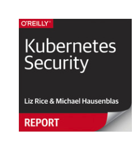
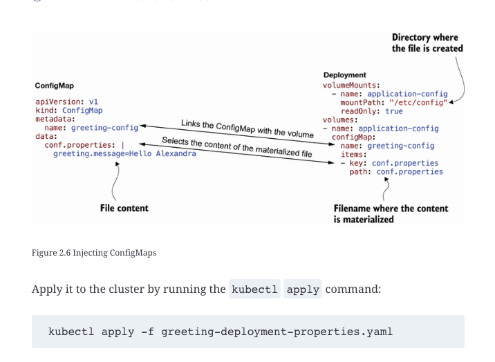
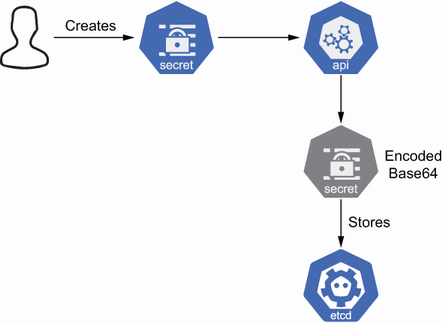

## 前提：

最近在聊天的時候討論到，究竟在 Kubernetes 內管控一些帳號與密碼的時候，我們都知道要使用 [Kubernetes Secret](https://kubernetes.io/docs/concepts/configuration/secret/) 而不要使用 [Environment Variables](https://kubernetes.io/docs/tasks/inject-data-application/define-environment-variable-container/) 。 但是在安全性上究竟有哪些差異，我決定查一些書上面的整理：


## 參考書籍內容


### **[Kubernetes Security**](https://learning.oreilly.com/library/view/kubernetes-security/9781492039075/) [Liz Rice](https://learning.oreilly.com/search/?query=author%3A"Liz Rice"&sort=relevance&highlight=true), [Michael Hausenblas](https://learning.oreilly.com/search/?query=author%3A"Michael Hausenblas"&sort=relevance&highlight=true)



You can pass environment variables into containers at runtime. This means you can take the container image (code) and configure it according to the scenario it is running in. In Kubernetes, “ordinary” environment variables can be specified directly in the pod YAML or via a [ConfigMap](http://bit.ly/2Q8Hlkb). But be careful: including secret values in YAML files that you check into code control means those secrets are accessible to the same people who can see the source code.

To mitigate this, Kubernetes also supports the [secret](http://bit.ly/2xCI7Pz) resource, which can be [passed into a pod as an environment variable](http://bit.ly/2xO0Syz). Your pod spec or ConfigMap YAML refers to the secret resource by name rather than directly to the secret value, so that it’s safe to put that YAML under code control.

Kubernetes 1.7 之後的版本，可以加上  [node authorization](http://bit.ly/2IfD2k1)  確保未經授權的 kubelet 來存取機密資訊。


### [Kubernetes Secrets Management](https://learning.oreilly.com/library/view/kubernetes-secrets-management/9781617298912/) By [Andrew Block](https://learning.oreilly.com/search/?query=author%3A"Andrew Block"&sort=relevance&highlight=true), [Alex Soto](https://learning.oreilly.com/search/?query=author%3A"Alex Soto"&sort=relevance&highlight=true)


### [2 An introduction to Kubernetes and Secrets](https://learning.oreilly.com/library/view/kubernetes-secrets-management/9781617298912/OEBPS/Text/02.htm#heading_id_10)




As discussed in chapter 1, one of the big differences between Secrets and ConfigMaps is how data is stored inside `etcd`. Secrets store data in Base64 format; ConfigMaps store data in plain text.


### 2.4.2 Secrets are mounted in a temporary file system

A Secret is only sent to a Node if there is a Pod that requires it. But what’s important is that a Secret, even though it is mounted as a volume, is never written to disk but in-memory using the `tmpfs` file system. `tmpfs` stands for temporal filesystem, and as its name suggests, it is a file system, where data is stored in volatile memory instead of persistent storage. When the Pod containing the Secret is deleted, the kubelet is responsible for deleting it from memory as well.


### 危險程度 / Hacking 方式

#### Environment Variables / 
```
export
 
declare -x GREETING_MESSAGE="Hello Anna"     ①
declare -x HOME="/"
declare -x HOSTid="greeting-demo-deployment-5664ffb8c6-2pstn"
...

```


#### Secret 放在暫存檔案

```
mount | grep tmpfs
 
tmpfs on /dev type tmpfs (rw,nosuid,size=65536k,mode=755)
tmpfs on /sys/fs/cgroup type tmpfs (ro,nosuid,nodev,noexec,relatime,mode=755)
tmpfs on /etc/sec type tmpfs (ro,relatime) /   ①
...
 
ls /etc/sec                                    ②
 
greeting.message
 
cat /etc/sec/greeting.message                  ③
 
Hello Anna
```


### 利用外部的結構



### Summary

- Kubernetes 叢集由主節點和可選的工作節點組成。
- 任何 Kubernetes 資源和叢集的目前狀態都儲存在`etcd` 實例中。
- 我們討論了將應用程式部署到 Kubernetes。
- 我們介紹了使用 ConfigMaps 在外部配置應用程序，無論是作為環境變數還是作為文件。
- Secrets 在建構和使用上與 ConfigMap 沒有太大不同。


### 要加強 configMap 可以參考這一篇

#### [使用 Kubernetes ConfigMap 進行正確的秘密管理](https://www.trendmicro.com/en_us/devops/23/f/kubernetes-configmaps-secret-management.html)
