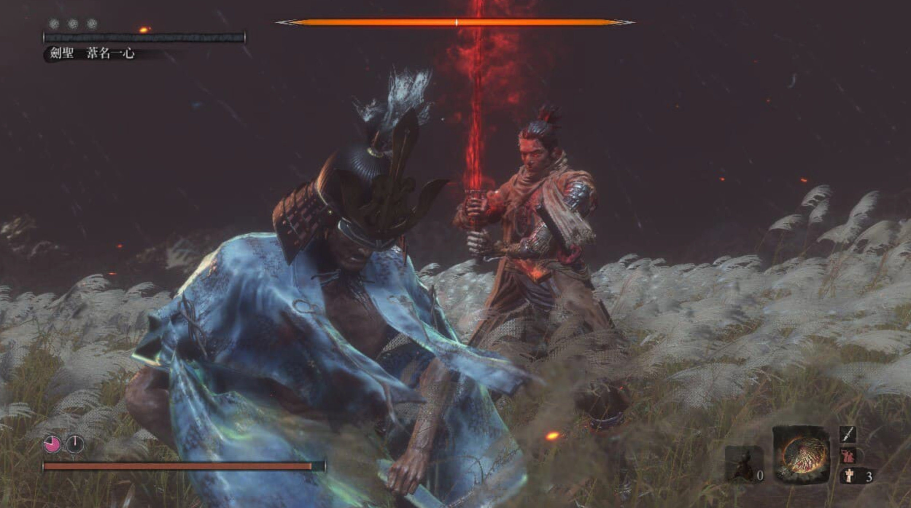
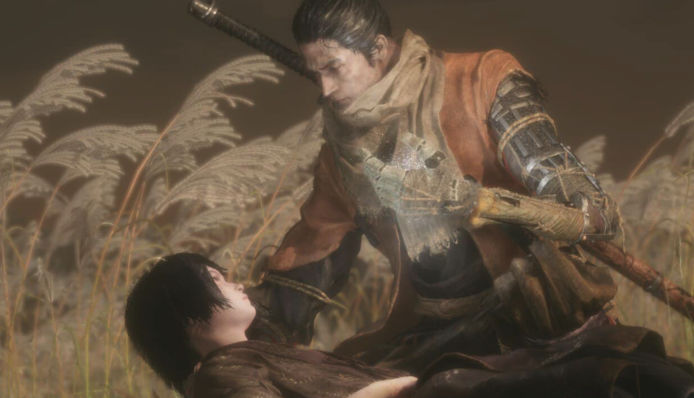
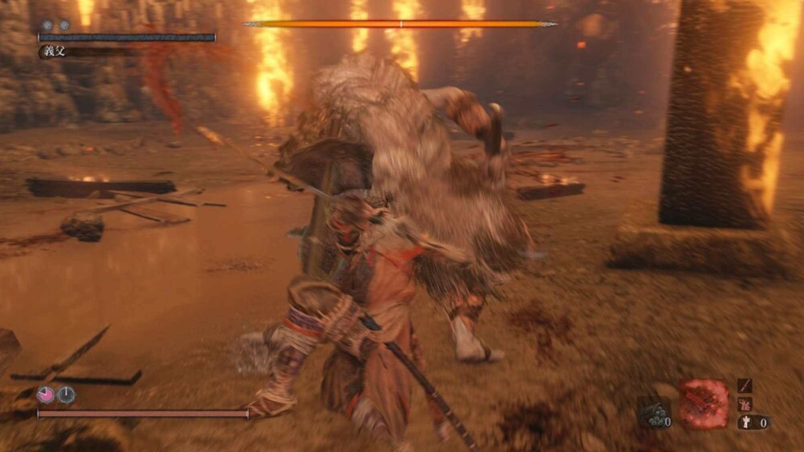
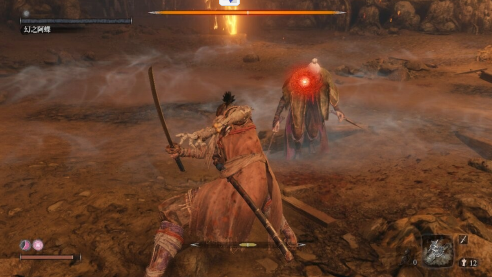

終於把隻狼打通關了，黑血狼剩下 「[血緣詛咒」 ，其他都在 Steam Deck 全破。 （可惡索尼獨佔）。

尾王一心比較麻煩就是第一階段，二三階段就乖乖用傘反擊慢慢耗，只識破槍的突刺。「猶豫，就會敗北」

## 比較難的關卡

雙義父打完，其實三年前的比在天守閣的弱一點，天守閣因為我不能卡牆，天守閣放毒倒是比較困擾。 不過慢慢防守用不死斬總算也是打完了 。

### 經過 「Ｐ的謊言」後，隻狼變簡單了

經過 「P的謊言」我的隻狼有變強很多。（明明才剛開始。

不過用 SD 好討厭啊～都不好錄影。為了截圖還差點忘記砍最後一刀，差點就搞笑了。討伐次數大概是五次，不過我有看攻略。

打完 P 的謊言再來打隻狼～會很好過誒

之前在 PS5 卡太久，一直沒時間打。 結果打完 P 的謊言練習很久的阻擋之後。 就很順利的過了 O_0 ？ 看來之前全破魂系列都是閃躲王～～

<iframe width="560" height="315" src="https://www.youtube.com/embed/T_5m74SByXA?si=m7sHf-jAio-6yJHJ" title="YouTube video player" frameborder="0" allow="accelerometer; autoplay; clipboard-write; encrypted-media; gyroscope; picture-in-picture; web-share" allowfullscreen></iframe>
