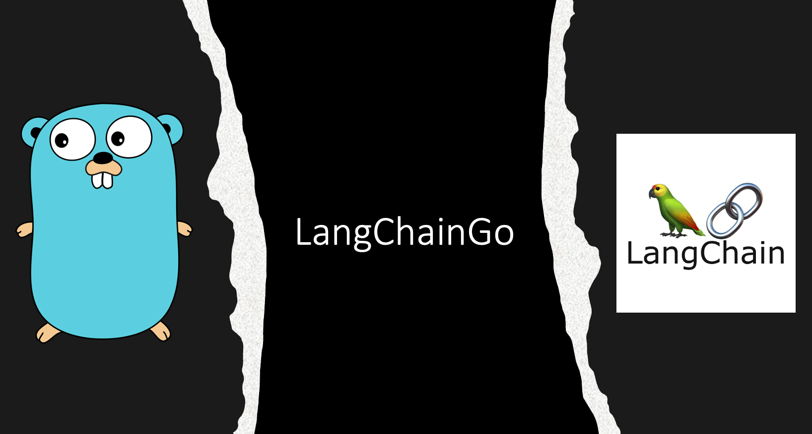
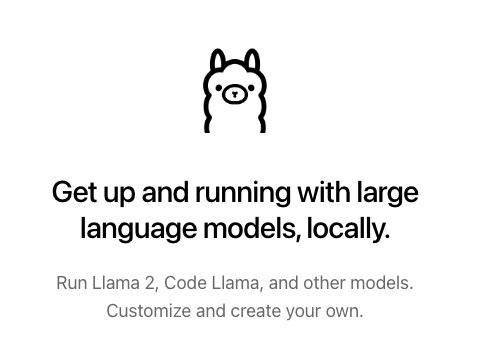

# 前提

好久沒來寫 Golang 來寫文章了，就想說把之前看過關於 Golang LangChain 相關的文章來敘述一下。以下這篇文章主要參考了 [Eli Bendersky 部落格的文章 - [Using Ollama with LangChainGo](https://eli.thegreenplace.net/2023/using-ollama-with-langchaingo/)](https://eli.thegreenplace.net/2023/using-ollama-with-langchaingo/)

 這裡也會詳細一點來介紹以下幾個部分：

- 什麼是 Ollama 能拿來做些什麼？
- 要如何使用 Ollama ?
- 如何透過 Golang 連接 Ollama 並且串接 LangChain 
- 來個有趣的範例吧


# 什麼是 Ollama



[Ollama](https://ollama.ai/) 是一個相當方便的工具，以往需要在本地端使用 llama 的話需要有以下的步驟：

- [到 Meta AI 申請下載 link](https://ai.meta.com/llama/)
- 透過 [LLAMA.cpp](https://github.com/ggerganov/llama.cpp) 把 LLAMA2 的 model 去轉換過後，讓你在 Mac OSX 上面可以執行並且讀取。 （當然還有 
- 然後執行  [LLAMA.cpp](https://github.com/ggerganov/llama.cpp) 去跑起來 LLAMA 的 model 來跑你需要的功能。


但是使用 Ollama 卻相當的簡單

### 安裝 Ollama 

參考 [github 說明](https://github.com/jmorganca/ollama)：

```
curl https://ollama.ai/install.sh | sh
```

### 執行之後，就會下載模型

```
ollama run llama2
```

更多其他 Models ：

| Model              | Parameters | Size  | Download                       |
| ------------------ | ---------- | ----- | ------------------------------ |
| Neural Chat        | 7B         | 4.1GB | `ollama run neural-chat`       |
| Starling           | 7B         | 4.1GB | `ollama run starling-lm`       |
| Mistral            | 7B         | 4.1GB | `ollama run mistral`           |
| Llama 2            | 7B         | 3.8GB | `ollama run llama2`            |
| Code Llama         | 7B         | 3.8GB | `ollama run codellama`         |
| Llama 2 Uncensored | 7B         | 3.8GB | `ollama run llama2-uncensored` |
| Llama 2 13B        | 13B        | 7.3GB | `ollama run llama2:13b`        |
| Llama 2 70B        | 70B        | 39GB  | `ollama run llama2:70b`        |
| Orca Mini          | 3B         | 1.9GB | `ollama run orca-mini`         |
| Vicuna             | 7B         | 3.8GB | `ollama run vicuna`            |

```
➜  Documents ollama run llama2
pulling manifest
pulling 22f7f8ef5f4c... 100% ▕██████████████████████████████████████████████████████████████████████████████████▏ 3.8 GB
pulling 8c17c2ebb0ea... 100% ▕██████████████████████████████████████████████████████████████████████████████████▏ 7.0 KB
pulling 7c23fb36d801... 100% ▕██████████████████████████████████████████████████████████████████████████████████▏ 4.8 KB
pulling 2e0493f67d0c... 100% ▕██████████████████████████████████████████████████████████████████████████████████▏   59 B
pulling 2759286baa87... 100% ▕██████████████████████████████████████████████████████████████████████████████████▏  105 B
pulling 5407e3188df9... 100% ▕██████████████████████████████████████████████████████████████████████████████████▏  529 B
verifying sha256 digest
writing manifest
removing any unused layers
success

# 寫一首詩，但是他看不太懂：
>>> write me a potry
Sure, I'd be happy to write a short story for you! Can you give me some details on what you would like the story to be about? For example,
is it a romance, a mystery, a sci-fi adventure, or something else entirely? And how long would you like the story to be?


# 用中文問也是可以，但是回答會是英文：
>>> 寫一個笑話給我
Of course! Here's a short humorous story for you:

One day, a man walked into a library and asked the librarian, "Do you have any books on Pavlov's dogs and Schrödinger's cat?"

The librarian replied, "It rings a bell, but I'm not sure if it's here or not."


# 強迫要他回覆中文，看起來還可以：
➜  ollama-go ollama run llama2
>>> 寫一首詩給我，  reply in zh_tw
 Of course, I'd be happy to write a poem for you! Here it is:

紅色的陽光在天上照亮，
顯示出世界的美好。
每一個人都有自己的story，
filled with laughter, tears, and glory.

在沒有你的時候，我們會繁榮；
在你回來的時候，我們會歡喜。
你是我們的家，是我們的心靈伴侶，
不管 WHERE 你去，我們都会等你回來。

I hope you like it! Let me know if you have any requests or preferences for the poem.
```


### 透過 API Gateway 呼叫 Ollama

最方便的，架起了 Ollama 之後除了可以透過 `ollama` 來呼叫，更可以透過 API 來對本地端呼叫。

```
curl http://localhost:11434/api/generate -d '{
  "model": "llama2",
  "prompt": "very briefly, tell me the difference between a comet and a meteor",
  "stream": false
}'
------
{"model":"llama2","created_at":"2023-12-11T14:41:36.760949Z","response":"\nSure! Here's the difference between a comet and a meteor:\n\nComets are icy bodies that originate from the outer reaches of the solar system. They are composed of dust, ice, and rock, and they have a long, elliptical orbit around the sun. When a comet approaches the inner solar system, the sun's heat causes the comet to release gas and dust, creating a bright tail that can be seen from Earth.\n\nMeteors, on the other hand, are small rocks or pieces of debris that enter Earth's atmosphere. As they travel through the atmosphere, they burn up due to friction with the air, producing a bright streak of light in the sky, commonly known as a shooting star. The remains of the meteoroid can sometimes survive entry into the atmosphere and land on Earth as a meteorite.\n\nSo, while both comets and meteors are objects in space, the key difference is that comets are icy bodies that originate from outside the solar system, while meteors are small rocks or pieces of debris that originate from within the solar system (primarily from asteroids).","done":true,"context":.......}
```

# 寫一個簡單的 LangChain 跟 Ollama 的應用

```
package main

import (
	"context"
	"fmt"
	"log"

	"github.com/tmc/langchaingo/llms"
	"github.com/tmc/langchaingo/llms/ollama"
	"github.com/tmc/langchaingo/schema"
)

func main() {
	llm, err := ollama.NewChat(ollama.WithLLMOptions(ollama.WithModel("llama2")))
	if err != nil {
		log.Fatal(err)
	}
	ctx := context.Background()
	completion, err := llm.Call(ctx, []schema.ChatMessage{
		schema.SystemChatMessage{Content: "Give a precise answer to the question based on the context. Don't be verbose."},
		schema.HumanChatMessage{Content: "What would be a good company name a company that makes colorful socks? Give me 3 examples."},
	}, llms.WithStreamingFunc(func(ctx context.Context, chunk []byte) error {
		fmt.Print(string(chunk))
		return nil
	}),
	)
	if err != nil {
		log.Fatal(err)
	}

	fmt.Println(completion)
}

```

你可以透過 github 找到完整程式碼
