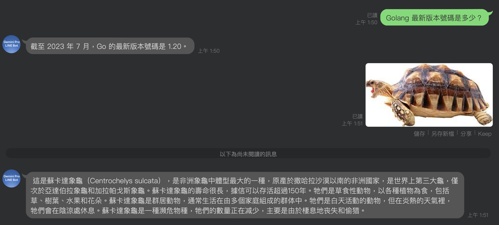
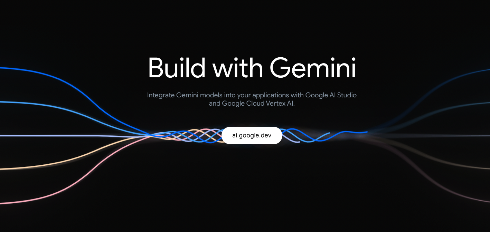
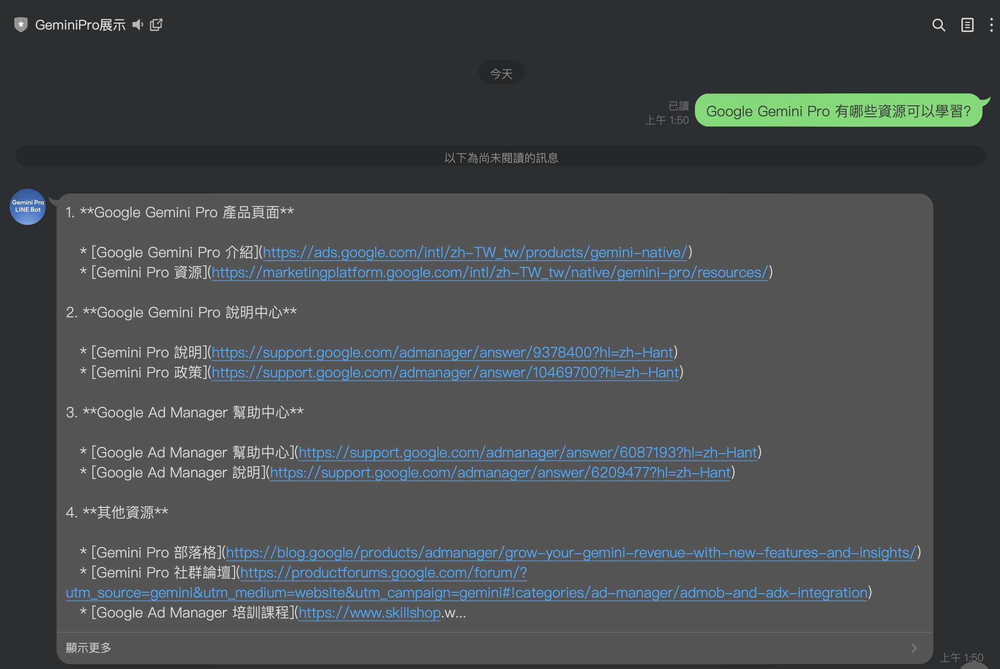
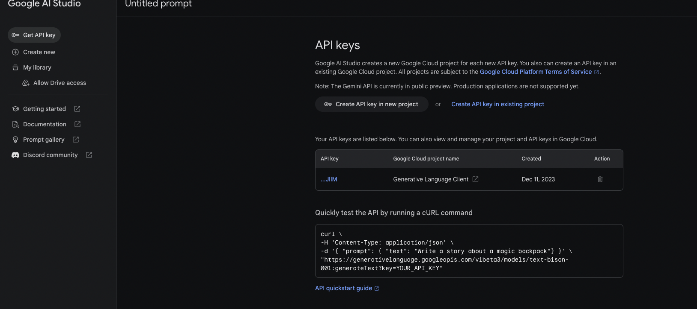
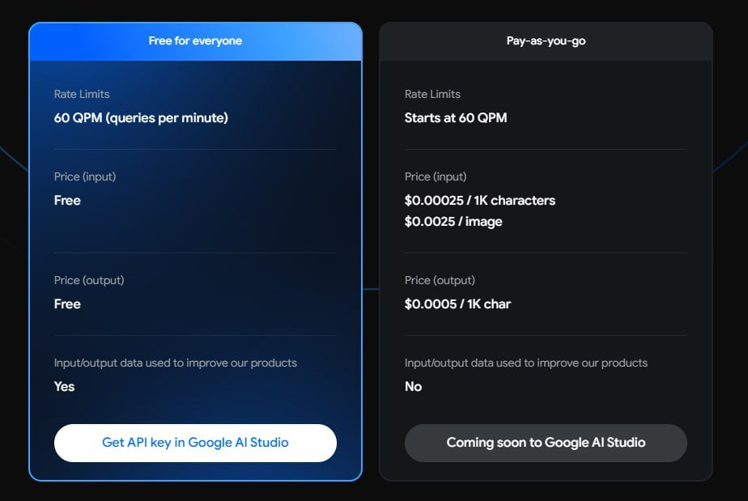
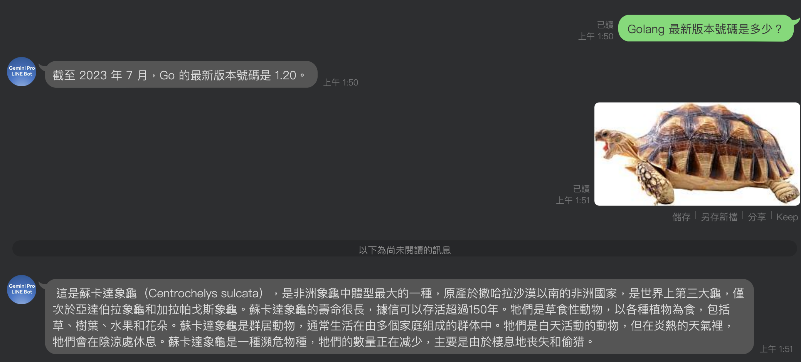
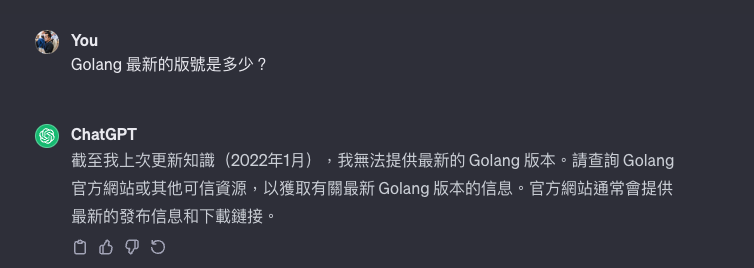

# 前提

上一次開始使用 [tmc](https://github.com/tmc)/[langchaingo](https://github.com/tmc/langchaingo) 打造一些基礎的 Golang 應用後，就在 12 月 13 號 Google 正式公開了 Gemini Pro 的相關 API 。本篇文章開始以下的事項：

- Google Gemini Pro 有哪些資源可以學習？
- 如何整合到 LINE Bot?
- 打造一個回覆，圖片辨識的 Gemini Pro LINE Bot


## Google Gemini Pro 有哪些資源可以學習



雖然才正式公佈不久，但是網路上其實有不少資源可以學習。我這邊列出一些資源： (直接問 Gemini Pro 出來的)



這裡也有一些我覺得蠻重要的資訊:

-  Vetex-ai (Google) 的 function calling ?  [https://cloud.google.com/vertex-ai/docs/generative-ai/multimodal/function-calling#function-calling-sdk-samples](https://cloud.google.com/vertex-ai/docs/generative-ai/multimodal/function-calling#function-calling-sdk-samples)
  - Colab: [https://colab.research.google.com/github/GoogleCloudPlatform/generative-ai/blob/main/gemini/function-calling/intro_function_calling.ipynb](https://colab.research.google.com/github/GoogleCloudPlatform/generative-ai/blob/main/gemini/function-calling/intro_function_calling.ipynb)
- Golang 加上 Gemini pro 這邊有大大 Eli Bendersky 寫的  sample code 
  [https://eli.thegreenplace.net/2023/using-gemini-models-from-go/](https://eli.thegreenplace.net/2023/using-gemini-models-from-go/)


## 如何取得  Google Gemini Pro - API Keys

到 Google AI Studio : [https://makersuite.google.com/app/apikey]( https://makersuite.google.com/app/apikey)



目前價位如下，還有一些免費額度可以用：



## 如何取得 Google Cloud Platform - Services Account Key JSON

照理說，如果只是要跑 Gemini Pro API call 應該是不需要 GCP 相關設定。  因為透過以下的 `curl` 是可以正常執行的：

```
curl \
-H 'Content-Type: application/json' \
-d '{ "prompt": { "text": "Write a story about a magic backpack"} }' \
"https://generativelanguage.googleapis.com/v1beta3/models/text-bison-001:generateText?key=YOUR_API_KEY"
```

但是可能是套件相關的原因，啟動相關 [Golang GAI API](https://github.com/google/generative-ai-go) 就會需要我準備相關的 gcloud 的 context 跟 credential 。 我猜跟整個套件的啟動有關，暫時先不去 debug。 (Github: [https://github.com/google/generative-ai-go)](https://github.com/google/generative-ai-go))

可以參考這一篇： [[學習文件] 如何在 Heroku 上面使用透過 Golang 來存取 Google Cloud 服務](https://www.evanlin.com/til-heroku-gcp-key/)


## 如何整合 LINE Bot?

#### 程式碼： [https://github.com/kkdai/linebot-gemini-pro](https://github.com/kkdai/linebot-gemini-pro)

這邊主要先整入兩個主要功能 :  ChatSession 跟 Image ，相關程式碼都在 [gemini.go](https://github.com/kkdai/linebot-gemini-pro/blob/main/gemini.go)


### Chat Completion 

```
// Gemini Chat Complete: Iput a prompt and get the response string.
func GeminiChatComplete(req string) string {
	ctx := context.Background()
	client, err := genai.NewClient(ctx, option.WithAPIKey(geminiKey))
	if err != nil {
		log.Fatal(err)
	}
	defer client.Close()
	model := client.GenerativeModel("gemini-pro")
	cs := model.StartChat()

	send := func(msg string) *genai.GenerateContentResponse {
		fmt.Printf("== Me: %s\n== Model:\n", msg)
		res, err := cs.SendMessage(ctx, genai.Text(msg))
		if err != nil {
			log.Fatal(err)
		}
		return res
	}

	res := send(req)
	return printResponse(res)
}
```


這個主要是處理一個 [Chat Session](https://pkg.go.dev/github.com/google/generative-ai-go/genai#example-ChatSession) ，就是類似 OpenAI 的 [Chat Completion](https://platform.openai.com/docs/guides/text-generation/chat-completions-api)。 加強解釋一些東西：

- 回傳資料 `res := send(req)` 其中的 res 不能直接用，需要透過 `printResponse(res)` 拿回來。

其實也就是拿出最接近的那個答案中的本文：

```
func printResponse(resp *genai.GenerateContentResponse) string {
	var ret string
	for _, cand := range resp.Candidates {
		for _, part := range cand.Content.Parts {
			ret = ret + fmt.Sprintf("%v", part)
			fmt.Println(part)
		}
	}
	fmt.Println("---")
	return ret + "\n---"
}
```


### Gemini Pro Vision / 圖片相關 API

```
func GeminiImage(imgData []byte) (string, error) {
	ctx := context.Background()
	client, err := genai.NewClient(ctx, option.WithAPIKey(geminiKey))
	if err != nil {
		log.Fatal(err)
	}
	defer client.Close()

	model := client.GenerativeModel("gemini-pro-vision")
	prompt := []genai.Part{
		genai.ImageData("png", imgData),
		genai.Text("Describe this image with scientific detail, reply in zh-TW:"),
	}
	log.Println("Begin processing image...")
	resp, err := model.GenerateContent(ctx, prompt...)
	log.Println("Finished processing image...", resp)
	if err != nil {
		log.Fatal(err)
		return "", err
	}

	return printResponse(resp), nil
}
```

幾件事情要注意:

- model 不一樣，放錯會出事情： `"gemini-pro-vision"`
- 資料一定要指定副檔名，超怪。 不過我都放 `"png"` 就過了。

## 快速部署

不想學那麼多，就準備好以下資料，就按下 Deploy 

- ChannelAccessToken
- ChannelSecret
- GCS_PROJECT_ID
- GCS_BUCKET_NAME
- GOOGLE_GEMINI_API_KEY
- GOOGLE_APPLICATION_CREDENTIALS (不用寫，固定的)
- GOOGLE_CREDENTIALS

## 成果與 Google Gemini Pro API 的一些特點：

### 1. 資料時效相當的新





時效蠻新的，很多資料都是 2023/07 之後。ChatGPT 這種就回答不出來。

- ChatGPT GPT 3.5 是 2022
- API GPT4 是 2023/04 


### 2. 很多資料會附上 Markdown Link ，蠻方便在 LINE Bot 中使用：


- 像是以上的內容，因為許多資料都有 link 可以使用，貼到 LINE Bot 沒有太多問題。
- 不過因為直接回 Markdown 可能要把相關語法刪除掉，才能正確顯示。
- 這裡註解一下，因為 Gemini Pro 的 temperature 預設是 0.9 ([refer](https://cloud.google.com/vertex-ai/docs/generative-ai/model-reference/gemini))


## 接下來:

可以開始來玩玩 Function Calling 儘可能把相關內容試試看。  然後也可以等等 LangChainGo 什麼時後把 [Gemini Pro 接起來](https://github.com/tmc/langchaingo/issues/410)。


 # 參考資料：

- [Using Gemini models from Go by Eli Bendersky's website](https://eli.thegreenplace.net/2023/using-gemini-models-from-go/)
- [Google Gemini API](https://cloud.google.com/vertex-ai/docs/generative-ai/model-reference/gemini#gemini-pro-vision)
- [Google Build with Gemini](https://deepmind.google/technologies/gemini/#build-with-gemini) 
- [Google Blog: It’s time for developers and enterprises to build with Gemini Pro](https://blog.google/technology/ai/gemini-api-developers-cloud/)
- [Google Gemini Pro - API Keys](https://makersuite.google.com/app/apikey)
- [Vertex API with Function Calling by LangChain: Competitor Analytics with Langchain Agents and Vertex Palm API](https://medium.com/google-cloud/competitor-analytics-with-langchain-agents-and-vertex-palm-api-410453cecd83) 
- [如何使用 Google 的 Gemini 模型 API？(基礎教學，附上 Python 範例程式)](https://blog.jiatool.com/posts/gemini_api/)
