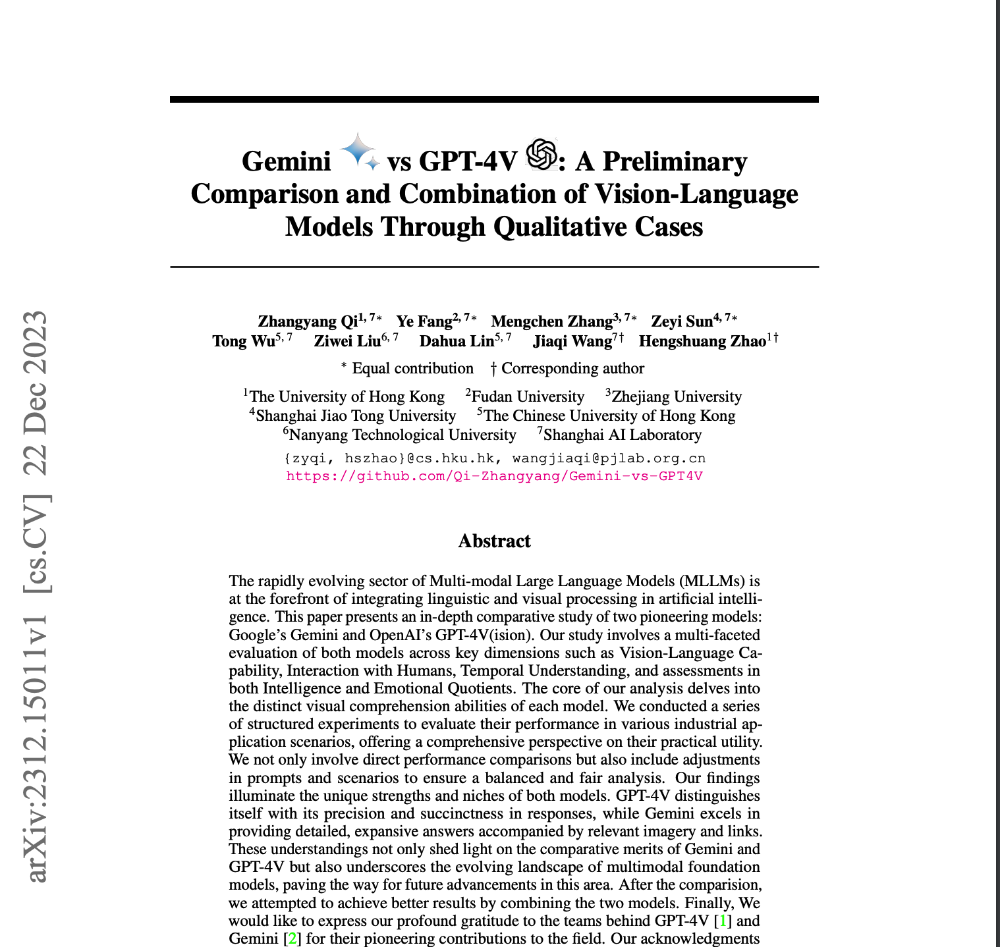
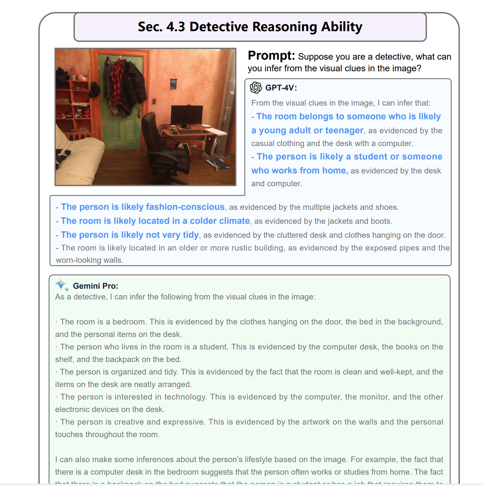
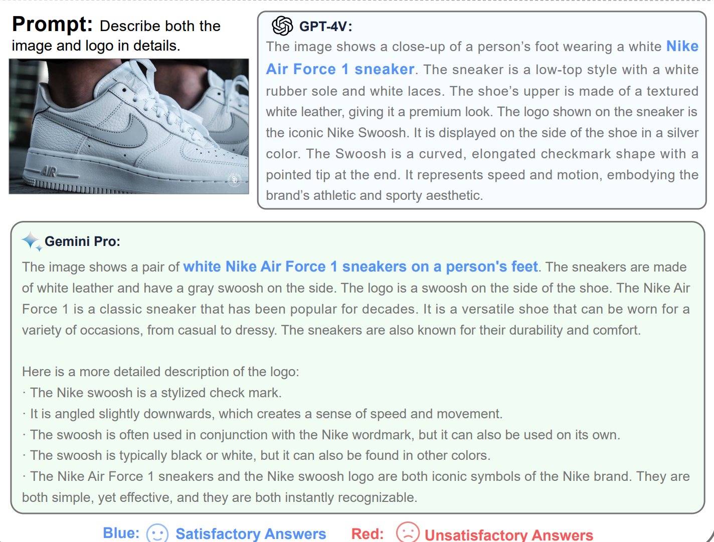
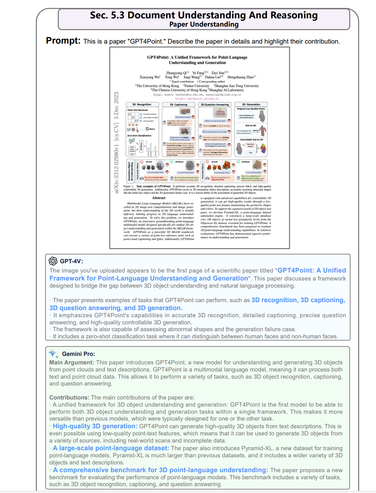

### 論文名稱: Gemini vs GPT-4V: A Preliminary Comparison and Combination of Vision-Language Models Through Qualitative Cases

[https://arxiv.org/abs/2312.15011](https://arxiv.org/abs/2312.15011)

## 快速總結

裡面透過之前微軟發表過的論文中的相關測試案例外，本篇論文也加上幾個類別的案例。 tl;dr GPT-4v 比較簡潔中確性高，但是 Gemini-Pro 的敘述比較清楚。 裡面有很多圖片與相關案例，蠻值得一讀。

## 幾個有趣案例

#### 當個偵探

都有看出幾個相關的點，蠻適合拿來做一些 side-project 。 :p 

### 判斷鞋子的品牌

有判斷出 NIKE Air Force 1 我覺得蠻厲害的。

### 讀論文第一頁圖片

成效不錯，如果沒有 arxiv 的資訊可以抽取。這會是一個方法。

