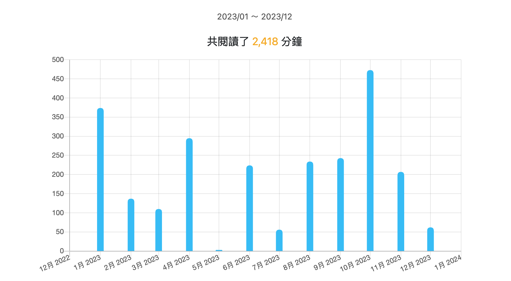
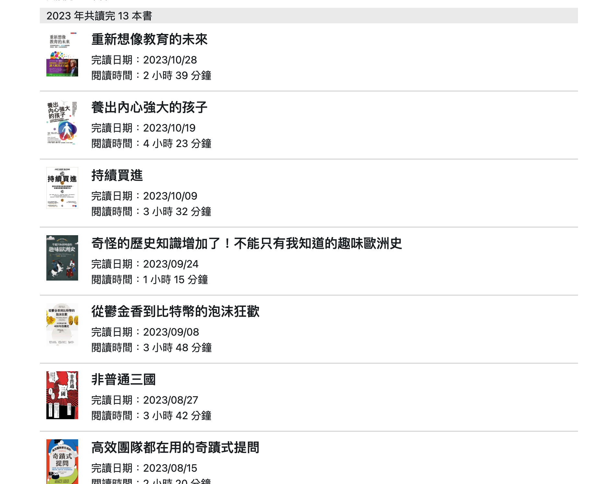
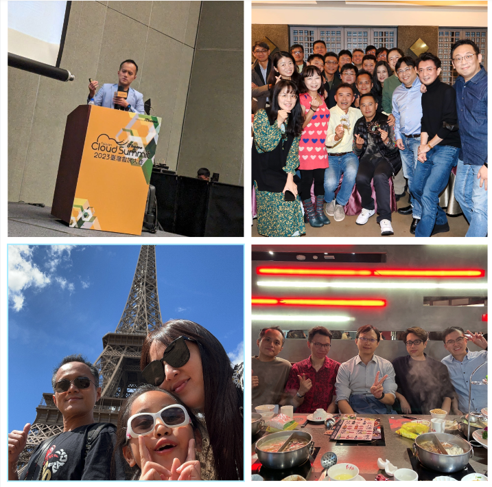
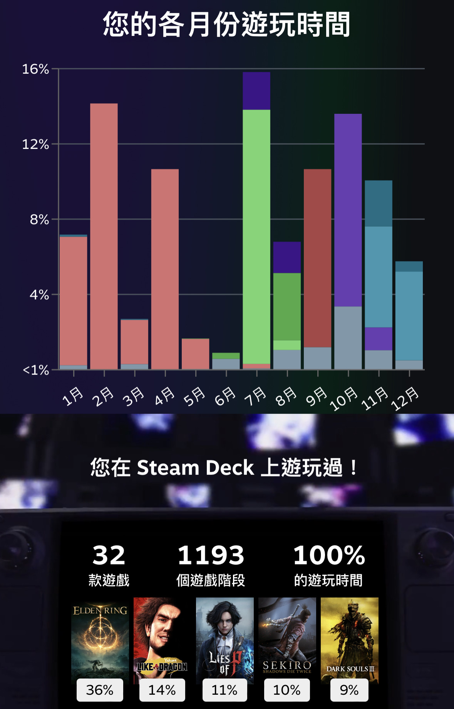
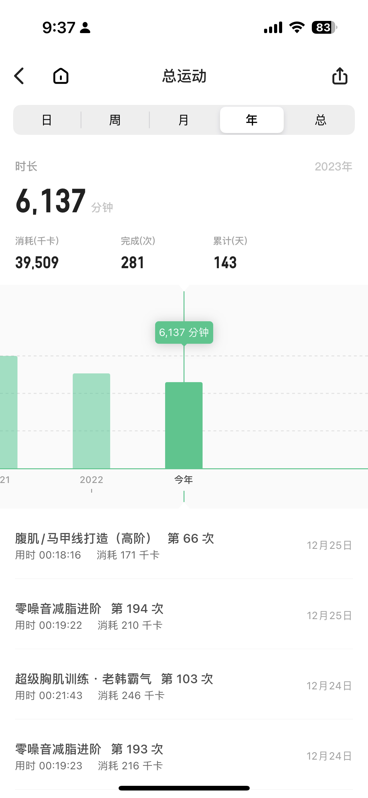

## 2023 年度回顧 

# 懶人包

今年最令人懷念的就是：

- 八月的時候，來了一趟去英國跟法國的旅遊。
- 因為去年 LLM 大爆發，今年有幸可以參加一堆好玩的專案與內部訓練。  (共有 [28 個 new Repositories](https://github.com/kkdai?tab=repositories&q=created%3A2023-01-01..2023-12-31&type=&language=&sort=))

到了這個年紀，可以從事自己喜愛的工作，家人開心在一起，還有健康身體，真的很重要。

## 數據總結

- 總共讀完: 2418 分鐘, 14 本書 (有 1 本其他平台)

  - 2022: 24 本書。 
- 部落格文章撰寫上：

  - 2023: 59 篇文章
  - 2022: 53 篇文章
- 健身運動：
  - 2023: 3595 mins
  - 2022: 3966 mins
- Github Contribution 上面:
  - 2023: 1062 
  - 2022: 828
- 因為 LLM 今年有許多專案： (共有 [28 個 new Repositories](https://github.com/kkdai?tab=repositories&q=created%3A2023-01-01..2023-12-31&type=&language=&sort=))

  - [linebot-langchain](https://github.com/kkdai/linebot-langchain) 
  - [linebot-embedchain](https://github.com/kkdai/linebot-embedchain) 
  - [linebot-langchain-travel](https://github.com/kkdai/linebot-langchain-travel) 
  - [langchain-jira-agent](https://github.com/kkdai/langchain-jira-agent) 
  - [chat-with-onlinepdf](https://github.com/kkdai/chat-with-onlinepdf) 
  - 有點多，建議大家去 repo 看。
-  聚會方面， 2023 比較解禁今年也比較有機會看到更多老朋友：
  - 4 月可以跟東吳大學同學們聚餐。
  - 12 月跟 Corel 的老朋友見面。

# 雜項數字

