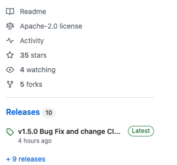
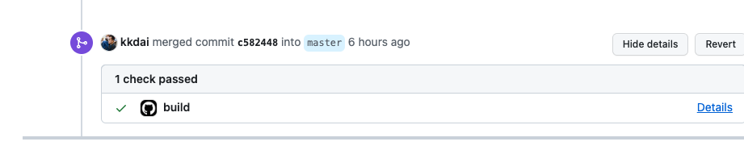
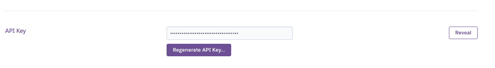

# Github Action 上的 CICD - Go Build

經常在教同學要打造自己的 side Project 的時候，要透過 Github 把自己的實際產品的想法表現出來。 其中，很重要的除了「文件的撰寫上」，那麼就會是「CICD」的實踐。 

----

#### 範例程式 Repo: 

[kkdai/bookmark-makerserver: A IFTTT MakerServer to help you post your tweet to github issue as a bookmark](https://github.com/kkdai/bookmark-makerserver)

----


在 Github Action 上有一個 Golang 基本的 CICD 工具 `Golang Build`

```
name: Go

on:
  push:
    branches: [ master ]
  pull_request:
    branches: [ master ]

jobs:

  build:
    runs-on: ubuntu-latest
    steps:
    - uses: actions/checkout@v4

    - name: Set up Go
      uses: actions/setup-go@v5
      with:
        go-version: 1.21

    - name: Build
      run: go build -v ./...

    - name: Test
      run: go test -v ./...
```

這個就是 [Github Action 提供的基本範本](https://docs.github.com/en/actions/automating-builds-and-tests/building-and-testing-go) ，可以讓你在 `Pull Request` 的時候跟 `Merge` 之後來跑 `Go Build` 的相關指令。




## Github 上的部署到 Heroku 的設定

這邊也可以參考一下 [Heroku 提供的基本設定教學與安裝 Github Action 的方法](https://github.com/marketplace/actions/deploy-to-heroku)。 

```
name: Deploy

on:
  push:
    branches:
      - master

jobs:
  build:
    runs-on: ubuntu-latest
    steps:
      - uses: actions/checkout@v2
      - uses: akhileshns/heroku-deploy@v3.12.14 # This is the action
        with:
          heroku_api_key: ${{secrets.HEROKU_API_KEY}}
          heroku_app_name: "YOUR APP's NAME" #Must be unique in Heroku
          heroku_email: "YOUR EMAIL"
```

- 其中 `HEROKU_API_KEY` 可以在 [Heroku 個人帳號網頁](https://dashboard.heroku.com/account)去取得。




### 原本設定: Merge 到 Master / Main 的時候 Deploy

但是裡面的設定都是 `Push Master/Main` 得時候才會啟動。這樣子其實有點麻煩，每一次的 Merge 到 Master/Main branch 都會發動部署。會讓像是 Document Update 的 PR 也會發動重複的 Deploy 。


### 如何改成透過 Github Release 來 Deploy?

這邊如果需要透過 `Draft a new release` 直接來選擇 deploy 到 Heroku 的話。就需要做以下修改。

```
name: Deploy

on:
  release:
    types: [created]

```

透過這個方式，就可以讓 Deploy 變得更加的直覺， 


## 完成版之後的 CICD 流程與未來展望：

- Pull Request  --> `Go Build` 檢查程式碼可編輯程度。
  - 未來可以考慮加上一些 Test Coverage 工具來做單元測試，甚至是更多相關測試內容。
- Ｍurged 之後，也是跑 `Go Build` 。
  - 未來可以加上一些自動化文件更新的 action 
- Release 之後，就會 Deploy 到 Heroku 。
  - 目前都是 Cloud Services ，如果有多雲平台或是 Dev / Product 不同 cluster 可以分開來。

# 參考文件

-  [Github Action 提供的基本範本: Building and testing Go](https://docs.github.com/en/actions/automating-builds-and-tests/building-and-testing-go)
- [Heroku 提供的基本設定教學與安裝 Github Action 的方法](https://github.com/marketplace/actions/deploy-to-heroku)
