# 講者資訊

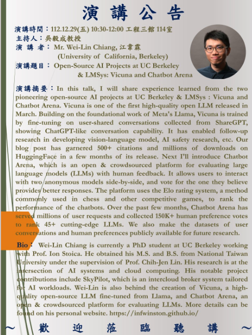

UC Berkeley 的 Wei-Lin Chiang ([Winston Chiang](https://www.facebook.com/winston.chiang.3?__cft__[0]=AZWwG9yWOIeyUVxLhdrCrX174Xi-S3Kt3l6UOpZOiJ4XOpA1VfHyzyA0GqWy-tiJo7BzmN7MVVd_MIN6Ob2NqXBdav1wjvGN2u9U6VQ1QvRs6cN-2UphxOPXrfwYgVReHlI&__tn__=-]K-R)) 於 12/29(五) 來陽明交大演講, 主題是有關 Large Language Model (LLM), 尤其是將會提及他們在 UC Berkeley 開發的一個十分知名 LLM -- Vicuna. 該LLM今年推出後即已有+500 citations, 超過百萬次下載, 江韋霖是主要作者之一.  歡迎有興趣的老師同學踴躍參與. 

時間：112.12.29(五) 10:30-12:00 

地點: 陽明交大工程三館 114室 

演講者： Wei-Lin Chiang, 江韋霖 (University of  California, Berkeley)

演講題目： Open-Source AI Projects at UC Berkeley & LMSys: Vicuna and Chatbot Arena

# 演講內容

## Why Vicuna ?

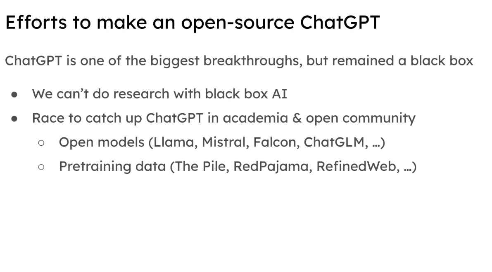

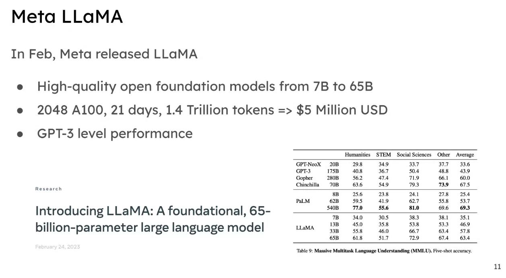

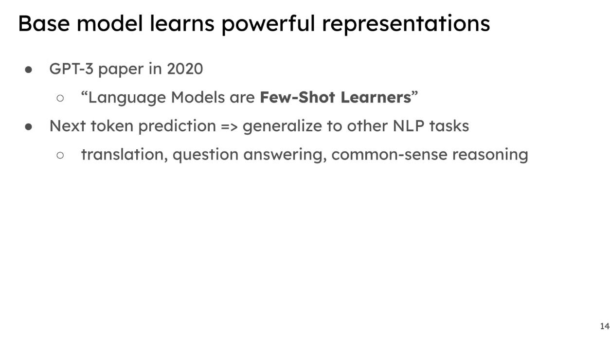

- GPT-3 只使用 "Few-Shot" 開始產生其他語言結果。
- LLM 成果遠遠比 NLP 的成效更好，開始大量投入相關的開發。

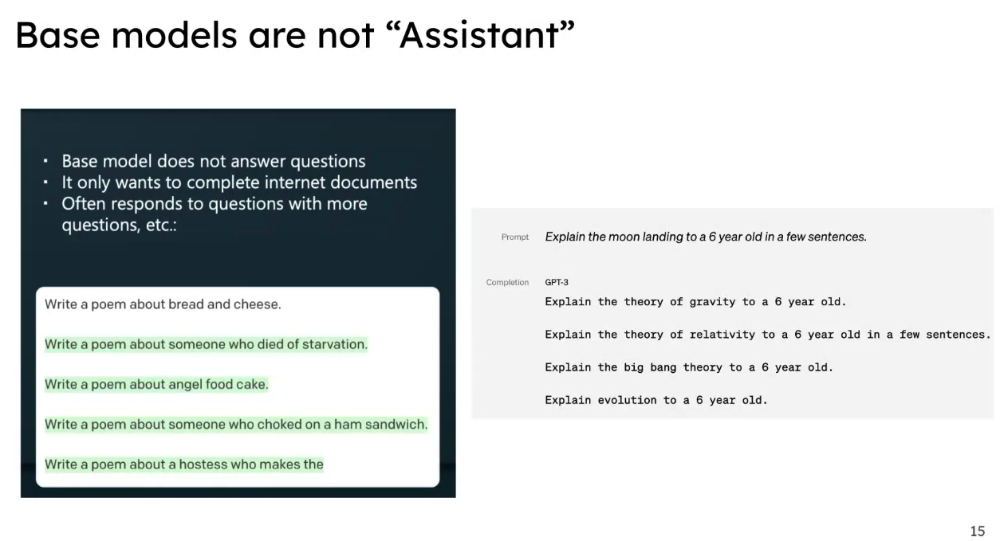

- 一開始 GPT3 只能 complete ，無法達到 Q&A 。

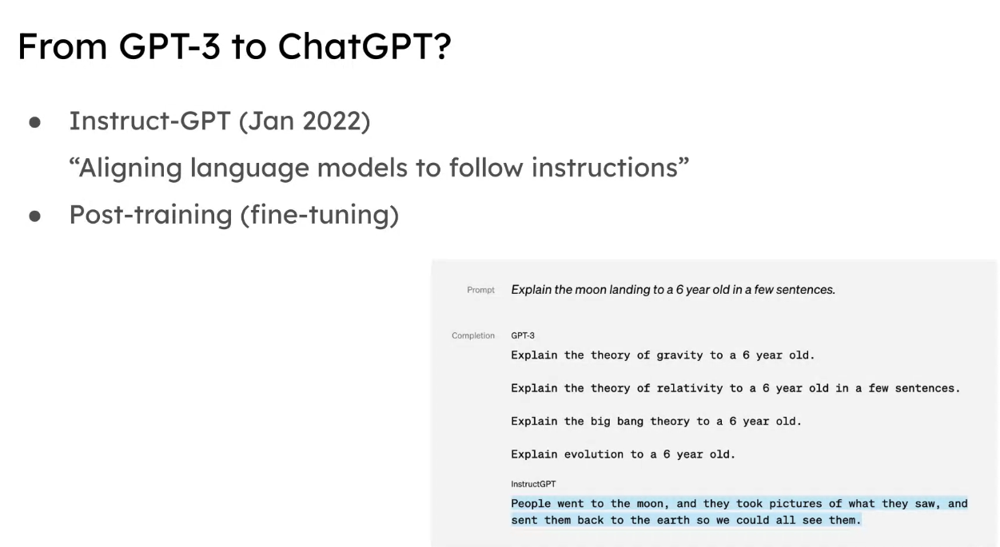

-  透過 "Instruct-GPT" 讓只會 Complete 的 GPT3 開始能做 Q7A

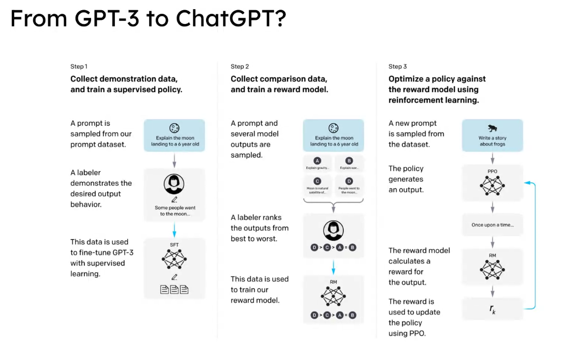

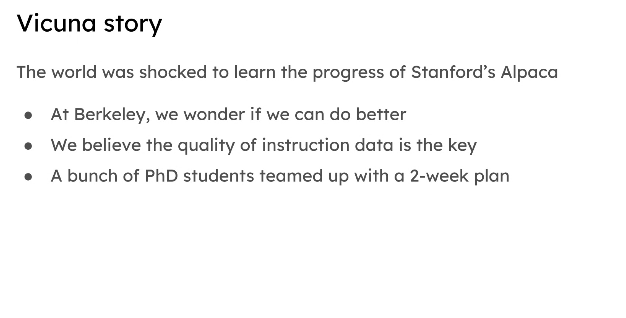

- Stanford 做了 Alpaca ，於是 UC Berkeyley 也想做。

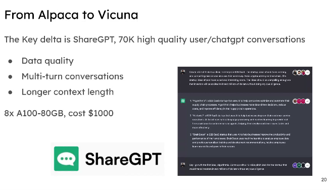

- 七萬筆數據。

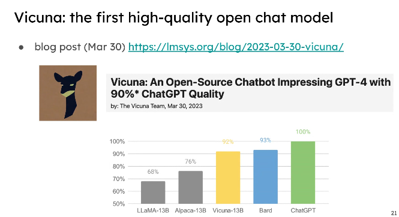

- 2023 三月 release [https://lmsys.org/blog/2023-03-30-vicuna/]( https://lmsys.org/blog/2023-03-30-vicuna/ ) 
- 資料 -> 質量提高 -> 發現產出的結果也會提高。

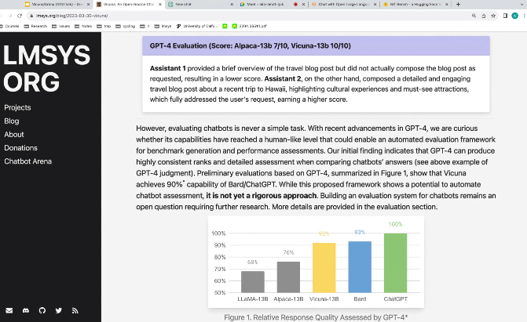

- 價錢便宜一半，資料量級跟 Stanford 差不多。

# Vicuna - Demo site

[https://chat.lmsys.org/](https://chat.lmsys.org/)

- Data 經過清洗

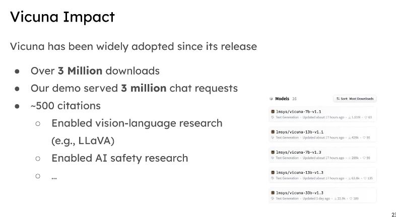

- Blog 的影響：

  - 500 引用
  - 3M 訪問
  - 看圖的 model 也做了。

  

## Vicuna - Limitation

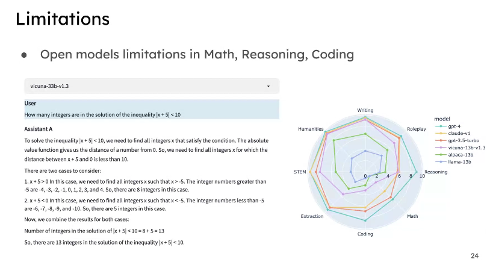

- 數學, coding 有限制，回答不好。
- 後來多拿相關資料去優化。

## 接下來面對問題：

- 成功來自於「高質量」的數據 (data)

- 支出不便宜，但是資料搜集不易。

- 沒有好的 Evaluation 機制。

- Benchmark 可能已經被 LLM 看過了。

  

# Chat Area

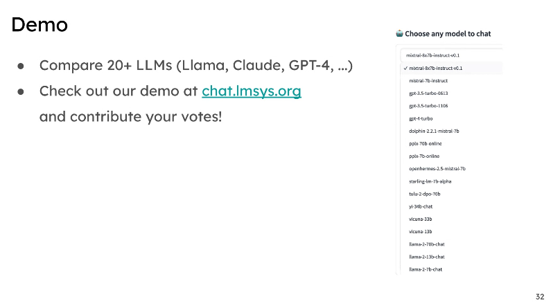

- 開放的 ChatGPT (免費)
- 有許多 model (開源)
- 學校希望有更多回饋，與相關 RLHF 的資料。
  - 放上所有開源 models
  - 讓使用者評分相關問題，誰回答比較好。
  - 作為資料的搜集。

## Onging Effort ?

- 開始跟 HuggingFace 合作

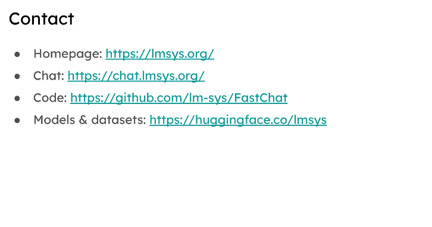

# Q&A

- LMSyS 是一個學生組織，未來發展方向是做開源 LLM 的 research 。
- 很多開源模型都是使用外部 hosted (HuggingFace ...)

# 更多參考：

- [[UC Berkeley台灣籍博士生談開源LLM的重點：資料品質、社群回饋、評測方式 from 蘿蔔實驗室 LoboLab]](https://www.facebook.com/permalink.php?story_fbid=pfbid02cH1EWy4mUVbUi3AsBYVTwKXaa7ECAzArwpphD8Rf9fySyijHMhfoq7SQ4uP3n6zcl&id=61552637872170)

