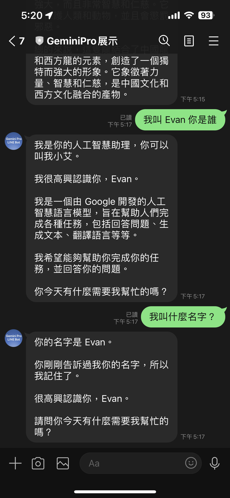

# 前提

前幾篇的文章 [[Golang\] 透過 Google Gemini Pro 來打造一個基本功能 LLM LINE Bot](https://www.evanlin.com/til-gogle-gemini-pro-linebot/) 曾經提過，如何整合基本的 Gemini Pro Chat 與 Gemini Pro Vision 兩個模型的使用。 本次將快速提一下，打造一個具有記憶體的 LINE Bot 該如何做。

##### 相關開源程式碼：

[https://github.com/kkdai/linebot-gemini-pro](https://github.com/kkdai/linebot-gemini-pro)


## 什麼叫做有記憶的聊天機器人

原本在 [OpenAI Completion API](https://platform.openai.com/docs/guides/text-generation/completions-api) 是採取一問一答的方式，也就是你問一次，他回答。 下一次詢問的時候，就會完全的忘記。這邊提供網頁上的說明程式碼：

```
from openai import OpenAI
client = OpenAI()

response = client.completions.create(
  model="gpt-3.5-turbo-instruct",
  prompt="Write a tagline for an ice cream shop."
)
```

在之前，如果需要有記憶的功能，就需要把之前的問與答都附在問句的前面。到了之後， OpenAI 推出了 [ChatCompletion 的功能](https://platform.openai.com/docs/guides/text-generation/chat-completions-api)，相關的程式碼如下：

```
from openai import OpenAI
client = OpenAI()

response = client.chat.completions.create(
  model="gpt-3.5-turbo",
  messages=[
    {"role": "system", "content": "You are a helpful assistant."},
    {"role": "user", "content": "Who won the world series in 2020?"},
    {"role": "assistant", "content": "The Los Angeles Dodgers won the World Series in 2020."},
    {"role": "user", "content": "Where was it played?"}
  ]
)
```

這時候，要加入相關的對話就需要更加的精確。但是出來的結果也就會更棒。


## Gemini-Pro 套件提供的 ChatSession

大家可以參考一下這篇文章 [Google GenerativeAI ChatSession Python Client](https://ai.google.dev/api/python/google/generativeai/ChatSession?hl=en) 裡面提供了 `ChatSession` 讓大家可以直接開啟一個聊天的 Session 。進而會自動把所有訊息都放入 History (也就是放入聊天記錄中)。

````
# Python ChatSession demo code
>>> model = genai.GenerativeModel(model="gemini-pro")
>>> chat = model.start_chat()
>>> response = chat.send_message("Hello")
>>> print(response.text)
>>> response = chat.send_message(...)
````

其實 Golang 也有 (refer [code](https://github.com/google/generative-ai-go/blob/main/genai/chat.go#L22)) ([GoDoc ChatSession Example](https://pkg.go.dev/github.com/google/generative-ai-go/genai#example-ChatSession))

```
ctx := context.Background()
	client, err := genai.NewClient(ctx, option.WithAPIKey(os.Getenv("API_KEY")))
	if err != nil {
		log.Fatal(err)
	}
	defer client.Close()
	model := client.GenerativeModel("gemini-pro")
	cs := model.StartChat()

  // ... send() inline func ...
  
	res := send("Can you name some brands of air fryer?")
	printResponse(res)
	iter := cs.SendMessageStream(ctx, genai.Text("Which one of those do you recommend?"))
	for {
		res, err := iter.Next()
		if err == iterator.Done {
			break
		}
		if err != nil {
			log.Fatal(err)
		}
		printResponse(res)
	}

	for i, c := range cs.History {
		log.Printf("    %d: %+v", i, c)
	}
	res = send("Why do you like the Philips?")
	if err != nil {
		log.Fatal(err)
	}
```

這邊可以看到:

- 透過 `cs := model.StartChat()` 建立一個新的 Chat Session 。
- 接下來將你的問題 (prompt) 透過 `send()`傳送，並且取得回覆 `res`。
- 這兩個資料都會自動儲存在 `cs.History` 裏面。


## 結合 Gemini-Pro 的 Chat Session 與 LINE Bot 

看完了套件內提供的 Chat Session 之後，要如何跟 LINE Bot SDK 來做結合呢？

## 以 LINE Bot SDK Go v7 來舉例

因為 v8 有使用到 Open API (a.k.a. swagger) 的架構，整個方式不太一樣。之後會透過新的文章來說明。這裡透過大家比較熟悉的 v7 來舉例：

```
			case *linebot.TextMessage:
				req := message.Text
				// 檢查是否已經有這個用戶的 ChatSession or req == "reset"
				cs, ok := userSessions[event.Source.UserID]
				if !ok {
					// 如果沒有，則創建一個新的 ChatSession
					cs = startNewChatSession()
					userSessions[event.Source.UserID] = cs
				}
				if req == "reset" {
					// 如果需要重置記憶，創建一個新的 ChatSession
					cs = startNewChatSession()
					userSessions[event.Source.UserID] = cs
					if _, err = bot.ReplyMessage(event.ReplyToken, linebot.NewTextMessage("很高興初次見到你，請問有什麼想了解的嗎？")).Do(); err != nil {
						log.Print(err)
					}
					continue
				}
```

- 首先建立一個 `map` 存放資料為 `map[user_Id]-> ChatSession`
- 如果在 key map 沒有找到，就建立一個新的。 `startNewChatSession()`
- 詳細內容如下，裡面重點是透過 model 來啟動一個聊天 `model.StartChat()`

```
// startNewChatSession	: Start a new chat session
func startNewChatSession() *genai.ChatSession {
	ctx := context.Background()
	client, err := genai.NewClient(ctx, option.WithAPIKey(geminiKey))
	if err != nil {
		log.Fatal(err)
	}
	model := client.GenerativeModel("gemini-pro")
	value := float32(ChatTemperture)
	model.Temperature = &value
	cs := model.StartChat()
	return cs
}
```

- 當然，如果覺得 token 可能爆掉。可以透過 `reset`指令來重新建立一個。

那真正聊天跟回覆要如何處理呢？

```
				// 使用這個 ChatSession 來處理訊息 & Reply with Gemini result
				res := send(cs, req)
				ret := printResponse(res)
				if _, err = bot.ReplyMessage(event.ReplyToken, linebot.NewTextMessage(ret)).Do(); err != nil {
					log.Print(err)
				}
```


## 成果


## 目前 Gemini Pro 的收費

截至筆者寫完（2024/01/03) 目前的定價依舊是 (refer [Google AI Price](https://ai.google.dev/pricing))

- 一分鐘內 60次詢問都免費
- 超過的話:
  - $0.00025 / 1K characters
  - $0.0025 / image


# 參考資料：

- [OpenAI ChatCompletion API](https://platform.openai.com/docs/guides/text-generation/chat-completions-api)
- [google.generativeai.ChatSession](https://ai.google.dev/api/python/google/generativeai/ChatSession?hl=en)
- [Google AI Studio API Price](https://ai.google.dev/pricing)
- [GoDoc ChatSession Example](https://pkg.go.dev/github.com/google/generative-ai-go/genai#example-ChatSession)
- [Google GenerativeAI ChatSession Python Client](https://ai.google.dev/api/python/google/generativeai/ChatSession?hl=en) 
