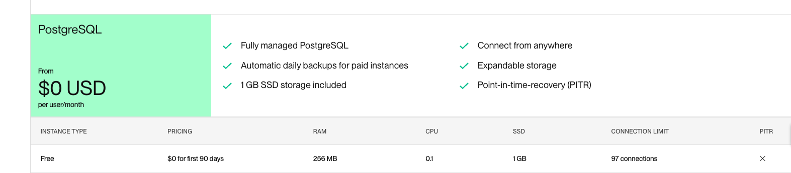

# 前情提要：

有在持續關注我的部落格的朋友，都知道我喜歡透過 Heroku 來快速部署我自己的雲服務 (或是 LINE Bot)。 當初 Heroku 就打著好上手，並且有免費方案的流程來讓許多開發者都有使用到。但是在 2022 十一月之後，就開始收費的 Heroku 也開啟許多人跑走的路途。這邊可以查看以下相關資料：

- [關於從 Heroku 跳到 Render 這件事情](https://israynotarray.com/other/20221213/3036227586/)

- [五個替代 Heroku  的平台免費測試執行 .Net Core 的文字辨識 OCR 網頁程式](https://blog.user.today/fly-io-asp-net-core-docker-ocr/)

- [從 Heroku 遷移至 Fly.io](https://medium.com/codememo/%E7%AD%86%E8%A8%98-%E5%BE%9E-heroku-%E9%81%B7%E7%A7%BB%E8%87%B3-fly-io-5f9f5cdb837b)

由於我手上的 Hobby Project 大概有 **50~80 個**，所以也就選擇先留在 Heroku 看看？ (要搬移真的太累) 每個月五美金的費用，也算是中規中矩，畢竟也是某些程度吃到飽（1000 dyno hours) ，也足夠我用。

但是又聽到朋友們的提醒與鞭策，於是來認真看一下跟測試結果。

# tl;dr 先講結論

- 我會搬遷到 Render $7 的方案，原因後提。
- 但是會慢慢把架構都搬遷過去，順便更新 SDK 套件。
- 一開始會採取兩個都部署跟發布。

## 價位比較 (based: 2024/01/02)

## Render 的價格跟性能: (free/Starter)

根據 [Render vs Heroku by Render](https://docs.render.com/render-vs-heroku-comparison) 有一些比較表：

認真看了一下 [Render 的費用](https://render.com/pricing) 

- 看起來 Free-tier 就有 512MB RAM，很不錯（但是要注意 CPU 0.15)
- 但是要注意 Free Bandwidth 是 100GB ，這個感覺會踩到。

- 更別說有免費 90 天的 PostgresSQL 資料庫 

- Redis 有 25MB 也夠用，但是會砍掉。

## Heroku 的費用與效能部分

- 沒有 Free-tier 
- 最低收費 Eco $5

根據 [Heroku Dyno Types](https://devcenter.heroku.com/articles/dyno-types):

- 效能其實不比 $7 差太多（當然遠遠多於 Render Free-Tier)

## 快速測試結果

拿了專案 https://github.com/kkdai/linebot-gemini-prohttps://github.com/kkdai/linebot-gemini-pro 來測試，發現：

- 回覆速度上 Heroku ($5) 跟 Render ($0) 不會差太多。 (Golang App)
- 但是上傳照片後，要處理 Render ($0) 就會炸掉。 由於記憶體兩者都是 512MB ，考量可能問題出在 CPU 上面。

### 交叉測試：

加上我另外一個小專案： [https://github.com/kkdai/pdf_online_editor?tab=readme-ov-file](https://github.com/kkdai/pdf_online_editor?tab=readme-ov-file)

測試結果 Render ($0) 一樣會炸掉。

## 付費後的測試 ($$$$)

# 結論

雖然 Heroku ($5)  比起 Render ($7) 還要便宜，但是考量以下的部分，可能會逐步轉移過去：

- Render 有免費方案，更適合作為活動推廣之用。 
- Render ($7)  有 DB 可以使用，但是 Heroku ($5)   的資料庫要額外付錢。
- Render ($7)  提供的管理頁面跟相關功能比較多。

# 參考資料：

- [關於從 Heroku 跳到 Render 這件事情](https://israynotarray.com/other/20221213/3036227586/)

- [五個替代 Heroku  的平台免費測試執行 .Net Core 的文字辨識 OCR 網頁程式](https://blog.user.today/fly-io-asp-net-core-docker-ocr/)

- [從 Heroku 遷移至 Fly.io](https://medium.com/codememo/%E7%AD%86%E8%A8%98-%E5%BE%9E-heroku-%E9%81%B7%E7%A7%BB%E8%87%B3-fly-io-5f9f5cdb837b)

- [Render vs Heroku by Render](https://docs.render.com/render-vs-heroku-comparison)
