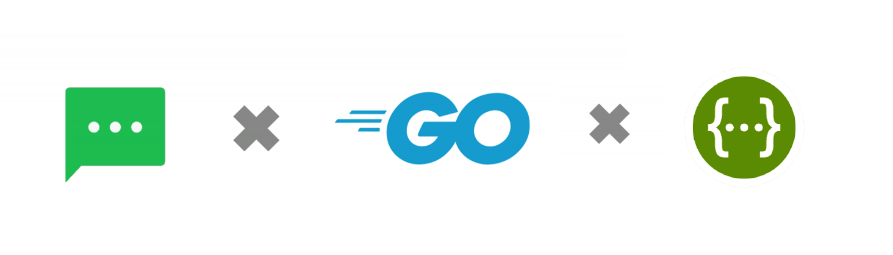
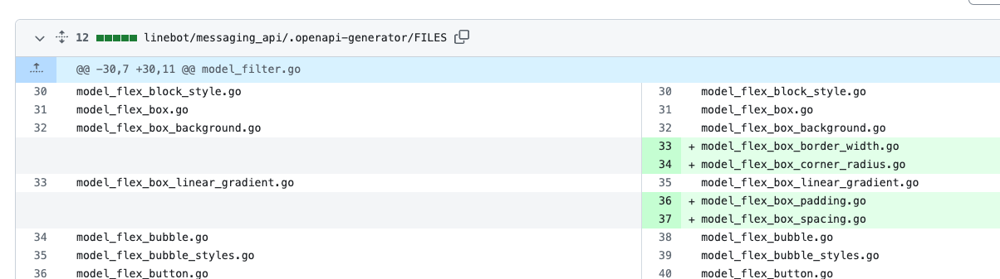

# 前情提要：

2023 年 [LINE Bot SDK 積極推動 OpenAPI](https://github.com/line/line-openapi) (a.k.a. swagger) 的標準介面。透過與 OpenAPI 的整合， LINE Bot SDK 有了許多好處（文章後半段補充）。本篇文章將稍微解釋一下，OpenAPI 導入後的優點，並且帶著大家一起來將有使用 [LINE Bot Go SDK](https://github.com/line/line-bot-sdk-go) v7 版本的升級到 v8 的版本。

##### 本次的程式碼，會用前幾篇文章提到的: [https://github.com/kkdai/linebot-gemini-pro](https://github.com/kkdai/linebot-gemini-pro) 作為範例。


## 支援 OpenAPI 的好處

 [LINE Bot Go SDK](https://github.com/line/line-bot-sdk-go) 近期也在 [2023/11 月](https://github.com/line/line-bot-sdk-go/releases/tag/v8.0.0)也將版號更新到了 v8，並且正式支援 [OpenAPI](https://github.com/line/line-openapi/)。 那麼簡單的來說，一個 SDK 套件支援 OpenAPI 有哪些好處呢？ 

#### 1. 標準化的 API 設計

- 許多 API 呼叫的方式，變得更加的直觀。也比較容易了解。後面也會稍微提到。


#### 2. 程式碼自動生成



- 以往要開發新的 API Entry 的時候，都要透過發送 issue -> 發送 PR -> 審核 -> 發布後才能發送到開發者手中。
- 但是導入後， LINE Bot SDK 使用的方式，是透過 Github Action 來自動去將最新的 [LINE OPENAPI Repo](https://github.com/line/line-openapi)抓下來後，根據新的變動產生相關的對應程式碼。 (參考上圖)（參考 [Code Generator 產生的commit](https://github.com/line/line-bot-sdk-go/commit/5ab525b2ec4c673f4242f32f71f85468bdea3bb0))

更多好處：

- **自動化文件生成:**有許多相關文件可以幫忙自動化產生 OpenAPI 的文件。

- **客戶端與服務端驗證:**透過 OpenAPI 的導入可以達成自動化測試與 Consumer-Driven Contract 的驗證。
- **API 生態系統工具的整合等等**


## 開始 Migrate LINE Bot Go SDK from v7 to v8

### 先修改套件版本 v7 -> v8

先加入以下三個套件，接下來會解釋一下：

```
	"github.com/line/line-bot-sdk-go/v8/linebot"
	"github.com/line/line-bot-sdk-go/v8/linebot/messaging_api"
	"github.com/line/line-bot-sdk-go/v8/linebot/webhook"
```
- `linebot`: 主要處理 v7 相關的內容，儘量不要使用。會逐步 deprecated 。
- `messaging_api` : 發送訊息用。
- `webhook`: 接受訊息與處理相關 event 用的。

接下來將慢慢整合，並且開始說明相關套件使用到的部分。

### 開始整合，並且說明相關變動之處：
#### "github.com/line/line-bot-sdk-go/v8/linebot/webhook"

- 負責接受 Webhook 相關資料，裡面包括兩大系列：
- `MessageEvent` 要處理相關訊息 Webhook 包括:
  - `TextMessageContent`: 文字訊息。
  - `StickerMessageContent`: 貼圖訊息 ..
  - `ImageMessageContent`: 圖片訊息，由使用者上傳的相片或是圖片訊息。
- 其他相關 Event 處理，包括：
  - `FollowEvent`: 有新的好友。
  - `PostbackEvent`: 這個比較常用，就是透過 postback 將使用者選擇作為輸入。
  - `BeaconEvent`: 可以透過這個訊息來接受來自有登記過的 Beacon HWID 的訊息。
- Webhook 處理方式也有點不同，細節稍微寫一下：

```
// 需要透過不同 Channel Secret 才能 Parse request 。
cb, err := webhook.ParseRequest(os.Getenv("ChannelSecret"), r)
	if err != nil {
		if err == linebot.ErrInvalidSignature {
			w.WriteHeader(400)
		} else {
			w.WriteHeader(500)
		}
		return
	}

	// 這邊比較類似以前方式，透過 callback 的 event 來 switch 個別 event type 。
	for _, event := range cb.Events {
		log.Printf("Got event %v", event)
		switch e := event.(type) {
		case webhook.MessageEvent:
			switch message := e.Message.(type) {
			// Handle only on text message
			case webhook.TextMessageContent:
			.......
```

- 關於 UserId 與 RoomId 的取得方式：

  - 以前都是透過 source.RoomID 來取得，但是現在透過另外一種方式來處理。但是得要有特殊處理：

  ```
  if source.RoomID != "" //不是群組，可能是 1 on 1
  	....
  ```

  - 現在則是透過不同的方式，要透過 `webhook.Source.(type)` 來處理：

  ```
  // 取得用戶 ID ，個人覺得更加容易了解。
  var uID string
  switch source := e.Source.(type) {
  case *webhook.UserSource:
    uID = source.UserId
  case *webhook.GroupSource:
    uID = source.UserId
  case *webhook.RoomSource:
    uID = source.UserId
  }
  ```

  

#### "github.com/line/line-bot-sdk-go/v8/linebot/messaging_api"

- 這個是負責發送相關訊息或是 Event 給使用者的。也就是要發送任何訊息都要透過過這個套件。 這個套件將資料格式有切開來了：

  - `messaging_api.MessagingApiAPI`: 負責處理小量訊息，包括 text message, sticker message ... 等等。
  - `messaging_api.MessagingApiBlobAPI`: Blob 負責處理比較大量的資料，比如說你需要抓取使用這上傳的圖片。
  - 這兩個都需要分開初始化，參考以下：

  ```
  	if err != nil {
  		log.Fatal(err)
  	}
  
  	blob, err = messaging_api.NewMessagingApiBlobAPI(channelToken)
  	if err != nil {
  		log.Fatal(err)
  	}
  
  ```

  - 如果要回覆一個訊息，變得更加容易了解：

  ```
  // v7: 需要先初始化之後，還要透過 Do() 才會執行
  
  if _, err = bot.ReplyMessage(event.ReplyToken, linebot.NewTextMessage(outStickerResult)).Do(); err != nil {
  	log.Print(err)
  }
  
  // v8: 可以直接呼叫
  if _, err := bot.ReplyMessage(
  		&messaging_api.ReplyMessageRequest{
  			ReplyToken: replyToken,
  			Messages: []messaging_api.MessageInterface{
  				&messaging_api.TextMessage{
  					Text: text,
  				},
  			},
  		},
  	); err != nil {
  		return err
  	}
  ```

## 總結：

Golang LINE Bot SDK 套件這一次除了升級到 OpenAPI 的版本之外，也對於許多呼叫方式與變數處理方式做了一個通盤的整理。在處理許多訊息上，變得更加直覺與異動。雖然要變動可能會比較多，並且還有一些 API 持續搬遷之中。 不過由於套件也還保持著 v7 的相關套件可以繼續使用 legacy API ，所以歡迎大家可以儘快開始整合到 v8 的版本。 這樣一來可以看到許多更新的 API 在第一時間就會釋放出來。

# 參考資料：

- [LINE OPENAPI Repo](https://github.com/line/line-openapi)

- [LINE Messaging API SDK for Go Repo](https://github.com/line/line-bot-sdk-go)
