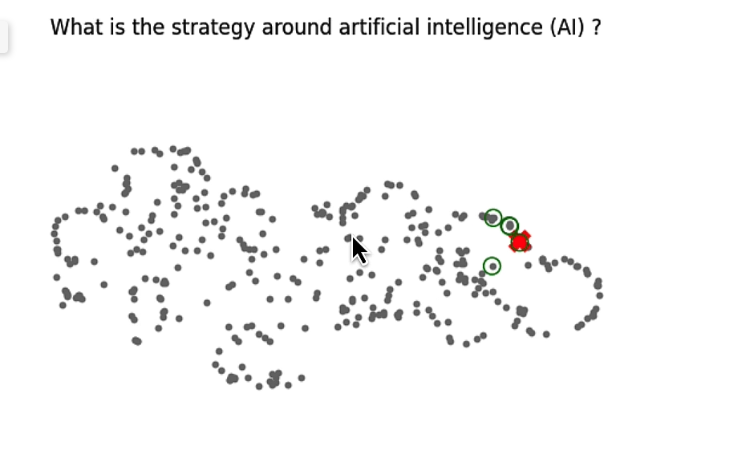
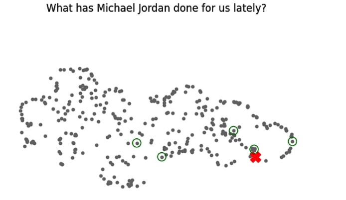
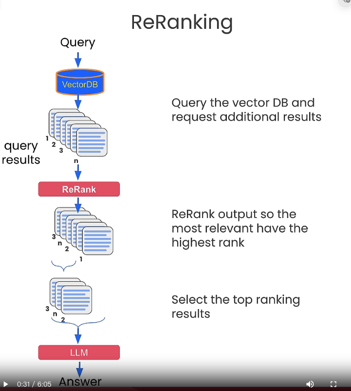

# 課程簡介

Deep Learning AI 新的課程，如何優化  IR/RAG on Chroma 。 講師是 Chroma co-founder 
有以下三個技術：

- Query Expansion: 透過相關概念來擴展查詢。
- Cross-encoder reranking: 透過不同檢索編碼來排序查詢結果。
- Training and utilizing Embedding Adapters: 透過加入 adapter 來優化檢索結果。


#### 課程資訊：  [https://learn.deeplearning.ai/advanced-retrieval-for-ai/](https://learn.deeplearning.ai/advanced-retrieval-for-ai/)


## RAG Pitfall 

經常查詢 RAG 結果回來會是不相關的，怎麼看出來？ 透過一個 umap 套件


```
import umap
import numpy as np
from tqdm import tqdm

embeddings = chroma_collection.get(include=['embeddings'])['embeddings']
umap_transform = umap.UMAP(random_state=0, transform_seed=0).fit(embeddings)


# 畫點出來
import matplotlib.pyplot as plt

plt.figure()
plt.scatter(projected_dataset_embeddings[:, 0], projected_dataset_embeddings[:, 1], s=10)
plt.gca().set_aspect('equal', 'datalim')
plt.title('Projected Embeddings')
plt.axis('off')
```


### 比較相近的問題（單一問題，比較容易)



這樣看起來查詢的資訊跟我們問得蠻相近的，紅色是回答的。綠色是前面幾個相關的。


### 如果問句有兩個以上，或是問句本身就不太相關。



 這樣就會出現，


## Query Expansion


## Cross-encoder reranking




## Training and utilizing Embedding Adapters


# 更多參考：

