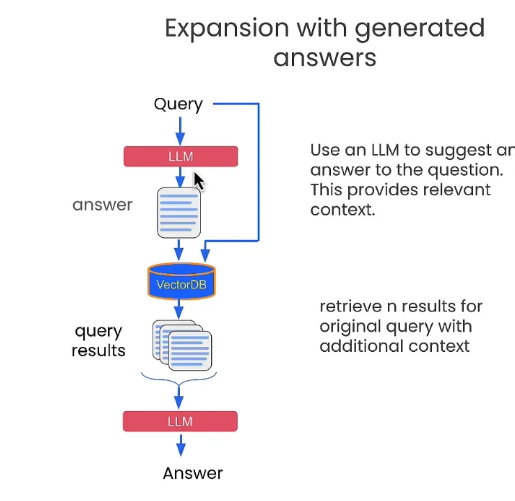
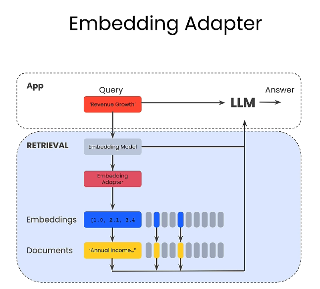
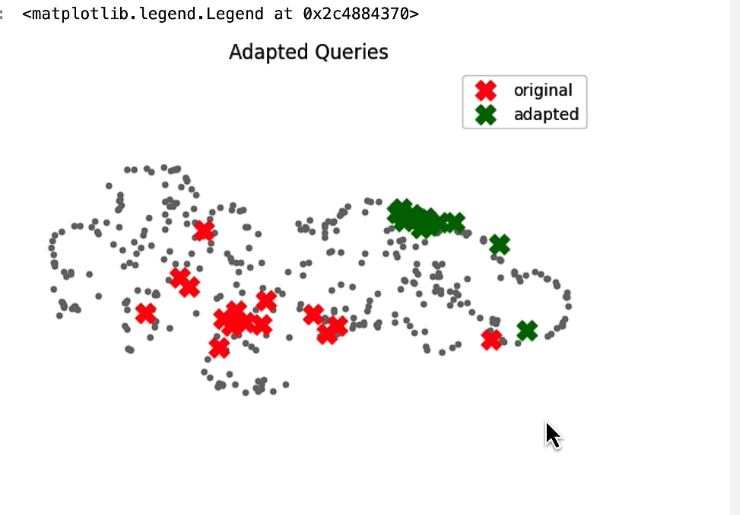

# 課程簡介

Deep Learning AI 新的課程，如何優化  IR/RAG on Chroma 。 講師是 Chroma co-founder 
有以下三個技術：

- Query Expansion: 透過相關概念來擴展查詢。
- Cross-encoder reranking: 透過不同檢索編碼來排序查詢結果。
- Training and utilizing Embedding Adapters: 透過加入 adapter 來優化檢索結果。


#### 課程資訊：  [https://learn.deeplearning.ai/advanced-retrieval-for-ai/](https://learn.deeplearning.ai/advanced-retrieval-for-ai/)


## RAG Pitfall 

經常查詢 RAG 結果回來會是不相關的，怎麼看出來？ 透過一個 umap 套件

```
import umap
import numpy as np
from tqdm import tqdm

embeddings = chroma_collection.get(include=['embeddings'])['embeddings']
umap_transform = umap.UMAP(random_state=0, transform_seed=0).fit(embeddings)


# 畫點出來
import matplotlib.pyplot as plt

plt.figure()
plt.scatter(projected_dataset_embeddings[:, 0], projected_dataset_embeddings[:, 1], s=10)
plt.gca().set_aspect('equal', 'datalim')
plt.title('Projected Embeddings')
plt.axis('off')
```


### 比較相近的問題（單一問題，比較容易)


這樣看起來查詢的資訊跟我們問得蠻相近的，紅色是回答的。綠色是前面幾個相關的。


### 如果問句有兩個以上，或是問句本身就不太相關。


 這樣就會出現差相當多的結果，造成查詢的資料相關度過少。出來的結果當然也就很差。

解決方式就要靠接下來的三個方法。

## Query Expansion



**透過延伸的假設答案，加上原來的問題。一起下去詢問:**

```
def augment_query_generated(query, model="gpt-3.5-turbo"):
    messages = [
        {
            "role": "system",
            "content": "You are a helpful expert financial research assistant. Provide an example answer to the given question, that might be found in a document like an annual report. "
        },
        {"role": "user", "content": query}
    ] 

    response = openai_client.chat.completions.create(
        model=model,
        messages=messages,
    )
    content = response.choices[0].message.content
    return content
```

e.g. 

- Q: Was there significant turnover in the executive team?
- 先用這個 Q 直接問 OpenAI 得到可能的解答 `hypothetical_answer`，但是因為沒有查詢特有 RAG 資料可能不會正確。
- 透過 `f"{original_query} {hypothetical_answer}"` 結合再一起，再來透過 VectorDB 來尋找答案。


```
original_query = "Was there significant turnover in the executive team?"
hypothetical_answer = augment_query_generated(original_query)

joint_query = f"{original_query} {hypothetical_answer}"
print(word_wrap(joint_query))
```


## Cross-encoder reranking


**透過不同問句，取得相似問句。透過該捷達來評分。**這邊的作法如下：

- 原本問句 `original_query` ，得到數個 `generated_queries`:
- 然後把原本問句跟其他問句下去找數組的解答。
- 將每一組解答，透過 `scores = cross_encoder.predict(pairs)` 評分來打分數。
- 挑選出比較高分的幾個項目再來去 RAG 

```
original_query = "What were the most important factors that contributed to increases in revenue?"
generated_queries = [
    "What were the major drivers of revenue growth?",
    "Were there any new product launches that contributed to the increase in revenue?",
    "Did any changes in pricing or promotions impact the revenue growth?",
    "What were the key market trends that facilitated the increase in revenue?",
    "Did any acquisitions or partnerships contribute to the revenue growth?"
]

queries = [original_query] + generated_queries

results = chroma_collection.query(query_texts=queries, n_results=10, include=['documents', 'embeddings'])
retrieved_documents = results['documents']

# Deduplicate the retrieved documents
unique_documents = set()
for documents in retrieved_documents:
    for document in documents:
        unique_documents.add(document)

unique_documents = list(unique_documents)

pairs = []
for doc in unique_documents:
    pairs.append([original_query, doc])
    
    
print("Scores:")
for score in scores:
    print(score)
```


## Training and utilizing Embedding Adapters



```
# 產生相關問句
def generate_queries(model="gpt-3.5-turbo"):
    messages = [
        {
            "role": "system",
            "content": "You are a helpful expert financial research assistant. You help users analyze financial statements to better understand companies. "
            "Suggest 10 to 15 short questions that are important to ask when analyzing an annual report. "
            "Do not output any compound questions (questions with multiple sentences or conjunctions)."
            "Output each question on a separate line divided by a newline."
        },
    ]

    response = openai_client.chat.completions.create(
        model=model,
        messages=messages,
    )
    content = response.choices[0].message.content
    content = content.split("\n")
    return content
```

產生相關答案

```
generated_queries = generate_queries()
for query in generated_queries:
    print(query)
```

透過 10 ~ 15 個問題，產生衍生的答案。約有 150 個。 這個就變成是新的資料集。（RAG)

透過新的相似度比較方式 (mse_loss):

```
def mse_loss(query_embedding, document_embedding, adaptor_matrix, label):
    return torch.nn.MSELoss()(model(query_embedding, document_embedding, adaptor_matrix), label)
```

透過這個方式，再來找出最好的解答。 



這張圖可以看出 adapted query  結果不容易產生不相關的答案。這邊也有建議，如果可以拿到使用者的資料來作為 adapted 問句，可能可以讓答案變得更好。

衍生思考：

- 發現結果過於不相關的時候。
- 透過多問幾題，然後找出相關答案。
- 變成新的資料集，作為查詢。就可以優化整個 RAG 的資料集，進而得到更好的解答。

## 課程總結：

- 先解釋 RAG 經常會遇到的陷阱。過於分散的問句，造成相似的解答不相關，回覆就會無法準確。
- **Expanding Query**： 請 OpenAI 幫你多問幾題，然後把問題跟答案都放進去詢問。
- **Cross Re-Rank**: 算是上面的進化版，透過產生問句的答案。透過一個評分機制。找到比較好的答案再下去 RAG 。
- **Embedding Adapter**:  產生更多問句，透過問句產生的解答。當作是新的 dataset ，並且下來 RAG 。


# 更多參考：

-   [https://learn.deeplearning.ai/advanced-retrieval-for-ai/](https://learn.deeplearning.ai/advanced-retrieval-for-ai/)

- [The Tech Buffet #18: Advanced Retrieval Techniques for RAG](https://thetechbuffet.substack.com/p/advanced-retrieval-techniques-for-rag)

- [9 Effective Techniques To Boost Retrieval Augmented Generation](https://towardsdatascience.com/9-effective-techniques-to-boost-retrieval-augmented-generation-rag-systems-210ace375049)
- [The Tech Buffet #18: Advanced Retrieval Techniques for RAG](https://thetechbuffet.substack.com/p/advanced-retrieval-techniques-for-rag)
