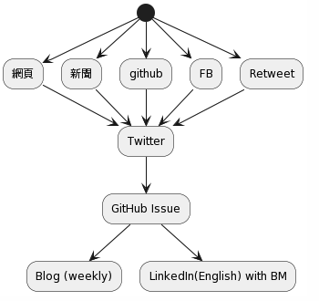

(From [PlantUML](//www.plantuml.com/plantuml/png/SoWkIImgAStDuSh8J4bLIClFBqdAh-3Yqj3ILD3LjLDGUhvjqyi5ZKfSO4v8UMP9IMgH4fByisaRNZJEmosVdbcIKPg4MzxD2RTSK6f9UMfg2OO2BZWReiuziyIZD4d1ixYuD1KeZSA7Ad7AoKzNq02QbfrJgQc4LObFPbvsQefddePhNdfEPd66fWBGaWm59rybBeVKl1HW6040))

# 總結

我一直以來都是一個喜歡東看西看的人（聽說很多人跟我一樣），但是一直以來資訊流的整理一直是我很痛苦的事情。接下來可能會有一系列的文章記錄著我邊打造個人 LLM KM 系統的時候的一些記錄跟想法。

# 資訊流

原本資訊流還蠻簡單的，就是希望所有的資訊可以透過 twitter 去當 gateway 然後開始轉到其他地方。 這裡有點麻煩得時候，自從 Twitter 再也不接受免費 API 的申請後（最便宜 100$USD) 。 只好去購買 IFTTT 的服務幫我把資訊從 Twitter 打到 Webhook 。 這邊我以前有類似的文章:

- [[TIL] 為了自己的習慣，弄了一個簡單的服務 Github issue bookmark](https://www.evanlin.com/til-2017-05-23/)

看到五年前開始打造的時候才 10 ~ 20 github issue ，現在卻有 1.3k 的數字。開始思考要如何整理相關資訊。

# 更多參考：

