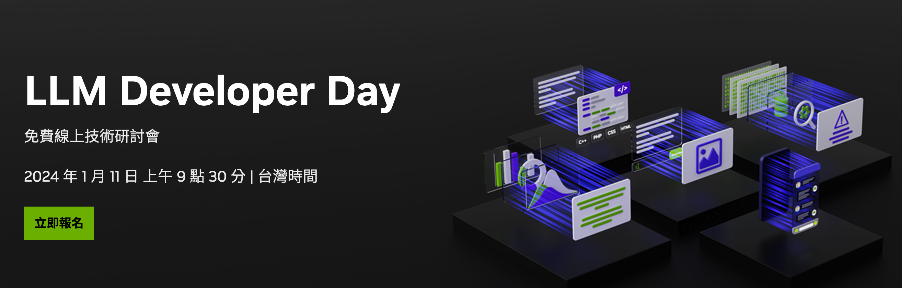
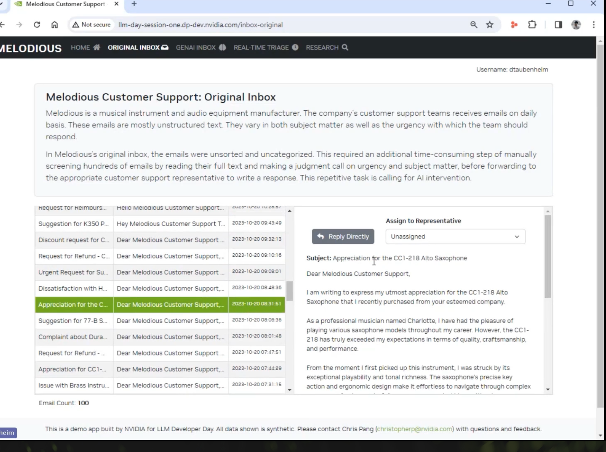
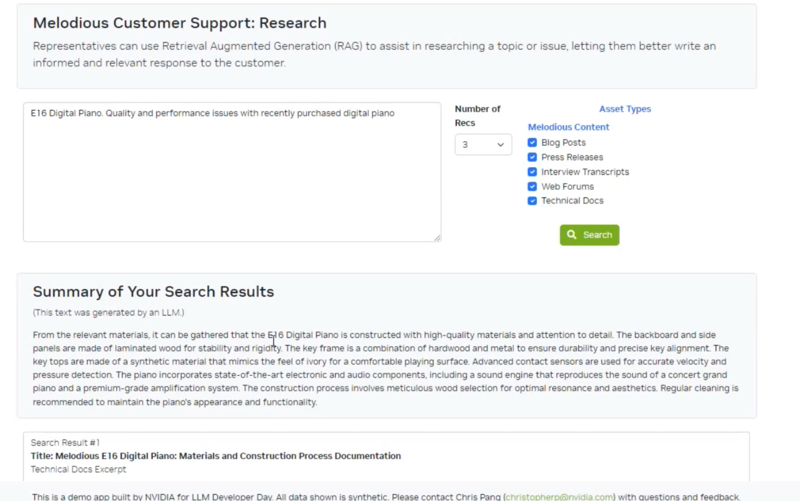
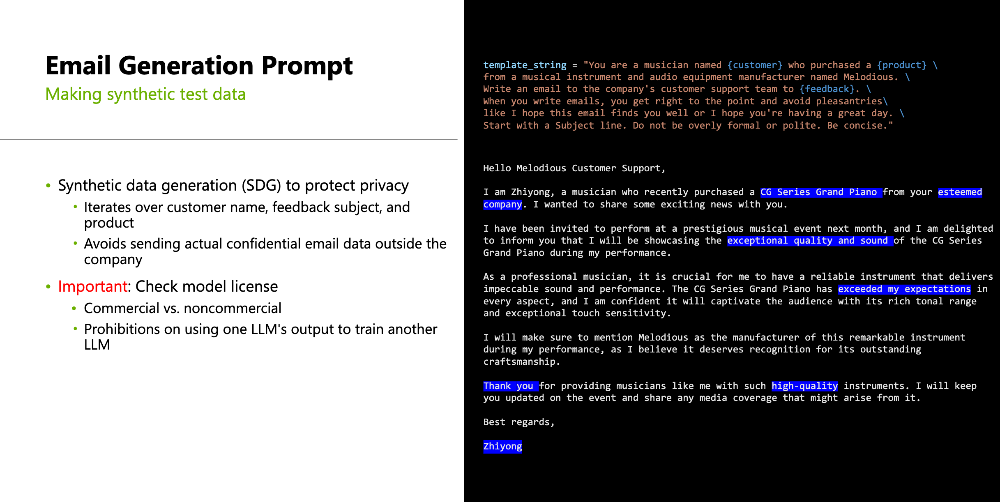
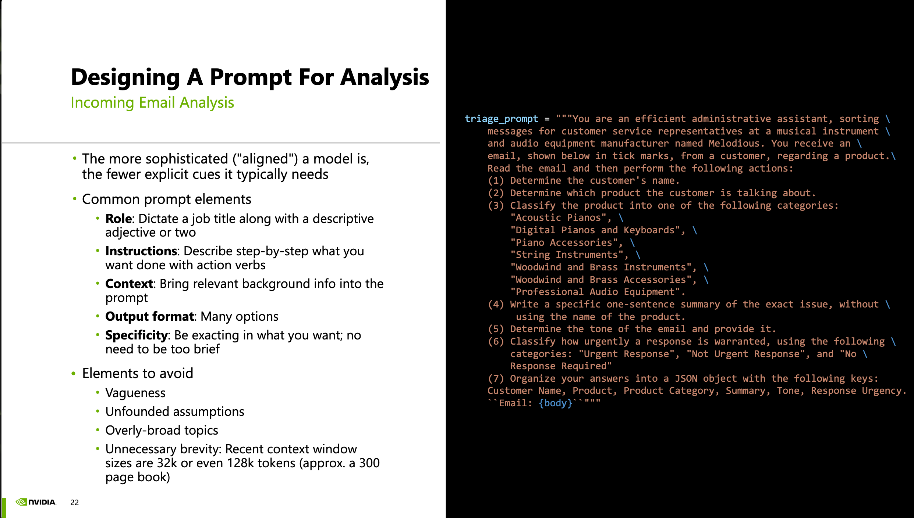
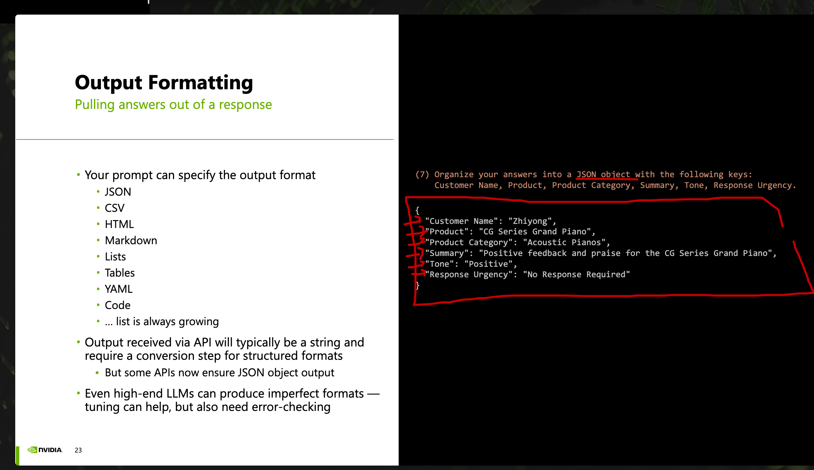
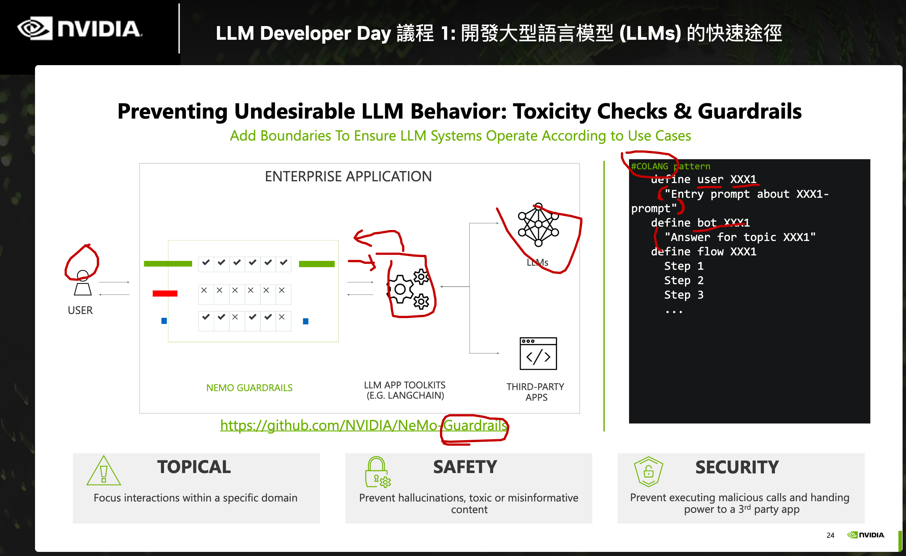
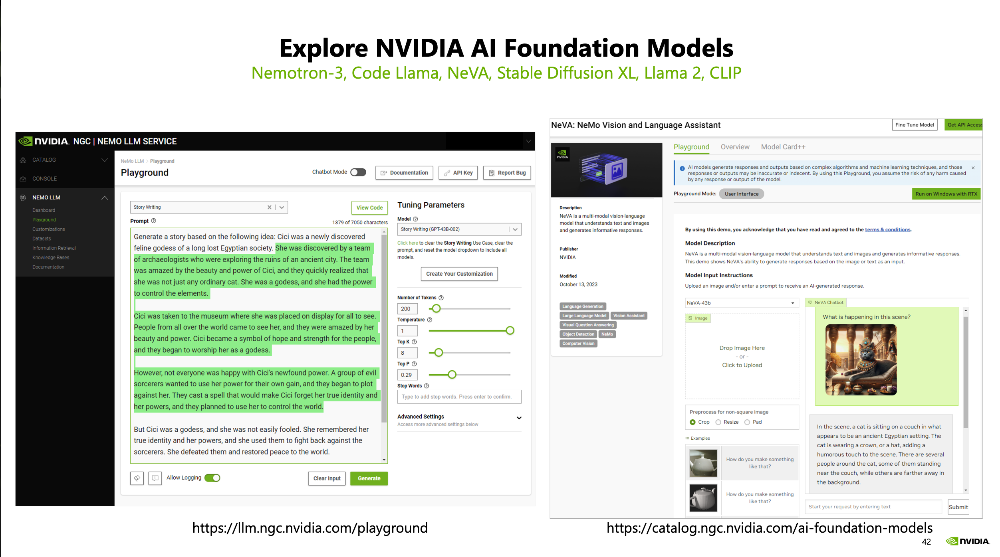

# 活動資訊

 [NVIDIA LLM Developer Day](https://www.nvidia.com/zh-tw/events/llm-developer-day/) （[重播](https://www.nvidia.com/en-us/on-demand/))

- 09:30 - 11:00 台灣時間 - 議程 1: 開發大型語言模型 (LLMs) 的快速途徑: [slide](https://on24static.akamaized.net/event/44/33/88/7/rt/1/documents/resourceList1704771459472/llmdevdaysession1taiwanwilliam1704771459472.pdf)  

- 11:10 - 12:50 台灣時間 - 議程 2a：量身客製自己的大型語言模型應用:[slides](https://on24static.akamaized.net/event/44/33/90/1/rt/1/documents/resourceList1704769052626/llmdevdaysession2taiwan11704769052626.pdf)

- 15:30 台灣時間 - 議程 2b：生物科學大型語言模型和生成式人工智慧

- 17:10 台灣時間 - 議程 3：運行自己的大型語言模型

# 議程 1: 開發大型語言模型 (LLMs) 的快速途徑

## 案例 (1) - 音樂公司的客服系統

- 第一個案例： 透過 LLM 來做樂器商的客服系統。 
- 收到客戶 email, 客戶 tag 
- 根據問題找出 RAG 可能的回覆。（顯示於下方），幫助客服回覆。

**感想:**

- 竟然用 OpenAI 而非 LLAMA 以 NV DevDay 來說有點怪。
- 裏面 OpenAI 版本是 < 1.0 ， 但是 Openai package 在 11/07 就已經更新到 1.0。（因為當初還被雷到）

### 1.1 解讀 email 的 prompt

- 分條列出好的地方跟不好的地方。
- 分類緊急性。
- 判斷信件的口吻
- 結構化輸出

### 1.2 分析的 Prompt 

- 資料處理的 prompt 

- 格式化輸出的 prompt 

- 透過 [COLANG](https://www.colanginstitute.org/)  來定義使用者資料流。

### 尚未公開產品 Nemotron-3

- NeVA (NeMo Vision and Language Assistant)

#### 其他:
GTC 2024 - 實體 GTC 03/18。

# 更多參考：

- [COLANG](https://www.colanginstitute.org/)  

  

