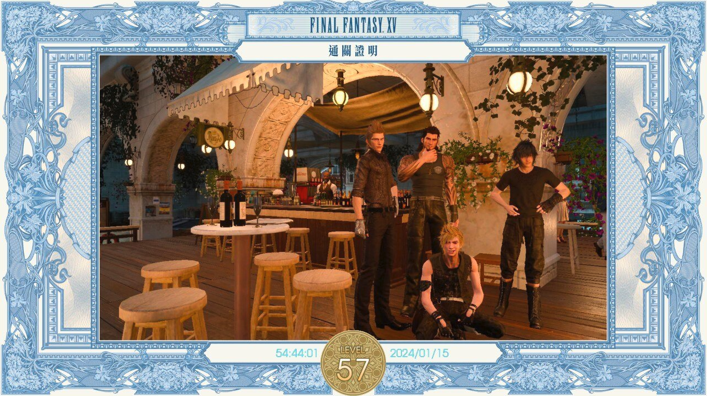
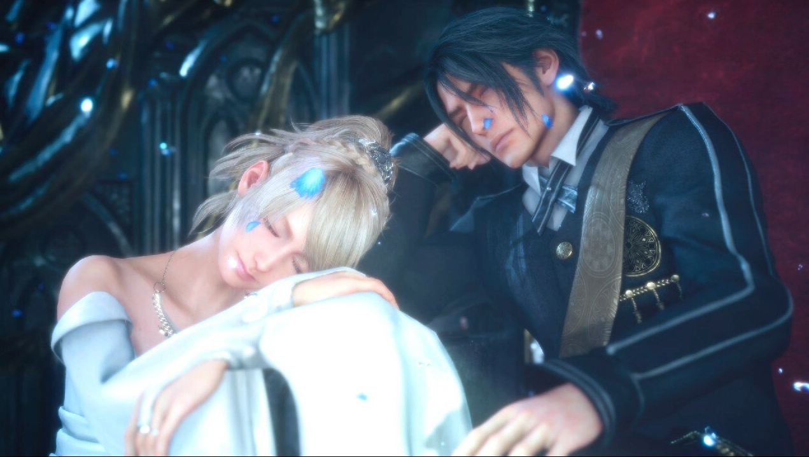

FF15 全破了， 同時有玩 FF16 (用 PS Portal) 跟 FF15 (Steam Deck) ，後來竟然覺得 FF15 比較讓我玩得下去。 很專心地把它破關了。

- 一開始為人詬病的開車兜風那段，我覺得很悠閒。

- FF15 的相當多樣的支線任務我還蠻喜歡的，不論陸行鳥，拍照任務，還是武器鍛鍊任務。

- 最後的三個好友單挑歷代王，很感人啊。

- 幾個 DLC 慢慢留著玩，應該要準備人龍8 惹。

